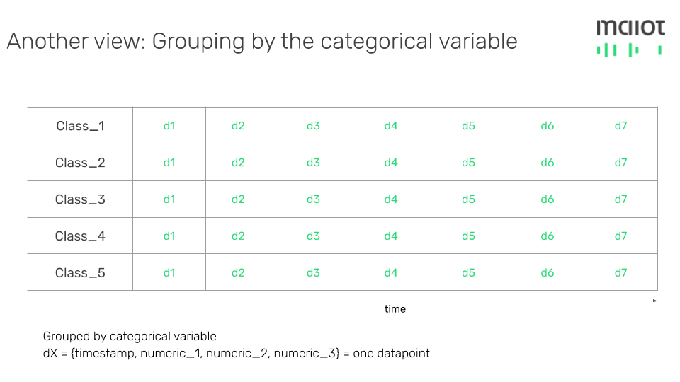
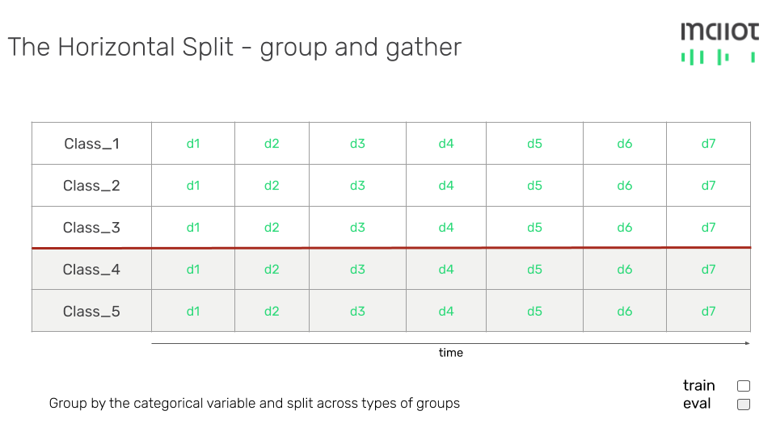
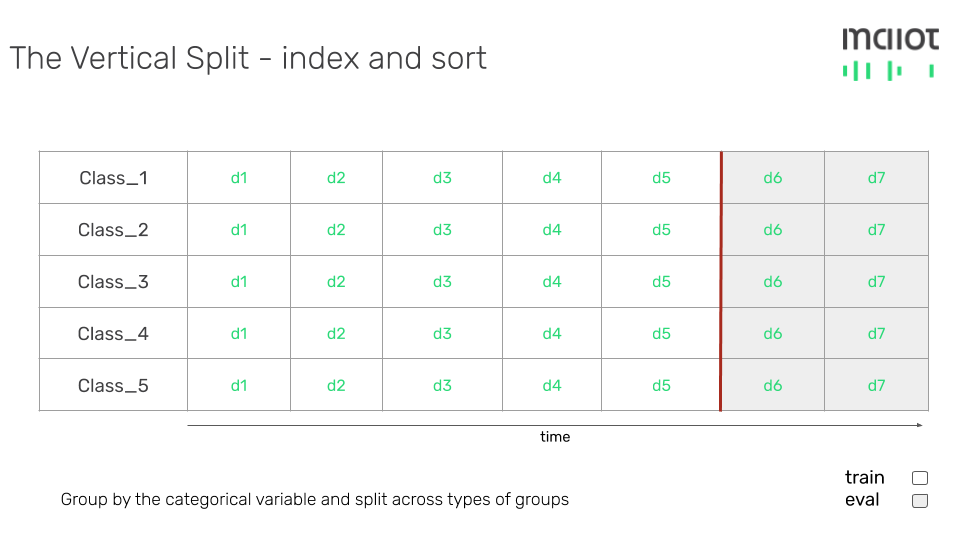
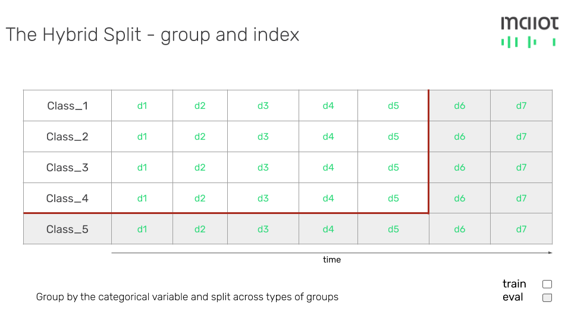

**Last updated:** November 21, 2022.

One attempt to ensure that ML models generalize in unknown settings is splitting
data. This can be done in many ways, from 3-way (train, test, eval) splits to
k-splits with cross-validation. The underlying reasoning is that by training a
ML model on a subset of the data, and evaluating on `unknown` data, one can
reason much better if the model has underfit or overfit in training.

    

        

    

<em>Courtesy: <a href="https://www.pexels.com/photo/man-doing-yoga-1701207/">Yogendra Singh on Pexels</a> </em>

For me, splitting data is the most under-rated task in all of data science. It is understandable that for most jobs,
a simple 3-way split suffices. However, I have stumbled across many problems where there is a 
need for more complicated splits to ensure generalization. These splits are more complex because they are derived 
from the actual data, rather than the structure of the data which the hitherto mentioned split methods are based on. 
This post attempts to break down some of the more `unconventional` ways to split data in ML development, and the 
reasoning behind them.

# Let's start with a dataset

In order to illustrate the split mechanisms, it helps to start with a sample
dataset to do the splits on. To make things easy, let's use a simple
multi-variate, time-series dataset represented in tabular format. This data
consists of  
3 numerical features, 1 categorical feature, and 1 timestamp feature. Below this
is visualized:

This type of dataset is common across many use-cases and industries in machine
learning. A concrete example can be multiple timestreams transmitted from
different machines with multiple sensors on a factory floor. The categorical
variable would then be the ID of the machine, the numerical features would be
what the sensors are recording (e.g. pressure, temperature, etc.), and the
timestamp would be when the data was transmitted and recorded in the database.

# Doing the splits

Imagine you receive this dataset as a CSV file from your data engineering
department and are tasked with writing a classification or a regression model.
The label in such a case could be any of the features or an additional column.
Regardless, the first thing to do would be to try to split up the data into sets
that are meaningful.

To make things easy, you decide to go make a simple split with `train` and
`eval`. You know immediately that a naive random split with shuffling won't fly
here - the data does have multiple sensor streams that are indexed by time after
all. So how do you split the data so that order is maintained and subsequent
models are sufficiently generalizable?

## Another view of the data

The most straightforward transformation we can do is to represent the data per
categorical class (in our running example, visualize the data per machine). This
would yield the following result:

<<<<<<< HEAD

=======

>>>>>>> main

## The Horizontal Split

The grouping together suddenly makes the issue of splitting a bit simpler, and
largely dependent on your hypothesis. If the machines are running under similar
conditions, one question you might ask is:
`How would a ML model trained on one group generalize to other groups`. That is,
if trained on `class_1`, `class_2` and `class_3` timestreams how would the model
fair on `class_4` and `class_5` timestreams. Here is a visualization of that
split:

<<<<<<< HEAD

=======

>>>>>>> main

I call this the `Horizontal` split due to the nature of the cut line in the above
visualization. This split can be easily achieved in most ML libraries by simply
grouping by the categorical feature and partitioning along it. A successful
training with this split would show evidence that the model has picked up
signals that generalize across previously unseen groups. However, it would not
showcase that it can predict the future behavior of one group.

It's important to note that the split decision did `NOT` account for time as
a basis of the split itself. One can assume however that you would also sort by
time per timestream to maintain that relationship in your data. This brings us
to the next split..

## The Vertical Split

But what if you want to split across time itself? For most time-series modeling,
a common way to split the data is `past` and `future`. That is, to take in the
training set historical data relative to the data in the eval set. The
hypothesis, in this case, would be:
`How would a ML model trained on historical data per group generalize to future data for each group?`.
This question might be answered by the so-called `Vertical` split:

<<<<<<< HEAD

=======

>>>>>>> main

A successful training with this split would showcase that the model can
pick up patterns across timestreams it has already seen, and make accurate
predictions of behavior in the future. However, this itself would not show that
this model will generalize well to other timestreams from different groups.

Of course, your multiple timestreams have to be sorted now individually, so we
still need to group. However, this time, rather than cutting across groups, we
take a sample of the `past` of each group and put it in train and the `future`
of each group in eval. In this idealized example, all the timestreams are of the
same length, i.e., each timestream has exactly the same number of data points.
However, in the real world, this maybe not be the case - so you would require a
system to build an index across each group to make this split.

## The Hybrid Split

An inquisitive ML researcher might at this point wonder if they could produce a
model that would generalize under both constraints of the `Horizontal` and the
`Vertical` split. The hypothesis, in that case, would be:
`How would a model trained on historical data for SOME groups generalize to future data of these groups AND all data from other groups?`.
A visualization of this `Hybrid` split would look like this:

<<<<<<< HEAD

=======

>>>>>>> main

Naturally, if model training is successful, this model would surely be more
robust than the others in a real-world setting. It would have displayed evidence
of not only the learning patterns of some of the groups it has already seen but
also evidence of the fact that it has picked up signals that generalize across
groups. This might be useful if we are to add more similar machines to the
factory in the future.

## Multi-dimensional splits

The notion of horizontal and vertical splits can be generalized to many
dimensions. For example, one might want to group by two categorical features
rather than one to even further isolate sub-groups in the data and sort them
per sub-group. There might also be complex logic in the middle to filter groups
that have a lower number of samples, and other business-level logic pertaining
to the domain.

# Conclusion

The hypothetical example is used to illustrate the endless possibilities of
various kinds of machine learning splits that can be created by an astute data
scientist. Just like it is important to
[ensure ML fairness](https://developers.google.com/machine-learning/fairness-overview)
whilst evaluating your models, it is equally important to spend sufficient time
thinking about splitting a dataset and its consequences to bias the model
downstream.

One easy way to do the `Horizontal`, `Vertical` and the `Hybrid` split by
writing just a
[few lines of YAML is via ZenML](https://docs.zenml.io/advanced-guide/pipelines/settings#method-3-configuring-with-yaml).
ZenML is a [MLOps framework](https://zenml.io) developed while we deployed
models to production, for datasets with similar characteristics as the example
above. If you are interested in the content above and would like to try ZenML,
please feel free to reach out to me at [hamza@zenml.io](mailto:hamza@zenml.io).
Head over to [our docs](https://docs.zenml.io) to understand more how it works
in more detail.

Thank you and happy splitting!
