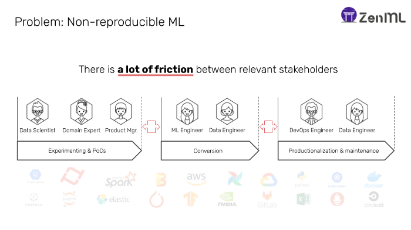
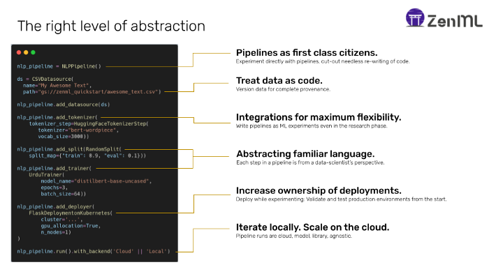
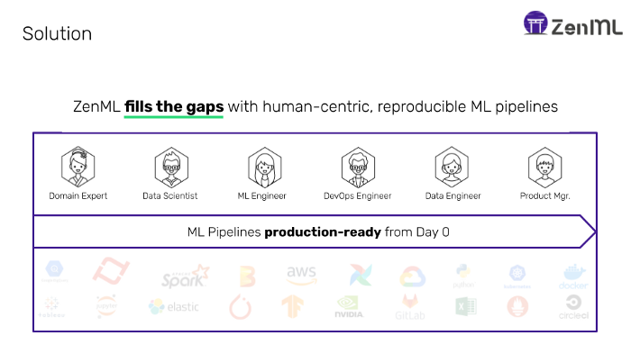

Today, Machine Learning powers the top 1% of the most valuable organizations in the world (FB, ALPH, AMZ, N etc). However, 99% of enterprises struggle to productionalize ML, even with the possession of hyper-specific datasets and exceptional data science departments.

Going one layer further into how ML propagates through an organization reveals the problem in more depth. The graphic below shows an admittedly simplified representation of a typical setup for machine learning:

|  | 
|:--:|
| *Figure 1: Why it’s hard to reproduce ML models* |

 
There are three stages to the above process:

## Experimenting & PoCs:

- **Technologies**: Jupyter notebooks, Python scripts, experiment tracking tools, data exploration tools
- **Persona**: Data scientists
- **Description**: Quick and scientific experiments define this phase. The team wants to increase their understanding of the data and machine learning objective as rapidly as possible.

## Conversion:

- **Technologies**: ETL pipelining tools such as Airflow
- **Persona**: Data Engineers
- **Description**: Converting finalized experiments into automated, repeatable processes is the aim of this code. Sometimes this starts before the next phase, some times after, but the essence is the same — take the code from the data scientists and try to put them in sort form of an automated framework.

## Productionalization & Maintenance:

- **Technologies**: Flask/FastAPI, Kubernetes, Docker, [Cortex](http://cortex.dev/), [Seldon](https://www.seldon.io/)
- **Persona**: ML Engineers / Ops
- **Description**: This is the phase that starts at the deployment of the model, and spans monitoring, retraining, and maintenance. The core focus of this phase is to keep the model healthy and serving at any scale, all the while accounting for drift.

Each of these stages requires different skills, tooling, and organization. Therefore, it is only natural that there are many potholes that an organization can run into along the way. Inevitably things that are important downstream are not accounted for in the earlier stages. E.g. If training happens in isolation from the deployment strategy, that is never going to translate well in production scenarios — leading to inconsistencies, silent failures, and eventually failed model deployments.

# The Solution

Looking at the above multi-phase process in Figure 1, it seems like a no-brainer to simply reduce the steps involved and therefore eliminate the friction that exists between them. However, given the different requirements + skillsets for each step, this is easier said than done. Data scientists are not trained or equipped to be diligent to care about production concepts such as reproducibility — they are **trained to iterate and experiment**. They don’t really care about code quality and it is probably not in the best interest of the company at an early point to be super diligent in enforcing these standards, given the trade-off between speed and overhead.

Therefore, what is required is an implementation of a framework that is **flexible but enforces production standards** from the get-go. A very natural way of implementing this is via some form of pipeline framework that exposes an automated, standardized way to run ML experiments in a controlled environment. ML is inherently a process that can be broken down into individual, concrete steps (e.g. preprocessing, training, evaluating, etc), so a pipeline is a good solution here. Critically, by standardizing the development of these pipelines at the early stages, organizations can lose the cycle of destruction/recreation of ML models through multiple toolings and steps, and hasten the speed of research to deployment.

If an organization can incentivize their data scientists to buy into such a framework, **then they have won half the battle of productionalization**. However, the devil is really in the details — how do you give data scientists the flexibility they need for experimentation in a framework that is robust enough to be taken all the way to production?

# An exercise in finding the right abstractions

Having motivated writing in pipelines from the get-go, it is only fair that I give more concrete examples of frameworks on how to achieve this. However, in my opinion, currently, the tooling landscape is too split into frameworks that are ML tools for ML people, or Ops tools for Ops people, not really satisfying all the boxes I mentioned in the last section. What is missing is an Ops (read pipelines) tool for ML people, with **higher-order abstractions at the right level for a data scientist**.

In order to understand why this is important, we can cast an eye towards how web development has matured from raw PHP/jQuery-based scripts (the Jupyter notebooks of web development) with the LAMP stack to the powerful React/Angular/Vue-based modern web development stacks of today. Looking at these modern frameworks, their success has been dictated by providing higher-order abstractions that are easier to consume and digest for a larger audience. They did not change the fundamentals of how the underlying web technology worked. They simply re-purposed it in a way that is understandable and accessible to a larger audience. Specifically, by providing components as first-class citizens, these frameworks have ushered in a new mechanism of breaking down, utilizing, and resharing the HTML and Javascript that powers the modern web. However, ML(Ops) does not have an equivalent movement to figure out the right order of abstraction to have a similar effect.

To showcase a more concrete example of my more abstract thoughts above, I’ll use [ZenML](https://github.com/maiot-io/zenml), an open-source MLOps framework to create iterative, reproducible pipelines.

> *Disclaimer: I am one of the core maintainers of ZenML.*

[ZenML](https://github.com/maiot-io/zenml) is an exercise in finding the right layer of abstraction for ML. Here, we treat pipelines as first-class citizens. This means that data scientists are exposed to pipelines directly in the framework, but not in the same manner as the data pipelines from the ETL space ([Prefect](https://www.prefect.io/), [Airflow](https://airflow.apache.org/) et al.). Pipelines are treated as experiments — meaning they can be compared and analyzed directly. Only when it is time to flip over to productionalization, can they be converted to classical data pipelines.

|  | 
|:--:|
| *Figure 2: ZenML abstract pipelines with familiar language to increase ownership of model deployments.* |

 
Within pipelines are steps, that are abstracted in familiar ML language towards the data scientist. e.g. There is a `TokenizerStep`, `TrainerStep`, `EvaluatorStep` and so on. Paradigms that are way more understandable than plugging scripts into some form of orchestrator wrapper.

Each pipeline run tracks the metadata, parameters and can be compared to other runs. The data for each pipeline is automatically versioned and tracked as it flows through. Each run is linked to git commits and compiled into an easy-to-read YAML file, which can be optionally compiled to other DSL’s such as on Airflow or Kubeflow Pipelines. This is necessary to satisfy other stakeholders such as the data engineers and ML engineers in the value chain.

Additionally, the interfaces exposed for individual steps are mostly set up in a way to be easy to extend in an idempotent, and therefore a distributed, manner. The data scientist can therefore scale-out with different processing backends (like Dataflow/Spark) when they are dealing with larger datasets.
All in all, ZenML is trying to get to the following scenario:

|  |
|:--:|
| *Figure 3: ZenML unifies the ML process.* |

 
Of course, [ZenML](https://github.com/maiot-io/zenml) is not the only mechanism to achieve the above — Many companies build their own home-grown abstraction frameworks to solve their specific needs. Often-times these are built on top of some of the other tools I have mentioned above. Regardless of how to get there, the goal should be clear: Get the data scientists **as close to production as possible** with as little friction as possible, incentivizing them to increase their ownership of the models after deployment.

This is a win-win-win for every persona involved, and ultimately a big win for any organization that aims to make it to the top 1% using ML as a core driver for their business growth.

# Plug

If you like the thoughts here, we’d love to hear your feedback on ZenML. It is [open-source](https://github.com/maiot-io/zenml) and we are looking for early adopters and [contributors](https://github.com/maiot-io/zenml)! And if you find it is the right order of abstraction for you/your data scientists, then let us know as well via [our Slack](http://zenml.io/slack-invite) — looking forward to hearing from you!