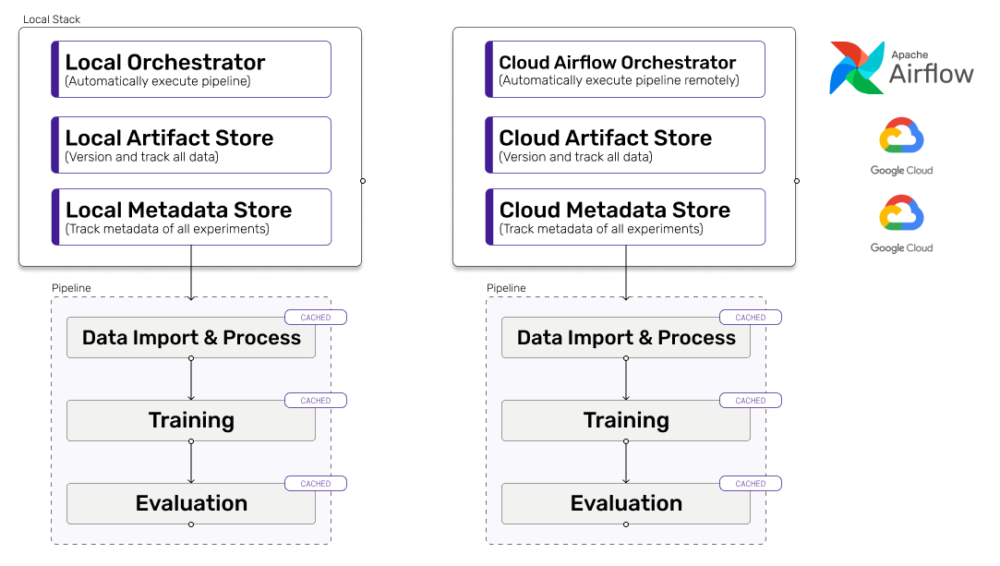

We've been hard at work for the last few months to finalize the 0.5.0 release
and we're super excited to finally share some details regarding this all-new
ZenML version with you!

We'll go over the main new features in this blog post but if you're looking for
a detailed list make sure to take a look at our
[release notes](https://github.com/zenml-io/zenml/blob/main/RELEASE_NOTES.md).

## Completely reworked API

If you're familiar with previous versions of ZenML, you'll be in for a huge
surprise. No more tedious subclassing for every step in your machine learning
pipeline, the new ZenML functional API allows you to simply decorate your
existing functions in order to run them in a ZenML pipeline. As long as the
inputs and outputs of your functions are part of the continuously expanding set
of supported datatypes, ZenML automatically takes care of serializing and
deserializing your step outputs. And if a datatype is currently not supported,
ZenML enables you to easily create a custom
[materializer](https://docs.zenml.io/framework-design#using-materializers-to-abstract-away-serialization-and-deserialization-logic)
to run your code anyway.

Let's take a look at a simple step that normalizes images for training to see
how the new API looks in practice:

```python
@step
def normalize(images: np.ndarray) -> np.ndarray:
    """Normalize images so the values are between 0 and 1."""
    return images / 255.0
```

Notice the `@step` above the normalization function? That's all that was needed
to transform this into a ZenML step that can be used in all your pipelines. Now
all that's left to do is creating a pipeline that uses this step and running it:

```python
@step
def load_data() -> np.ndarray:
    ...

@pipeline
def load_and_normalize_pipeline(
    load_data_step,
    normalize_step,
):
    # Connect the inputs and outputs of our pipeline steps
    images = load_data_step()
    normalize_step(images=images)

# Create and run our pipeline
load_and_normalize_pipeline(load_data(), normalize()).run()
```

Our [quickstart](https://docs.zenml.io/quickstart-guide) and
[functional guide](https://docs.zenml.io/guides/functional-api) are the perfect
place if you want to learn more about our new API.

## Stacks

Stacks are one of ZenMLs new
[core concepts](https://docs.zenml.io/core-concepts). A stack consists of three
components that define where to store data and run ZenML pipelines:

- A metadata store: Stores metadata like pipeline names and parameters used to
  execute steps of a pipeline.
- An artifact store: Stores output data of all steps executed as part of a
  pipeline.
- An orchestrator: Executes a pipeline locally or in a cloud environment.

The diagrams below show two exemplary stacks and their components:

|                                |
| :---------------------------------------------------------------------------------------------------------: |
| _Figure 1: Example stacks for local development (left) and production using Apache Airflow and GCP (right)_ |

<br>
While the development stack uses your local machine to execute pipelines and store data, the production stack runs pipelines using Apache Airflow and stores their resulting data in GCP.
In future versions of ZenML we will integrate many popular tools for each of these components so you can easily create stacks that match your requirements.

After setting up multiple stacks for development and production, it is as easy
as calling

```
  zenml stack set production_stack
```

to switch from executing pipelines locally to running them in the cloud! Check
out our [functional API guide](https://docs.zenml.io/guides/functional-api) to
learn more about the remaining core concepts or skip straight to
[the last part](https://docs.zenml.io/guides/functional-api/deploy-to-production)
to see the magic of stacks in action.

## New post-execution workflow

Inspecting and comparing pipelines after they were executed is an essential part
of working with machine learning pipelines. That is why we've added a completely
new
[post-execution workflow](<(https://docs.zenml.io/guides/post-execution-workflow)>)
that allows you to easily **query metadata** like the parameters used to execute
a step and **read artifact data** like the evaluation accuracy of your model.
This is how it works:

```python
# Get a pipeline from our ZenML repository
pipeline = Repository().get_pipeline(pipeline_name="my_pipeline")
# Get the latest run of our pipeline
pipeline_run = pipeline.runs[-1]
# Get a specific step of the pipeline run
evaluation_step = pipeline_run.get_step(name="evaluation_step")

# Use the step parameters or outputs
class_weights = evaluation_step.parameters["class_weights"]
evaluation_accuracy = evaluation_step.output.read()
```

In future versions, this will be the basis on which we will build visualizations
that allow you to easily compare different runs of a pipeline, catch data drift
and so much more!

## Type hints

Starting with version 0.5.1, ZenML now has type hints for the entire code base!
Apart from helping us make the codebase more robust, type hints in combination
with unit tests allow us to implement new features and integrations quickly and
confidently. Type hints also **increase code comprehensibility** and **improve
autocompletion** in many places so working with ZenML is now even easier and
quicker!

## What lies ahead

It has been a huge undertaking to rework the entire ZenML API but we're super
happy with how it turned out (join our [Slack](https://zenml.io/slack-invite/)
to let us know if you agree or have some suggestions on how to improve it)!

There are however a few features that are still missing from previous versions
of ZenML, but now that we have a solid foundation to work on it should be a
quick process to reintegrate them. So keep your eyes open for future releases
and make sure to
[vote](https://github.com/zenml-io/zenml/discussions/categories/roadmap) on your
favorite feature of our [roadmap](https://zenml.io/roadmap) to make sure it gets
implemented as soon as possible.

_Michael Schuster is a Machine Learning Engineer at ZenML._
