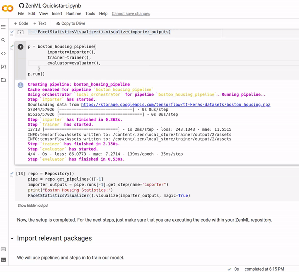

ZenML 0.5.3 adds support for statistics visualizations, greatly improved speed for CLI commands as well as lots of small improvements to the pipeline and step interface.

For a detailed look at what's changed, give [our full release notes](https://github.com/zenml-io/zenml/releases/tag/0.5.3) a glance. This blog post will cover some of the big-picture changes.

## Statistics Visualizations

In the latest release we added the concept of visualizations as a first-class citizen in ZenML. Now you can use awesome third-party libraries to visualize ZenML steps and artifacts. We support the facets visualization for statistics out of the box, to find data drift between your training and test sets.

We use the built-in FacetStatisticsVisualizer using the [Facets Overview](https://pypi.org/project/facets-overview/) integration. [Facets](https://pair-code.github.io/facets/) is an awesome project that helps users visualize large amounts of data in a coherent way.

|  |
|:--:|
| *Here's what the statistics visualizer looks like* |

 
## CLI Speed Improvements

You may have noticed that the previous versions of ZenML CLI were a bit slow. 😬 Sorry about that. We've fixed the problem. There were some imports of large libraries happening at inopportune moments. This improvement will get a whole blog post of its own, so watch this space for more details…

## Contribute to ZenML!

Join our [Slack](https://zenml.io/slack-invite/) to let us know what you think we should build next!

Keep your eyes open for future releases and make sure to [vote](https://github.com/zenml-io/zenml/discussions/categories/roadmap) on your favorite feature of our [roadmap](https://zenml.io/roadmap) to make sure it gets implemented as soon as possible.

[Image credit: Photo by [Al Soot](https://unsplash.com/@anspchee?utm_source=unsplash&utm_medium=referral&utm_content=creditCopyText) on [Unsplash](https://unsplash.com/images/things/balloon?utm_source=unsplash&utm_medium=referral&utm_content=creditCopyText)]