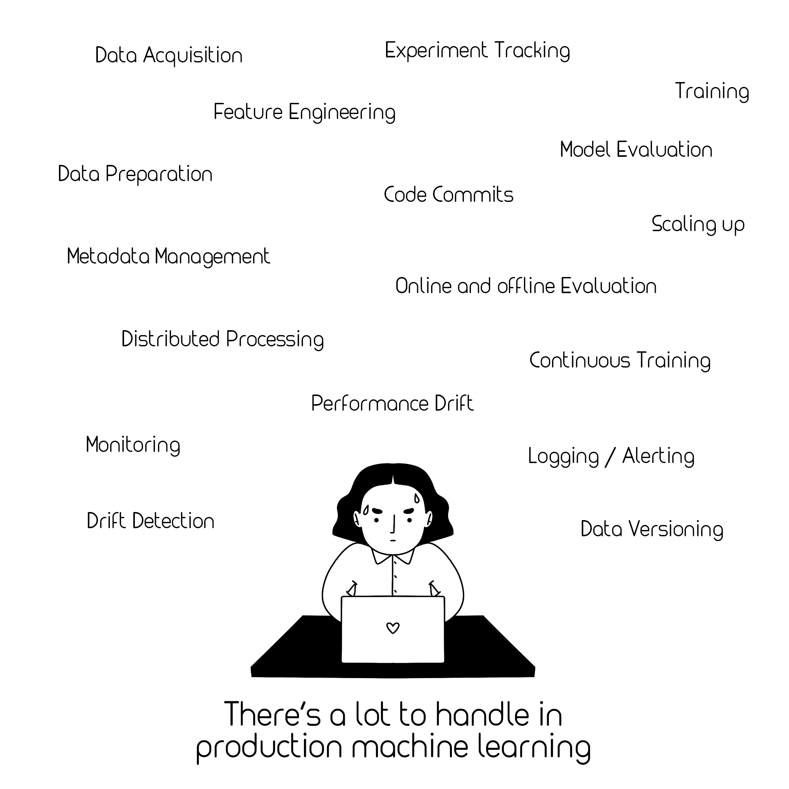
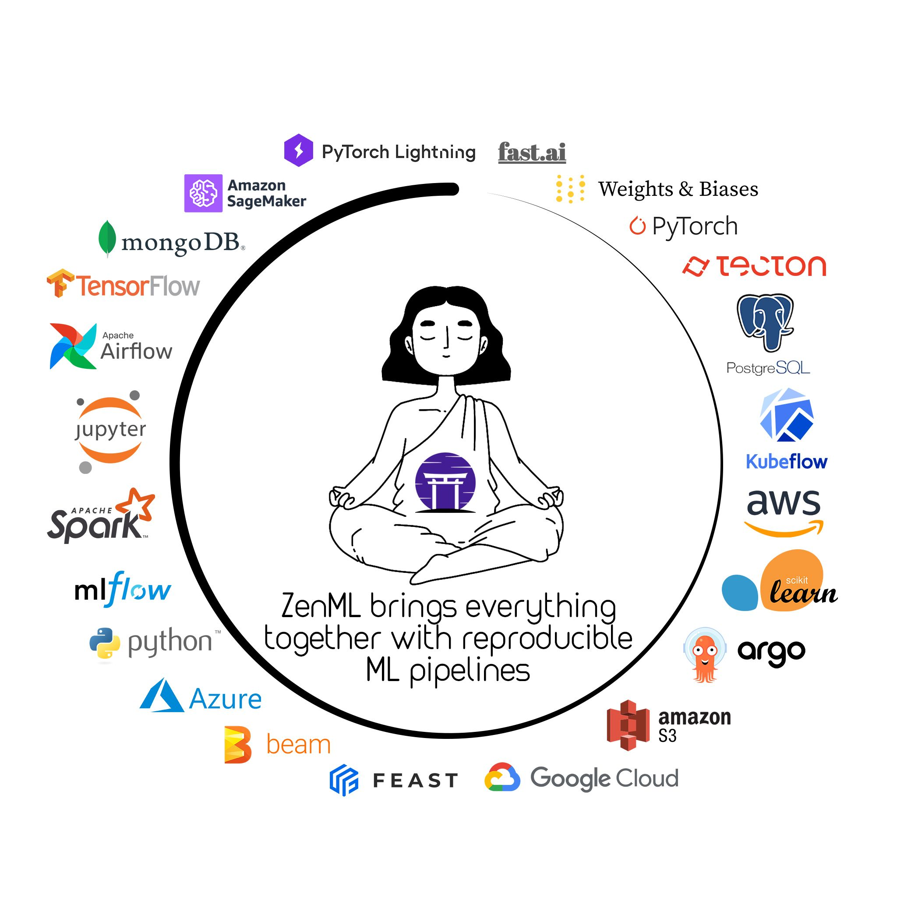

# Lazy Loading Integrations in ZenML
When working on a project in **Python**, it is very likely that you will run into an issue where even the simplest of imports can lead to a chain of imports, which in turn can cost you a few seconds of run time before you even start to use what you imported. Left unchecked, this eager consumption of time can become even more apparent and annoying if you working on a project where the response time is critical and there are a wide variety of tools in play. Let's put this into perspective for a tool that handles Machine Learning workflows in a production setting.

## Fractured space of Machine Learning

In recent years, the field of Machine Learning has become even more fractured, especially in a production setting. Anyone who deals with a Machine Learning workflow needs to not only think about designing and training models but also a wide variety of tasks ranging from data ingestion to processing, from training to serving, from distributed processing to orchestration. The solutions to these problems are usually tailored to the problem at hand and they utilize a different set of tools/frameworks to bring forth a solution. Naturally, it is impossible to claim that there is only"**one"** set of tools/frameworks that can solve it all. 



This is something that we have to consider at **ZenML** and it is why we aim to create an environment where our users already have access to some of the widely used tools while having the option to extend the framework as they see fit. Through a set of high-level abstractions, we want to minimize the friction as much as possible between these moving parts of an ML workflow, and at the center of this solution, we have our **Integrations**.



## What do Integrations bring to the table?

In order to describe the concept of **Integrations**, we can draw an example from one of our base concepts, namely *the artifact store*. The artifact store is an integral part of any pipeline execution in **ZenML** and as the name suggests, it is used to store the outputs of each step within your pipeline. When you install **ZenML**, you directly get access to our built-in `LocalArtifactStore`. 

However, this local implementation barely scratches the surface of what is needed in a production setting. With your infrastructure in mind, you might find it more ideal to utilize the Google Cloud Platform (or any other cloud provider) to set up your environment, in which case you would not care about loading any other artifact store implementation than the `GCPArtifactStore`. That is why the **Integrations** are there.

They propose a solution, where you will find a bunch of implementations bundled up together within the context of an **Integration.** For instance, by simply activating our `GCPIntegration`, you gain access to all our tools that are related to Google Cloud Platform, like the `GCPArtifactStore`, `GCPMetadataStore`, and much more to come. Moreover, since they are all wrapped up by this concept, we can make sure that their requirements are set up properly and they are only loaded when you actually need them.

## How are the Integrations implemented?

In **ZenML**, an **Integration** is a simple Python class which features a `NAME`, a list of `REQIUREMENTS`, and a few helper functions, namely `check_installation` and `activate`:

```python
class Integration(metaclass=IntegrationMeta):
    """Base class for integration in ZenML"""

    NAME = "base_integration"
    REQUIREMENTS: List[str] = []

    @classmethod
    def check_installation(cls) -> bool:
        """Method to check whether the required packages are installed"""
        ...

    @classmethod
    def activate(cls) -> None:
        """Method to activate the integration"""
```

While `NAME`, `REQUIREMENTS`, and `check_installation` are quite self-explanatory, the `activate` method is a bit more complicated and key to our operation. In short, it is responsible for loading and registering the tools which come with the `Integration`.  This method of lazy-loading gives us an opportunity to be optimized in terms of time and choose the exact moment when we want to load the actual **Integration**.

## How do I use the tools that come with an Integration?

Assuming that you have installed the requirements of an **Integration**, you can go ahead simply import any tools within its arsenal and start using it:

```python
from zenml.integrations.tensorflow.materializers import KerasMaterializer
```

Even though this seems relatively straightforward, we also need to take a look at what happens if the integration you installed brings a component that is not necessarily imported or used within your pipeline creation code. A great example of this can be displayed through the creation of a basic step:

Normally, when you are creating a step in **ZenML**, the input- and output annotations play a major role in the execution of the step. If not set otherwise, **ZenML** will take a look at the annotations, find the default `materializer` in its `materializer_registry` for each annotation, and use the dedicated `materializer` object to use for reading or writing. 

```python
@step
def trainer(X_train: np.ndarray, y_train: np.ndarray) -> tf.keras.Model:
		...
```

In this example, the output of the step is a `tf.keras.Model` and normally, in its barest form, the `materializer_registry` has no `materializer` pre-loaded for this type. This is mainly due to the fact that it will not be needed by everybody who will use our tools. Making them load a `materializer` for an annotation that they will not need would be a waste of time. However, to counteract that, we can keep a track of which **Integrations** you have installed in your environment and activate them upon pipeline execution. This way you will have access to the tool within the integration **when it matters.**

## What is in store for the Integrations in the future?

**Integrations** are a new concept that we recently added to our arsenal and we hope that they will be a great gateway for us and our users to extend **ZenML** as we fit. For us, the next immediate step will likely revolve around implementing an easy way for you to manage your **Integrations** through our CLI tool. If you are interested in **ZenML** or if you have any questions or feedback, make sure
