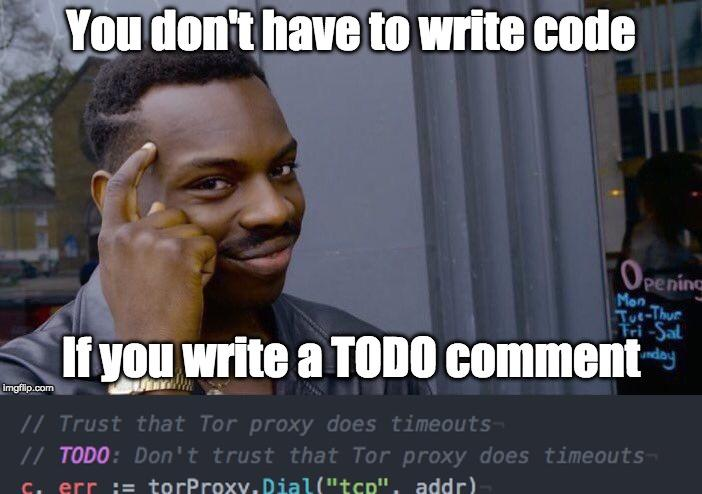
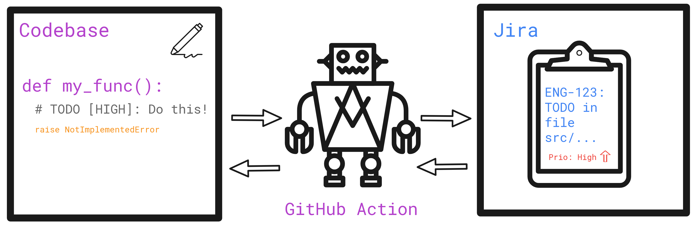

If you're a software developer, you're probably familiar with the following
scenario: You're working on a new feature or trying to fix a bug, and while
reading through some code existing code you notice that there's a nicer way to
write it, or maybe a potential edge case isn't handled. But where to go from
here? Write a todo comment and let your future self handle it of course!



While this might not be the optimal solution, I still regularly use todo
comments if the fix is too complicated to implement right away as I find it can
get quite distracting to repeatedly switch to my browser and create an issue
with a meaningful description.

## How to keep todo comments in sync with Jira issues

This however brings a problem with it: these todos are separated from our Jira
board so we did not take them into account when planning our sprints. Keeping
the comments in code in sync with our Jira issues manually would require a
considerable amount of effort. We would have to periodically go over the entire
codebase and create issues for new todos as well as delete issues and todos if
their counterpart was removed. Instead, we looked at multiple GitHub
integrations in the Jira marketplace but couldn't find an existing solution with
similar features, so we decided to implement a GitHub Action that helps us track
todos automatically.



## GitHub Actions to the rescue

Each time something is pushed to the main branch, a GitHub workflow is triggered
which simply calls a python script to do the heavy lifting. The script itself
uses the following regular expression to find todo comments in our python files:

```python
pattern = r"(^[ \t]*#) TODO ?\[(LOWEST|LOW|MEDIUM|HIGH|HIGHEST|[A-Z]*?-[0-9]*?)\]:(.*$\n(\1 {2}.*$\n)*)"
```

Don't worry I won't bore you with the details of how this expression works, but
it essentially means that our todo comments have to conform to a certain syntax
(a comment starting with a capital TODO followed by a priority in square
brackets and a colon) in order for the script to detect them. Once all
syntactically correct todos are found, they are processed as follows:

- **Create issues for new todos:** Each time new code gets merged into the main
  branch of our repository, our script detects all new todos and creates Jira
  issues with the specified priority and description. The created issues include
  a github link to the actual comment for more context and are tagged with a
  separate label so we can quickly find them later. Additionally, we modify the
  comments to include a reference to the created issue which is not only used to
  avoid creating duplicated issues but also comes in quite handy if you come
  across a comment and want to for example check if there's already someone
  working on it. ```python # before # TODO [HIGH]: Do something very important
  here

      # after
      # TODO [ENG-123]: Do something very important here
      ```

- **Delete todos for closed issues:** Our codebase is evolving quite quickly at
  the moment and we closed some obsolete issues from time to time. To
  automatically keep the todo comments and issues in sync, the script also
  deletes todo comments when the corresponding issue was closed.

- **Tag issues when a todo is deleted:** Now there is just one case left to
  handle: what if a todo comment gets deleted and the corresponding issue is
  still open? We decided to handle this with caution and not close the issue
  automatically to guard against accidentally deleted comments. Instead, our
  script adds a separate label to these "orphan" issues so we can easily discuss
  whether they should actually be closed during our planning meetings.

If you're interested in more details or having something similar in your
projects, check out the
[script](https://github.com/zenml-io/zenml/blob/f5e7f688e102db80d87a6d4ba4513fcff84a242d/scripts/update_todos.py)
and the accompanying
[GitHub workflow](https://github.com/zenml-io/zenml/blob/f5e7f688e102db80d87a6d4ba4513fcff84a242d/.github/workflows/update_todos.yml).

_Michael Schuster is a Machine Learning Engineer at ZenML._
