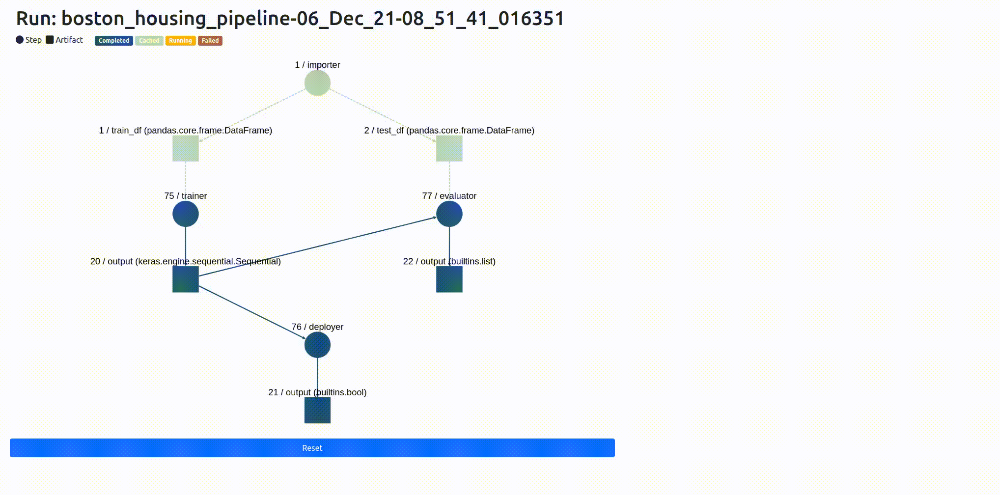

ZenML 0.5.4 adds visualizations for your native ZenML pipelines as well as
several bugfixes and updates to our documentation (`init` docstrings galore!).
We removed a dependency we no longer needed, which will make your `pip`
installs much faster! For a detailed look at what's changed, give [our full release
notes](https://github.com/zenml-io/zenml/releases/tag/0.5.4) a glance. This blog
post will cover the big change we're introducing in the new version.

## Pipeline Lineage Tracking & Visualization

The [statistics visualizations from the last release](https://blog.zenml.io/zero-five-three-release/) got us all inspired to add a
few more useful ways of seeing what's going on in your pipelines. It's not
uncommon for pipelines to be made up of many steps, and those steps can interact
and intersect with one another in often complex patterns. We've built a way for
you to inspect what's going on with your ZenML pipeline:

|  |
|:--:|
| *Here's what the pipeline lineage tracking visualizer looks like* |

You can see in this animated diagram that each of the steps and artifacts of the pipeline are
represented as circles or squares respectively. We included a way to get a quick
sense of the status of these elements through colour: red shapes means that a
step has failed, while blue and green show success. (Orange means your step is
still running in the orchestrator).

We're also really excited that you can see
whether a particular step or artifact is cached or not. (Watch this space for a
blog coming soon on the benefits of caching!) On the right-hand side of the chart, you can view metadata about the particular
step or artifact, including information about the step's lineage and so on.

## Contribute to ZenML!

Join our [Slack](https://zenml.io/slack-invite/) to let us know what you think we should build next!

Keep your eyes open for future releases and make sure to [vote](https://github.com/zenml-io/zenml/discussions/categories/roadmap) on your favorite feature of our [roadmap](https://zenml.io/roadmap) to make sure it gets implemented as soon as possible.

[Image credit: Photo by [Luca Upper](https://unsplash.com/@lucaupper?utm_source=unsplash&utm_medium=referral&utm_content=creditCopyText) on [Unsplash](https://unsplash.com/s/photos/balloons?utm_source=unsplash&utm_medium=referral&utm_content=creditCopyText)]