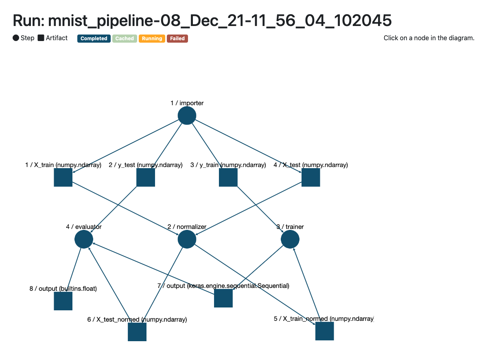
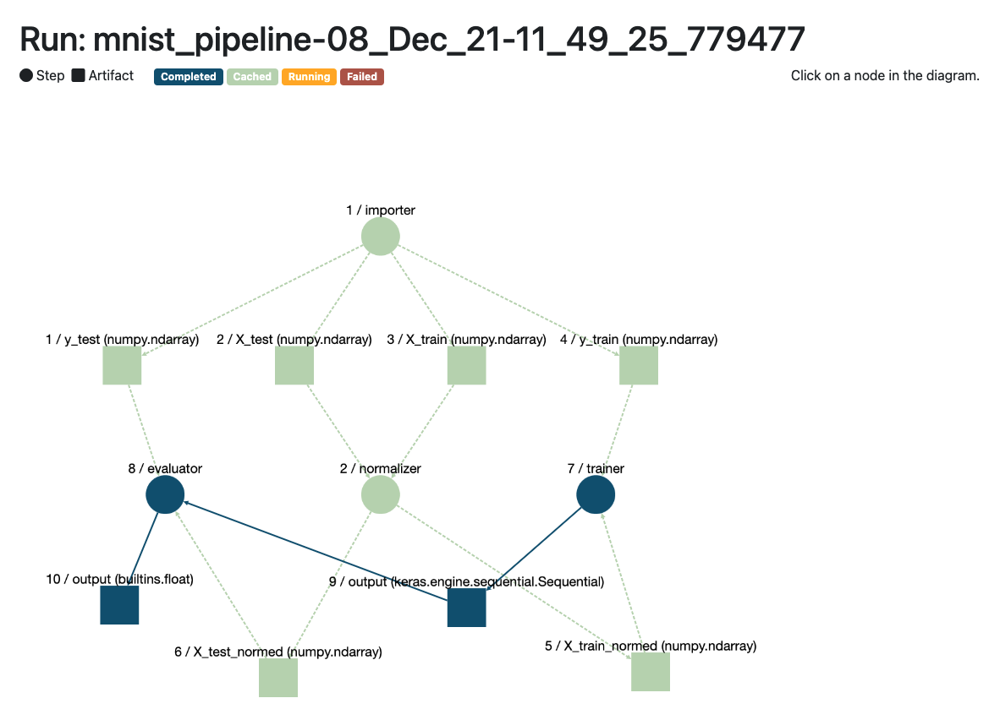

Data is the lifeblood that feeds machine learning models. The process of developing those models requires data in different forms. During the early lifecycle stages of any particular model, particularly when experimenting with different approaches, this data will get used repeatedly.

Machine learning model development is extremely iterative in this way. Data scientists are constantly repeating steps in slightly different combinations. Given that data often is imported or transformed in the course of these steps, it would be good to find a way to minimise wasted work. Luckily, we can use caching to save the day.

If we organise the steps of our model training smartly, we can ensure that the data outputs and inputs along the way are cached. A good way to think about splitting up the steps is to use the image of [pipelines](https://blog.zenml.io/tag/pipelines/) and the steps that are executed. For each step, data is passed in, and (potentially) gets returned. We can cache the data at these entry and exit points. If we rerun the pipeline we will only rerun an individual step if something has changed in the implementation, otherwise we can just use the cached output value.

## Benefits of Caching

I hope some of the benefits of caching are clear to you now.

- **🔁 Iteration Efficiency** - When experimenting, it really pays to have a high frequency of iteration. You learn when and how to course correct earlier and more often. Caching brings you closer to that by making the costs of frequent iteration much lower.
- **💪 Increased Productivity** - The speed-up in iteration frequency will help you solve problems faster, making stakeholders happier and giving you a greater feeling of agency in your machine learning work.
- **🌳 Environmental Friendliness** - Caching saves you the [needless repeated computation steps](https://machinelearning.piyasaa.com/greening-ai-rebooting-the-environmental-harms-of-machine/) which mean you use up and waste less energy. It all adds up!
- **＄ Reduced Costs** - Your bottom-line will thank you! Not only do you save the planet, but your monthly cloud bills might be lower on account of your skipping those repeated steps.

## Get caching for free with ZenML pipelines

ZenML takes care of caching the artifacts that either come in or are output from the steps of your machine learning pipeline. We build on top of the caching that `tfx` enables through its [`MLMetadataStore`](https://www.tensorflow.org/tfx/guide/mlmd), a library that stores information about the pipeline steps and the artifacts that are output. This foundational practice of building pipelines made up of steps - with some kind of way to track the metadata around these steps - is necessary for caching to work.

Caching is triggered whenever the step does anything dynamically, for example downloading a file from somewhere which might change. The cache for that particular step's artifact is then invalidated whenever the code signature for the step changes, or when caching is manually disabled by setting the `@step` decorator's `enable_cache` parameter to `False`. We compare the two steps with a simple hashing function to see whether any changes have taken place.

These things are often made clearer with an actual example, so let's jump into the [Boston housing price regression dataset](https://keras.io/api/datasets/boston_housing/). (Follow the steps in our [examples directory](https://github.com/zenml-io/zenml/tree/main/examples/lineage) to get this running on your local machine.)

On the first run, we can visualise the steps of the pipeline as having all completed. None are cached yet, as you would expect.

|  |
|:--:|
| *Here's what the pipeline lineage tracking visualizer looks like* |

 
When we run the pipeline again, you can see that the `importer` step and the resulting artifacts have been cached.

|  |
|:--:|
| *Here's what the pipeline lineage tracking visualizer looks like* |

 
In this case, caching does save us some time but the step wasn't very compute-intensive to start with. Think how much time it would save you in your complex feature engineering pipelines.

## Plug

If you like the thoughts here, we’d love to hear your feedback on ZenML. It is [open-source](https://github.com/maiot-io/zenml) and we are looking for early adopters and [contributors](https://github.com/maiot-io/zenml)! And if you find it is the right order of abstraction for you/your data scientists, then let us know as well via [our Slack](http://zenml.io/slack-invite) — looking forward to hearing from you!

[Photo by [Juliana Kozoski](https://unsplash.com/@jkozoski?utm_source=unsplash&utm_medium=referral&utm_content=creditCopyText) on [Unsplash](https://unsplash.com/s/photos/pipes?utm_source=unsplash&utm_medium=referral&utm_content=creditCopyText)]