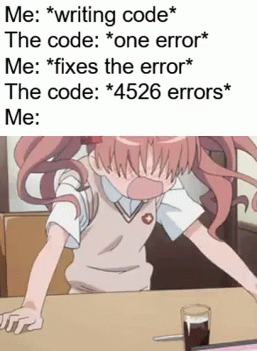

This one gets a bit technical, but stick with me. Imagine you come across the following code in some codebase:

```python
dates = [...]

def process_date(input):
	date = extract_date(input)
	dates.append(date)
	return date
```

If you were calling this function somewhere in your own code, how would you reason about how to use it? We have an `extract_date` function (defined elsewhere in the code), but we have no real sense of what this input parameter would be. Are we taking in strings as input? Are we taking in `datetime.datetime` objects? Does the `extract_date` function accept both, or do we need to ensure that we are only taking a specific type? And what does it even return? A `datetime.datetime` object? A string?

The fact that there are so many unknowns in even this very trivial example suggests a bigger problem: given that Python is a dynamically-typed language, how do we ensure that our codebase is robust? We not only care that things work as we'd expect them to work, but also that this code won't require excess maintenance or troubleshooting as long as it is part of our codebase.

The dynamic nature of Python allows us to develop with speed and be flexible, but that comes with a cost. If you're not being careful, it can be easy to trade short-term expediencey for long-term maintainability. This is the problem that type hinting tries to solve from a variety of angles. You use typecheckers like [`mypy`](http://mypy-lang.org/) to make sure you're actually doing what you said you would do in your code in terms of the types you're passing around between functions, and you have a boost in readability and communication that comes from your annotated function signatures. In the end, we want code that's easy to use, read and maintain. Type hints help move you a bit closer to that goal.

At ZenML, we use type hints and type checking extensively both in our codebase as well as our day-to-day workflow. This was something we introduced in a systematic way — [thanks](https://github.com/zenml-io/zenml/pull/117) [Michael](https://github.com/zenml-io/zenml/pull/137)! — for the [post-0.5.0 ZenML](https://blog.zenml.io/release_0_5_x/) and we haven't looked back!

I personally didn't have much experience working with types in Python prior to joining ZenML, so I read the first part of [Patrick Viafore](https://www.linkedin.com/in/patviafore)'s excellent book, ['Robust Python'](https://www.amazon.com/Robust-Python-Write-Clean-Maintainable/dp/1098100662?tag=soumet-20), to understand more. (I wrote a series of articles summarising the chapters in detail [here](https://mlops.systems/categories/#robustpython), so check that out if you want to dive a bit deeper.)

## Refresher: how are type hints used in Python?

Before getting into the specific details of how we use all this at ZenML, a quick review is probably in order. Take a look at the following type-hinted code:

```python
name: str = "alex"

def some_function(some_number: int, some_text: str = "some text") -> str:
	# your code goes here
	return "" # returns a string
```

You can see the different places that type annotations might appear. You can annotate variables in your code. I’ve seen this one less often, but it’s possible. Then you can have type annotations for the parameters when defining functions (some even with default values assigned). You can also have type annotations for the return value of those functions.

Note that type hints are not used at runtime, so in that sense they are completely optional and don’t affect how your code runs when it’s passed through the Python interpreter. (Type hints were introduced in Python 3.5, though there is a way to achieve the same effect using comments and a standard way of listing type annotations that way if you are stuck with a Python 2.7 😱 codebase.)

With some type annotations added to our code, we can use a typechecker like `mypy` to see whether things are really as we imagine. In Viafore’s own words:

> “type checkers are what allow the type annotations to transcend from communication method to a safety net. It is a form of static analysis.”

If your codebase uses type annotations [to communicate intent](https://mlops.systems/robustpython/python/books-i-read/2021/12/29/robust-python-1.html), and you’re using `mypy` to catch any of those type errors, remember that typecheckers only catch this certain type of errors. You still need to be doing testing and all the other best practices to help catch the rest.

There are [a variety of ways](https://mlops.systems/robustpython/python/books-i-read/2022/01/08/robust-python-4.html) to constrain different groupings of types, and some [special rules and syntax](https://mlops.systems/robustpython/python/books-i-read/2022/01/18/robust-python-5.html) for when you use type collections, but otherwise there isn't much you have to know to start skilfully annotating your function signatures.

# How does all of this work in practice at ZenML?

Though there are other type checkers — like [Pyre](https://pyre-check.org/) and [Pyright](https://github.com/microsoft/pyright) — we use `mypy` to keep us accountable and to statically analyse our codebase. It is the most commonly used option for type checking in Python and it does most of what you probably need it for. You can run it via the command line, inline as part of your IDE, or as part of a CI/CD pipeline. We do all three:

- via the command line: we have [a script](https://github.com/zenml-io/zenml/blob/main/scripts/lint.sh) which includes a call to `mypy` that gets used very regularly whenever code is changed.
- inline: [Pyright](https://github.com/microsoft/pyright) is easy to use with VS Code (via [the Pylance extension](https://marketplace.visualstudio.com/items?itemName=ms-python.vscode-pylance)) and provides visual cues as you write your code
- as part of our CI/CD pipeline: the script mentioned above [is called](https://github.com/zenml-io/zenml/blob/main/.github/workflows/main.yml) whenever new code is pushed to a branch as a PR, and whenever that code is merged into our [`develop`](https://github.com/zenml-io/zenml/tree/develop) or [`main`](https://github.com/zenml-io/zenml) branches.

You can configure `mypy` to your heart’s desire either with inline comments in your code, or via a configuration file. A configuration file is probably the way to go, particularly if you’re versioning your code and sharing these kinds of settings across a team. You can specify how strict you want `mypy` to be when checking your type hints. We err towards the more strict side of things, but the tool in general is flexible enough to support many different options along that strictness spectrum.

One extra trick that is pretty invaluable is how we use [`pre-commit`](https://pre-commit.com/) to [ensure that code is not throwing any `mypy` errors](https://github.com/zenml-io/zenml/blob/develop/.pre-commit-config.yaml) before a commit is allowed to be made. I'll be honest and admit that sometimes you get this fun workflow, where you fix one `mypy` error only to find many other errors get spawned as a consequence of the fix:



For the most part, however, I haven't found the mypy-enforced discipline around type hints to be much of a burden.

To sum up the benefits: using type hints and a typechecker make your code more robust because it allows you to clearly communicate intent and because it enforces some sort of discipline around how you pass types around your codebase.

If you have a large codebase which has *no* type hints or where they are unpredictably applied, there are a number of strategies mentioned in chapter seven of Viafore's 'Robust Python'. Possible options include:

- Focusing on the pain points — think about where the lack of type hints has already seen bugs emerge in the past
- Add type hints to new code only, and make a plan to add them to the old code slowly over time
- Type annotate the pieces of the codebase that actually drive the product or business’ profits — these are the ones that you care most that they are robust, so you might want to start there.
- Type annotate whatever is complex to understand — these are probably the areas where you could benefit from being explicit with what types are being passed in and around.

All of these are options and it will definitely depend on your particular situation.

Do you use type hints in your codebase? Come on over to [our Slack community](https://zenml.io/slack-invite/) and let us know!