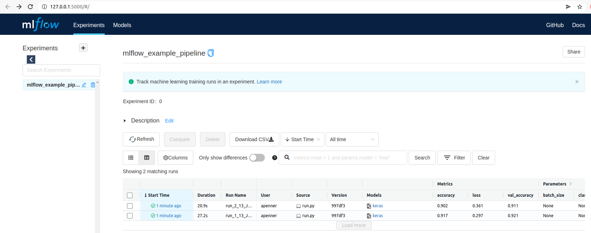
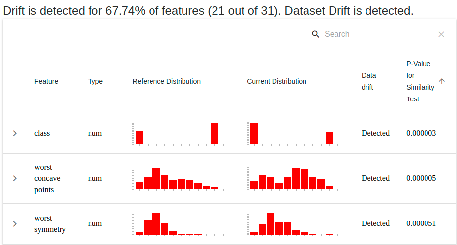

ZenML 0.5.7 is out now and we bring you not one but two brand new integrations to cover common use cases. ZenML now supports [MLFlow for tracking](https://www.mlflow.org/docs/latest/tracking.html) pipelines as experiments and [Evidently](https://github.com/evidentlyai/evidently) for detecting drift in your ML pipelines in production!

There are a bunch of other smaller changes, including preventing Kubeflow Pipelines from timing out during the local installation process and a bunch of improvements to the feedback that the ZenML CLI tool gives you. For a detailed look at what's changed, give [our full release
notes](https://github.com/zenml-io/zenml/releases/tag/0.5.7) a glance.

## MLFlow Tracking

[You voted](https://github.com/zenml-io/zenml/discussions/115), we integrated! This new addition of [MLFlow Tracking](https://www.mlflow.org/docs/latest/tracking.html) as part of ZenML's integrations means that you can track your training runs using MLFlow. This gives you a handy web UI that you can use to log and query your experiments. ZenML is tracking all of your parameters and metrics already, but you might prefer to visualise those changes in the MLFlow web UI.



We've [written an example](https://github.com/zenml-io/zenml/tree/main/examples/mlflow) that showcases the integration that you can check out by using the `zenml example pull mlflow` CLI command. The `README` file offers full instructions for how to set this up manually, but if you just want to try out the UI and let ZenML handle the local setup for you, just type `zenml example run mlflow`.

Watch this space for more MLFlow goodness coming your way!

## Evidently for Drift Detection

[Evidently](https://github.com/evidentlyai/evidently) is an open-source tool for detecting drift among your data inputs. Machine learning pipelines are built on top of those data inputs, so it is worth checking for drift if you have a model that was trained on a certain distribution of data.



The ZenML integration with Evidently implements this functionality in the form of several standardized steps. You select which of the profile sections you want to use in your step by passing a string into the `EvidentlyProfileConfig`. Possible options supported by Evidently are:

- "datadrift"
- "categoricaltargetdrift"
- "numericaltargetdrift"
- "classificationmodelperformance"
- "regressionmodelperformance"
- "probabilisticmodelperformance"

For example, you could define a step to detect drift using our standard interface in the following way:

```python
drift_detector = EvidentlyProfileStep(
    EvidentlyProfileConfig(
        column_mapping=None,
        profile_section="datadrift",
    )
)
```

Here you can see that defining the step is extremely simple using our class-based interface and then you just have to pass in the two dataframes when defining the pipeline for the comparison to take place.

```python
@pipeline
def drift_detection_pipeline(data_loader, full_data, partial_data, drift_detector):
    data_loader = data_loader()
    full_data = full_data(data_loader)
    partial_data = partial_data(data_loader)
    drift_detector(reference_dataset=full_data, comparison_dataset=partial_data)
```

As with MLFlow, we've [written an example](https://github.com/zenml-io/zenml/tree/0.5.7/examples/drift_detection) for you to see how it all works in code. You can check it out by using the `zenml example pull drift_detection` CLI command. The `README` file offers full instructions for how to set this up manually, but if you just want to try out the UI and let ZenML handle the local setup for you, just type `zenml example run drift_detection`.

## Contribute to ZenML!

Join our [Slack](https://zenml.io/slack-invite/) to let us know what you think we should build next!

Keep your eyes open for future releases and make sure to [vote](https://github.com/zenml-io/zenml/discussions/categories/roadmap) on your favorite feature of our [roadmap](https://zenml.io/roadmap) to make sure it gets implemented as soon as possible.

[Image credit: Photo by <a href="https://unsplash.com/@rustyct1?utm_source=unsplash&utm_medium=referral&utm_content=creditCopyText">Rusty Watson</a> on <a href="https://unsplash.com/s/photos/balloons?utm_source=unsplash&utm_medium=referral&utm_content=creditCopyText">Unsplash</a>]