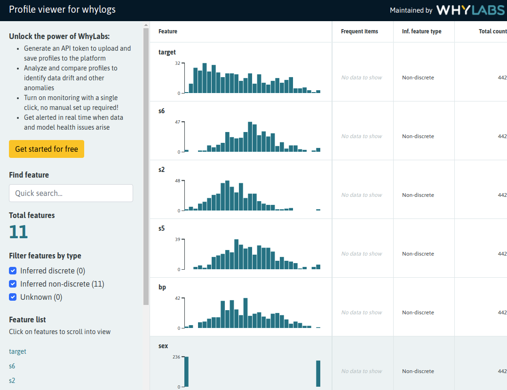

ZenML 0.6.0 is out now. We've made some big changes under the hood, but our
biggest public-facing addition is our new integration to support all your data
logging needs: [`whylogs`](https://github.com/whylabs/whylogs). Our core
architecture was
[thoroughly reworked](https://github.com/zenml-io/zenml/pull/305) and is now in
a much better place to support our ongoing development needs.

Smaller changes that you'll notice include extensive documentation additions,
updates and fixes. For a detailed look at what's changed, give
[our full release notes](https://github.com/zenml-io/zenml/releases/tag/0.6.0) a
glance.

## 📊 Whylogs logging

[Whylogs](https://github.com/whylabs/whylogs) is an open source library that
analyzes your data and creates statistical summaries called whylogs profiles.
Whylogs profiles can be visualized locally or uploaded to the WhyLabs platform
where more comprehensive analysis can be carried out.

ZenML integrates seamlessly with Whylogs and [WhyLabs](https://whylabs.ai/).
This example shows how easy it is to enhance steps in an existing ML pipeline
with Whylogs profiling features. Changes to the user code are minimal while
ZenML takes care of all aspects related to Whylogs session initialization,
profile serialization, versioning and persistence and even uploading generated
profiles to [Whylabs](https://whylabs.ai/).

With our `WhylogsVisualizer`, as described in
[the associated example notes](https://github.com/zenml-io/zenml/tree/main/examples/whylogs),
you can visualize Whylogs profiles generated as part of a pipeline.

## ⛩ New Core Architecture

We implemented
[some fundamental changes](https://github.com/zenml-io/zenml/pull/305) to the
core architecture to solve some of the issues we previously had and provide a
more extensible design to support quicker implementations of different stack
components and integrations. The main change was to refactor the `Repository`,
`Stack` and `StackComponent` architectures. These changes had a pretty wide
impact so involved changes in many files throughout the codebase, especially in
the CLI which makes calls to all these pieces.

We've already seen how it helps us move faster in building integrations and we
hope it helps making contributions as pain-free as possible!

## 🗒 Documentation and Example Updates

As the codebase and functionality of ZenML grows, we always want to make sure
our documentation is clear, up-to-date and easy to use. We made a number of
changes in this release that will improve your experience in this regard:

- added a number of new explainers on key ZenML concepts and how to use them in
  your code, notably on
  [how to create a custom materializer](https://docs.zenml.io/v/0.6.0/guides/index/custom-materializer)
  and
  [how to fetch historic pipeline runs](https://docs.zenml.io/v/0.6.0/guides/index/historic-runs)
  using the `StepContext`
- fixed a number of typos and broken links
- added versioning to our API documentation so you can choose to view the
  reference appropriate to the version that you're using. We now use `mkdocs`
  for this so you'll notice a slight visual refresh as well.
- added new examples highlighting specific use cases and integrations:
  - how to create a custom materializer
    ([example](https://github.com/zenml-io/zenml/tree/0.6.0/examples/custom_materializer))
  - how to fetch historical pipeline runs
    ([example](https://github.com/zenml-io/zenml/tree/0.6.0/examples/fetch_historical_runs))
  - how to use standard interfaces for common ML patterns
    ([example](https://github.com/zenml-io/zenml/tree/0.6.0/examples/standard_interfaces))
  - `whylogs` logging
    ([example](https://github.com/zenml-io/zenml/tree/0.6.0/examples/whylogs))

## ➕ Other updates, additions and fixes

As with most releases, we made a number of small but significant fixes and
additions. The most import of these were that you can now access the metadata
store via the step context. This enables a number of new possible workflows and
pipeline patterns and we're really excited to have this in the release.

We added in a markdown parser for the `zenml example info …` command, so now
when you want to use our CLI to learn more about specific examples you will see
beautifully parsed text and not markdown markup.

We improved a few of our error messages, too, like for when the return type of a
step function doesn’t match the expected type, or if step is called twice. We
hope this makes ZenML just that little bit easier to use.

## 🙌 Community Contributions

We received [a contribution](https://github.com/zenml-io/zenml/pull/317) from
[Bhuwan Bhatt](https://github.com/bhattbhuwan13), in which he fixed a
documentation error. Thank you, Bhuwan!

## Contribute to ZenML!

Join our [Slack](https://zenml.io/slack-invite/) to let us know what you think
we should build next!

Keep your eyes open for future releases and make sure to
[vote](https://github.com/zenml-io/zenml/discussions/categories/roadmap) on your
favorite feature of our [roadmap](https://zenml.io/roadmap) to make sure it gets
implemented as soon as possible.

[Image credit: Photo by <a
href="https://unsplash.com/@rustyct1?utm_source=unsplash&utm_medium=referral&utm_content=creditCopyText">Rusty
Watson</a> on <a
href="https://unsplash.com/s/photos/balloons?utm_source=unsplash&utm_medium=referral&utm_content=creditCopyText">Unsplash</a>]
