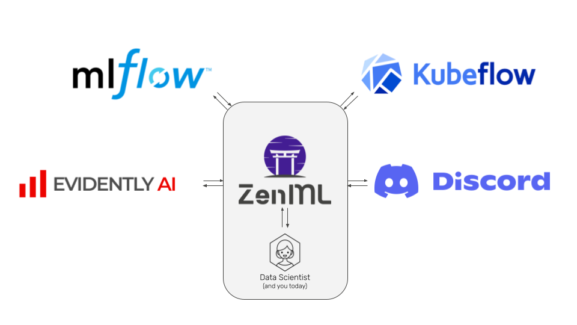
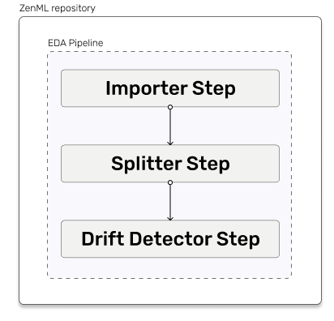
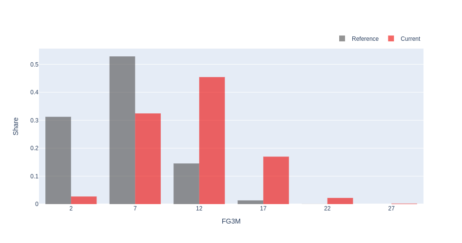
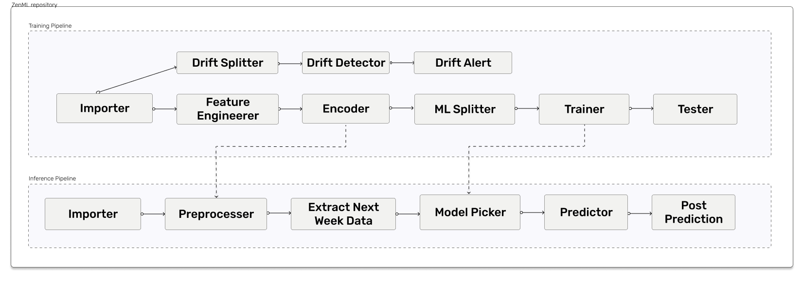
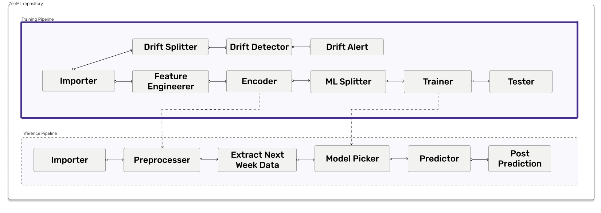
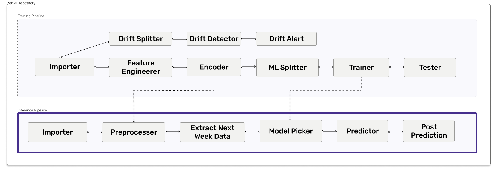
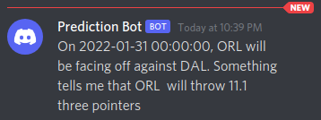

# The Gameplan

Before diving headfirst into this challenge, we got together as a team and brainstormed what our ZenHack was going to
be about.

A ZenHack is a small internal hackathon with the intention of taking an idea into production using ZenML. 
This serves a few purposes. 
For one, it gives us as the ZenML team a direct insight into user experience. As such one of
the side effects is a bouquet of fresh new user-stories, tasks and sometimes bugs to fix. 
Another benefit of our ZenHack is to show off our newest features and how they can be assembled into a killer
machine learning stack. 

For this ZenHack specifically we had quite a few new features to showcase. We wanted to show off how to use 
[evidently](https://evidentlyai.com/) for drift detection, [mlflow](https://mlflow.org/) for model tracking 
and [kubeflow pipelines](https://www.kubeflow.org/) for orchestration of scheduled repeating pipeline runs. 



As we have some hardcore NBA fans on the team, the idea of creating a prediction bot for NBA matches came up. This idea
caught on quickly and our minds started to put together the story that we wanted to explore.

## Step 1 - Analyze our Data

Without data there is no pipeline. Luckily for us the [nba](www.nba.com) offers an api with a lot of current and
historical datapoints. Additionally, there is an easy-to-use python wrapper out there, that made our lives even easier
([nba_api](https://readthedocs.org/projects/nba-api/)).  

After some rummaging through the many endpoints, we found data for every regular season match going back to 2000. 
This raw data contains the two teams, the date, time and season of the match as well as a bunch of 
game stats. Exactly what we were looking for!

### Did Steph Curry change how the game is played?

With data in hand, it was time to explore our data. As we were looking to predict three pointers thrown in a match it 
only seemed fitting to analyze how the king of three-pointers, Stephen Curry, impacted the role that three-pointers play
in nba matches. This sounds very much like a drift detection problem. 
[Here](https://medium.com/data-from-the-trenches/a-primer-on-data-drift-18789ef252a6) is a nice article explaining what
data drift is. 

To detect datadrift you generally need a reference dataset. When new data comes in, its distribution is compared to the 
reference data, in order to determine if data has drifted.
This is exactly the question we want to answer here. Has Stephen Curry impacted the distribution of the amount of 
three-pointers in nba matches? To calculate this, we need to choose a point in time to delineate a 'before' from an
'after' Curry. We chose the date of [this](https://www.youtube.com/watch?v=GEMVGHoenXM) legendary game of
the Golden State Warriors, Curry's team, against Oklahoma City. 


### Evidently 

For drift detection we have an integration of evidently that we can leverage. Evidently helps evaluate and monitor 
machine learning data and models in production. Check out our blogpost on the evidently integration 
[here](https://blog.zenml.io/zenml-loves-evidently/) to learn more.

Regarding our question about Curry's impact, there are only a few steps needed to perform the necessary data 
exploration.

1. We need to import the data from the nba -> `Importer Step`
2. We need to split our data around our chosen delineation date __2016-02-27__ -> `Splitter Step`
3. We need to let evidently do what they are best at, analyze data.-> `Drift Detector Step`



With these steps implemented and easily connected within a ZenML pipeline all that is left to do is to run the 
pipeline and look at the beautiful visualization that evidently offers:



As you can see here, we were quickly able to go from data and initial question to a full blown pipeline and an answer to
our question. It appears that the data has drifted ever since 2016-02-27. This might not be undeniable proof for the 
claim made about Stephen Curry's impact on the game. But it is a compelling correlation.


## Step 2 - Building our Continuous Pipelines 

With the data exploration behind us, lets advance onto the continuous pipelines. Within or brainstorming session we
came up with a diagram very similar to the one below, albeit a bit less organized. 



Let us unpack this diagram together. The objective of this ZenHack was for us to periodically receive predictions for 
upcoming nba matches in our discord channel. So what do we need to get there? Well on the highest level of abstraction
we need two separate entities. One **continuous training pipeline** and a **prediction pipeline**.

### Training pipeline



The training pipeline needs to take in historical data for a given timeframe and spit out a trained model at the other 
end. Here is a short description for all the steps we deemed necessary to get from input to output.

1. Importer - Imports data from nba.com for a given set of Seasons
2.Feature Engineer - Additionally filter data by time and add Opponent Column to each row
3. Encode - Encode Season ID and Team Abbreviations for the benefit of the model
4. ML Splitter - Split the dataset into train, eval and test set
5. Trainer - Train a Model to predict on the data
6. Tester - Test the performance of the model

On the other branch:
2. Drift Splitter - Split data at 7 days ago
3. Drift Detector - Check if the last 7 days of games have drifted away from the past years of data
4. Drift  Alert - Send a message to discord so that we can intervene

### Prediction Pipeline



The prediction pipeline on the other hand needs a schedule for upcoming matches as the input and should
post our prediction to our discord chat. To achieve this we have also split the problem into a few distinct steps.
1. Importer - Import game schedule from a different data source
2. Preprocessor - Massage data into the same table format that the model was trained and apply the same encoding
   1. Note that this is another point where **ZenML** makes it super easy to take outputs from steps in different
   pipelines
3. Extract Next Week Data - Here we filter to only use the next weeks schedule
4. Model Picker - Decide which model to pick based on scores of the test set in the training pipeline
5. Predictor - Run an inference on the matches for the upcoming week
6. Post Prediction - This step has actually turned into two
   1. Data Postprocessor - To turn one hot encodings back into a human-readable form
   2. Discord Poster - To post our predictions to discord

### Mlflow tracking

The [MLflow Tracking](https://mlflow.org/docs/latest/tracking.html) component is an API and UI for logging parameters, 
code versions, metrics, and output files when running your machine learning code and for later visualizing the results.

We at ZenML are currently actively working on deeply integrating with MLflow and making it as easy as possible
to utilize mlflow within your ZenML pipelines. For this ZenHack we used MLflow tracking for its visualization. 
Keep your eyes peeled though, we have some more MLflow related features coming up in our next releases. 

Within our ZenHack only two lines of code were really necessary to liftoff with MLflow.

1. Enabling mlflow for out pipeline
```python
@enable_mlflow
@pipeline
def pipeline_entrypoint(....):
    ...
```
This configures the mlflow backend and the experiment name and establishes a connection between a ZenML pipeline run and
a mlflow run.

2. Select what to log in code
```python
...
mlflow.sklearn.autolog()
clf = RandomForestRegressor(max_depth=config.max_depth)
...
```

And with just that, we have mlflow tracking in our pipeline. The mlflow ui can now be started from within our
jupyter notebook:

```
!mlflow ui --backend-store-uri '{local_mlflow_backend()}' --port 4999
```

And like that we can use the mlflow ui to quickly compare runs and analyze the different runs.

### Kubeflow Pipelines and Scheduled Runs

[Kubeflow Pipelines](https://www.kubeflow.org/docs/components/pipelines/introduction/) is a platform for building and 
deploying portable, scalable machine learning (ML) workflows based on Docker containers.

Check out our [docs](https://github.com/zenml-io/zenfiles) to find out how to quickly go from standard pipeline 
orchestration to using kubeflow pipelines for your own applications.

Within our ZenHack we used Kubeflow as the orchestration backend for our scheduled training. After some configuration 
steps (see screenshot below) Kubeflow Pipelines runs locally. 


The python script that is called in the last line of the screenshot instantiates the pipeline and starts a 
Scheduled run. For demonstration purposes we have choosen to repeat every 10 minutes here. 

```python
train_pipe = training_pipeline(
    importer=game_data_importer(),
    ...
    drift_alert=discord_alert(),
)

train_pipe.run(
    schedule=Schedule(start_time=datetime.now(), interval_second=600)
    )
```

### Discord Step

"If a tree falls in a forest and no one is around to hear it, does it make a sound?". Well we won't tackle that 
philosophical question here. But what is the point of training and prediction on models if those predictions
are never heard or seen?

This is why we implemented a small discord-posting step that takes our ZenHack a step further. Once we deploy the 
training and prediction pipelines on a schedule we can see the prediction for the upcoming game on discord.

Here is the very first prediction posted at 10:39 CET on 30.01.2022:



And somehow our very first prediction came true. Approximately 4 1/2 hours later Orlando Magic concluded their 
[match](https://statsdmz.nba.com/pdfs/20220130/20220130_DALORL_book.pdf) against the Dallas Mavericks with 11 
three pointers.


## The Endgame

This ZenHack was a special one for us, as there was an additional motive behind it. We had the privilege of presenting 
ZenML at a Meetup organized by [MLOPs.community](https://mlops.community/) on the 26.01.2022. Just in time for this 
meetup we pulled off a clutch play of our own. With just a few minutes to spare we put together all the pipelines 
within the ZenHack and released ZenML 0.6.0, so that participants could code along while we walked through the ZenHack.

Come check out the vod of this meetup [here](). In it our founder 
[Hamza Tahir](https://www.linkedin.com/in/hamzatahirofficial/) was in an interactive live coding session together with
[Ben Epstein](https://www.linkedin.com/in/ben-epstein/) with this ZenHack as a basis.

## Conclusion

This ZenHack truly was a fun adventure for us to embark upon. There were so many aspects to it, which makes coming up
with concise conclusions not very easy. So lets split them up a bit:

### What I hope you can take away from this

1. If you too want a discord bot that predicts nba games for you, checkout the code
[here](https://github.com/zenml-io/nba-ml-pipeline). Feel free to improve the underlying models or steps and make a 
pullrequest. We are eager for your feedback, so if you run into any issues or if you like what you see, come join us on
[Slack](https://zenml.io/slack-invite/) and let us know!

2. If you have an idea similar to ours and quickly want to go from **idea** to **continuous training/inference** , then
**ZenML** is the way to get there.

### My takeaways

1. Personally, I got to know ZenML from a very different angle which is an awesome way to inform our vision 
going forward.
2. These ZenHacks are an amazing way to really user test our code. The few smaller issues we found during this ZenHack 
were directly put into tickets and have been solved already. It is a real testament how fast we can move .

Image credit: Photo by [Markus Spiske](https://unsplash.com/@markusspiske) on [unsplash](https://unsplash.com)
