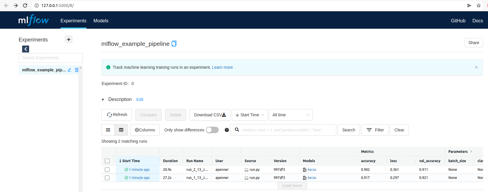

Most professional or so-called 'citizen' data scientists will be familiar with the scenario that sees you spending a day trying out a dozen different model training configurations in which you experiment with various hyper parameters or perhaps different pre-trained models. As evening falls, you emerge from the haze of experimentation and you ask yourself: which of my experiments offered the best results for the problem I'm trying to solve?

At this point, especially for smaller use cases or where you were unsure if a hunch was worth pursuing and just wanted to try a few things out, you might be left empty-handed, unable to give an answer one way or another beyond some hunch that there *was* one set of parameters that really performed well, if only you could remember what they were… And if someone asked you to reproduce the steps it took you to create a particular model, would you even be able to do that?

<iframe src="https://giphy.com/embed/NzQSHl01OBLkk" width="480" height="270" frameBorder="0" class="giphy-embed" allowFullScreen></iframe><p><a href="https://giphy.com/gifs/angry-computer-regular-show-NzQSHl01OBLkk">via GIPHY</a></p>

This would be one of those times where it's worth reminding ourselves that data science includes the word 'science', and that we need to be careful around how we track and reason about models. The workflows and practice of machine learning is sufficiently complicated (and often non-deterministic) that we need rigorous ways of ensuring that we really are doing what we think we are doing, and that we can reproduce our work. (It's not for nothing that 'reproducibility' is [often](https://petewarden.com/2018/03/19/the-machine-learning-reproducibility-crisis/) [paired](https://www.technologyreview.com/2019/02/18/137357/machine-learning-is-contributing-to-a-reproducibility-crisis-within-science/) with 'crisis'.)

There are manual ways that you could use to help address this problem, but they're unlikely to be sufficient. Will your spreadsheet experiment tracker really capture *everything* you needed to produce a particular model? (Think about how the particular configuration or random split of data is so central to how your model performs.) What you really want is something that will handle all this tracking of data and parameters, in as automatic a way as is possible.

<iframe src="https://giphy.com/embed/JWuBH9rCO2uZuHBFpm" width="480" height="480" frameBorder="0" class="giphy-embed" allowFullScreen></iframe><p><a href="https://giphy.com/gifs/Giflytics-JWuBH9rCO2uZuHBFpm">via GIPHY</a></p>

# Why use MLflow Tracking?

Enter, [MLflow Tracking](https://mlflow.org/docs/latest/tracking.html), part of [a wider ecosystem](https://mlflow.org/docs/latest/concepts.html) of tooling offered by MLflow to help you train robust and reproducible models. Other commonly-used pieces are [the model registry](https://mlflow.org/docs/latest/model-registry.html) (which stores any model artifacts created during the training process) as well as  their flexible suite of plugins and integrations allowing you to [deploy the models](https://mlflow.org/docs/latest/models.html#built-in-deployment-tools) you create.

MLflow Tracking is what allows you to track all those little parts of your model training workflow. Not only does it hook into an artifact store of your choosing (such as that offered by ZenML), but it offers a really useful UI interface which you can use to inspect pipeline runs and experiments you conduct. If you want to compare the performance or accuracy of several experiments (i.e. pipeline runs), some diagrams and charts are only a few clicks away. This flexible interface goes a really long way to solving some of the problems mentioned earlier.

One really useful feature offered by MLflow Tracking is that of [automatic logging](https://mlflow.org/docs/latest/tracking.html#automatic-logging). Many commonly-used machine learning libraries (such as `scikit-learn`, Pytorch, `fastai` and Tensorflow / Keras) support this. You either call `mlflow.autolog()` just before your training code, or you use a library-specific version of that (e.g. `mlflow.sklearn.autolog()`). In this way, MLflow will handle logging metrics, parameters and models without the need for explicit log statements. (Note that you can also include the [non-automated logging](https://mlflow.org/docs/latest/tracking.html#logging-data-to-runs) of whatever custom properties are important for you.

## ZenML + MLflow Tracking = 🚀

If you're using ZenML to bring together the various tools in your machine learning stack, you'll probably be eager to use some of this tracking goodness and make your own experiments more robust. ZenML actually *already* partly supported what MLflow Tracking does in the sense that any artifacts going in or out of the steps of your ZenML pipeline were being tracked, stored and versioned in your artifact and metadata store. (You're welcome!) But until now we didn't have a great way for you to interact with that metadata about your experiments and pipeline runs that was non-programmatic and also visual.

MLflow Tracking gives you that ability to inspect the various experiments and pipeline runs in the (local) web interface and is probably going to be a friendlier way of interacting with and reasoning about your machine learning experiments.



You could have used MLflow Tracking in the past, too, but with our latest integration updates ZenML handles some of the boilerplate complicated setup that comes with using MLflow. There are [different ways](https://mlflow.org/docs/latest/tracking.html#where-runs-are-recorded) of deploying the tracking infrastructure and servers and it isn't a completely painless task to set all this up and to get going with MLflow Tracking. This is where we make your life a bit easier: we setup everything you need to use it on your (currently: local) machine, connecting the MLFlow Tracking interface to your ZenML artifact store. It can be a bit tricky to configure the relevant connections between the various modular pieces that talk to each other, and we hide this from you beneath an abstraction.

We think that this ability to converse between the MLflow universe and the ZenML universe is extremely powerful, and this approach is at the heart of what we are trying to build with our tool to help you work with reproducible and robust machine learning pipelines.

## Just tell me how to use it already!

The best place to see MLflow Tracking and ZenML being used together in a simple use case is [our example](https://github.com/zenml-io/zenml/tree/main/examples/mlflow_tracking) that showcases the integration. It builds on the quickstart example, but shows how you can add in MLflow to handle the tracking. In order to enable MLflow to track artifacts inside a particular step, all you need is to decorate the step with `@enable_mlflow` and then to specify what you want logged within the step. Here you can see how this is employed in a model training step that uses the `autolog` feature I mentioned above:

```python
# Define the step and enable mlflow - order of decorators is important here
@enable_mlflow
@step
def tf_trainer(
    config: TrainerConfig,
    x_train: np.ndarray,
    y_train: np.ndarray,
) -> tf.keras.Model:
    """Train a neural net from scratch to recognize MNIST digits return our
    model or the learner"""
    model = tf.keras.Sequential(
        [
            tf.keras.layers.Flatten(input_shape=(28, 28)),
            tf.keras.layers.Dense(10),
        ]
    )

    model.compile(
        optimizer=tf.keras.optimizers.Adam(config.lr),
        loss=tf.keras.losses.SparseCategoricalCrossentropy(from_logits=True),
        metrics=["accuracy"],
    )

    mlflow.tensorflow.autolog()
    model.fit(
        x_train,
        y_train,
        epochs=config.epochs,
    )

    # write model
    return model
```

While running MLflow from your code, you need to specify global configuration parameters (which then goes on to define how experiments and runs are displayed and stored in the MLflow Tracking UI/system), but beyond that it's pretty easy to use. You specify these global parameters by initializing and setting an `Environment` object:

```python
zenml.integrations.mlflow.mlflow_environment import MLFLOW_ENVIRONMENT_NAME

mlflow_env = Environment()[MLFLOW_ENVIRONMENT_NAME]
```

Check out [the API docs](https://apidocs.zenml.io/0.6.1/api_docs/environment/) to learn more about the `Environment` object and watch this space for a blog post where we explain more about why we chose to add this recently.

# Over to you now!

If you're inspired by this illustration of how you can make your machine
learning workflow that little bit more reproducible and robust, check out [the
full
example](https://github.com/zenml-io/zenml/tree/main/examples/mlflow_tracking)
that illustrates the integration. If you use it in your own code base, please do
let us know — [say hi on Slack](https://zenml.io/slack-invite/)! — and as always
if you have any questions, we're here for you.
