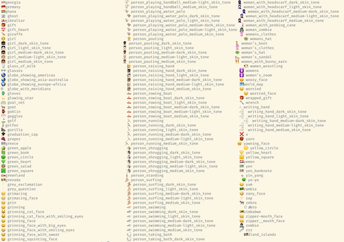

For an open-source tool without a web frontend, one of the main ways users will interact with [ZenML](https://github.com/zenml-io/zenml) is [our command-line interface or CLI](https://apidocs.zenml.io/0.6.1/cli/). I recently worked on an effort to improve the visual experience of anyone using our CLI by integrating the popular open-source library, [`rich`](https://github.com/Textualize/rich), into the code base.

The items that follow are what I consider to be low-hanging fruit for any CLI that is written in Python. You may already have custom solutions or use specific packages that offer certain features. It might be worth considering just getting all of that CLI and terminal goodness from [`rich`](https://github.com/Textualize/rich), however, given that it does so much for you with relatively little dependency bloating that you perhaps might expect.

## 1. All the Emojis!


Let's cover the important one first 😉: `rich` offers full support for emojis in your CLI interfaces. I'm being slightly flippant here, but only slightly. You may be familiar with emojis as used in chat apps such as the winking face above, but there are hundreds of other, potentially more useful, emojis that you might want to use.

For the ZenML CLI, we went with a ✅ tick emoji to indicate that [an integration](https://docs.zenml.io/features/integrations) was installed when listing the available and supported integrations. We also chose a 👉 pointing hand emoji to indicate which component or stack was currently activated among the various configurations that we allow you to construct. Nothing too fancy in either case, but I think they're more useful and communicative as a user than the other options (like an asterisk, for example). (You'll see examples of how we used them below.)

You can view a list of all the supported emojis by running `python -m rich.emoji` (after `pip` installing `rich`).

## 2. Markdown parsing



Our CLI allows users to view information about [the examples we provide](https://blog.zenml.io/examples-cli/) to showcase how ZenML works (and how it can be used). Each example already contains a markdown `README.md` file with information about the implementation, installation instructions and so on.

We didn't want to duplicate work that had already gone into creating those information sheets, so we used them to allow the user to learn about the examples. A simple `zenml example info mlflow_tracking` was used to output the raw text of the markdown file. For obvious reasons, this wasn't satisfactory from a usability perspective.

Now, with `rich`, we have a way to parse the raw markdown markup and display it as a rich document. What's more, we use [the `pager`](https://rich.readthedocs.io/en/stable/reference/console.html?highlight=pager#rich.console.Console.pager) which gives a familiar interface to anyone interacting with the info document. (In fact, it was searching for an option to handle this markdown parsing that first saw us discover `rich` and all the other things it does.)

## 3. Beautiful, Informative Tracebacks


Errors are often where the rubber meets the road in software projects. When you're developing you want those error messages to be informative, clear and not some kind of runic message you have to decode.

With `rich`, you get a complete redesign of how [tracebacks](https://rich.readthedocs.io/en/stable/traceback.html) are displayed, one that I have found far more useful when trying to understand why a particular code change has caused an error. Moreover, you have the option to have local variables displayed alongside the stack trace message, all neatly boxed up to make it clear what you're looking at.

Enabling this as the default way to display Python tracebacks is as simple as adding the following to somewhere that always gets loaded:

```python
from rich.traceback import install
install(show_locals=True)
```

## 4. `print()` gets a makeover


Just like tracebacks in `rich` are better than the Python defaults, you also have [a better `print`](https://rich.readthedocs.io/en/stable/introduction.html#quick-start). Standard data structures like dicts and lists are converted to strings, syntax highlighting is added and they are clearly presented.

We don't actually use any `print` statements in our CLI tool, but through `rich` our users get access to it for their own purposes, be it debugging or otherwise.

## 5. Inspect your objects


I have been using [`inspect`](https://rich.readthedocs.io/en/stable/introduction.html#rich-inspect) from `rich` ever since I first saw it used. Like most things in this post, it is a convenience function that offers a better default to standard Python ways of inspecting an object. See the above illustration of what the output looks like. If you pass in `methods=True` you'll see what methods can be called on that object. If you pass in `docs=True` you can read the docstrings for that object.

Like `print`, we don't currently use this anywhere in the outputs of our CLI tool, but we have plans to add some of this output and users have full access to `inspect` in their own pipelines.

## 6. Status Spinners


When someone tells you that they upgraded their CLI tool, spinners are what you expect. Who doesn't love a good spinner!? We added only one (when you call `zenml init`) but probably will use more as our tool grows.

You can get a good idea of the kinds of spinners available by running `python -m rich.status` which will output a sort of demo with some spinners. Adding this into your code is painless with a simple context manager:

```python
with console.status("Doing really important work…"):
    # do something here
```

## 7. Progress Bars


The next step up from a spinner is [a progress bar](https://rich.readthedocs.io/en/stable/progress.html). You get these with `rich` and they're easy to set up:

```python
from rich.progress import track

some_iterable = []
for n in track(range(len(some_iterable)), description="Doing important things…"):
    # do something here with the iterable's values 
```

Not only do these progress bars offer a visual indication of your progress, `rich` also does some background calculations and it suggests an approximate time until completion (based on how quickly you move through the elements).

## 8. Tables


We use all sorts of [tables](https://rich.readthedocs.io/en/stable/tables.html) in our CLI. We display the integrations you have installed, the stacks you have set up, the examples available for download and so on.

A clear table is an easy win to make it easier for the user to interact with CLI output. You can get much, much more with advanced `rich` tabular composition features, but probably you don't need anything complicated. You just need a table with lines where previously you didn't have that.

## 9. Customised message styles


If you have an application of more than minimal complexity you will likely want to have different variations of how you output to the terminal. Maybe you want specific colours for warning or error messages, or there's a particular style that should only be used in certain situations. For all that, `rich` offers a, well, rich API and set of functionality that allows you to output pretty much everything you'd want to the terminal.

Check out [the docs](https://rich.readthedocs.io/en/stable/console.html) for the full details, but `rich` will handle any kind of styling and colours that you want to include, justification and alignment within the boundaries of the terminal, soft wrapping, and so on.

## 10. The `rich` logging handler

[a code snippet? as an image?]

We haven't fully committed to this yet in the ZenML CLI, but if you want all `rich`'s goodies in all of your CLI output, use the `rich` logging handler. Simply set [the `RichHandler`](https://rich.readthedocs.io/en/stable/logging.html) as (one of your) logging handlers when you're configuring your `logging` setup.

In this way, you'll get access to everything that `rich` offers, except now it's in your logs. You probably want to be careful with this, especially if logs are in any sense mission-critical, since the console markup might cause issues when reviewing those logs at a later date. It's nevertheless a full-featured way of handling your logging output and if you don't already have a custom setup, this is probably worth checking out.

***

[Let us know](https://zenml.io/slack-invite/) if you end up using these tips and the `rich` library to spruce up your CLI! Get the latest version of ZenML to use all our latest richified CLI goodness.

*Alex Strick van Linschoten is a Machine Learning Engineer at ZenML.*