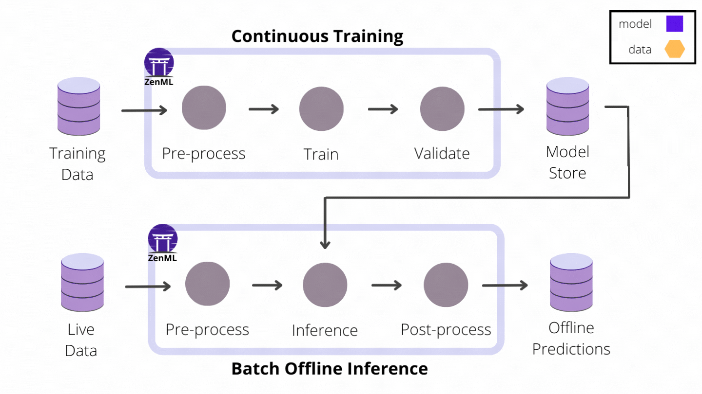
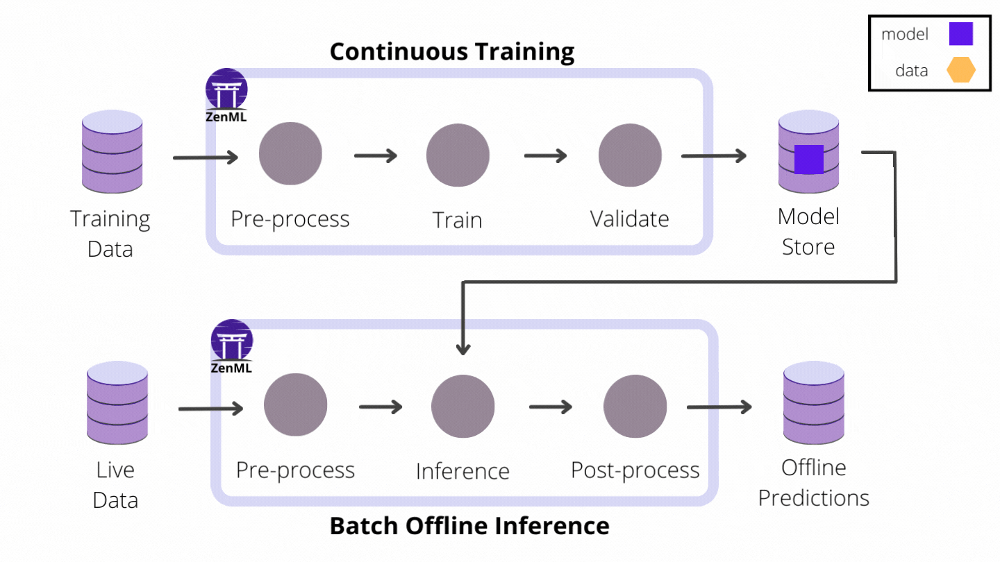
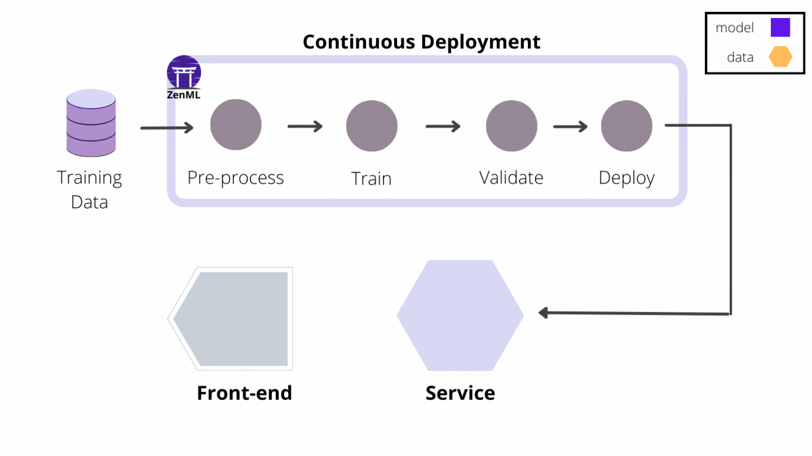

There is something particularly memorable about that moment of achievement
that comes after automating the training of a machine learning model, when
everything in the universe just seems to come into alignment. Your training
pipeline is properly set up to load new data from relevant sources, it is
scheduled to run daily or weekly and more importantly, it automatically
re-trains and validates models when necessary. This is a good place to be
and you worked hard to get here. It's time to sit back, enjoy a few moments of
well earned bliss and let someone else worry about taking the models to
production.

<iframe src="https://giphy.com/embed/Q79Xp6bkWLSmvAuPUa" width="480" height="400" frameBorder="0" class="giphy-embed" allowFullScreen></iframe><p><a href="https://giphy.com/gifs/Friends-season-2-episode-15-friends-tv-Q79Xp6bkWLSmvAuPUa">via GIPHY</a></p>

If you are still someone who relates to this story, then you will be surprised
to know that this staged approach to ML development is quickly becoming a thing
of the past. Machine Learning is moving towards a more streamlined development
model, one that combines continuous training together with continuous model deployment
to production to achieve faster development cycles and better quality.
In this new discipline, production readiness is not something you leave to the
last minute, but rather something you consider early on and improve with
each iteration.

However good they may be, it is nonetheless understandable why exercising these
ideas is difficult. Automating the deployment of models to production brings
many challenges that draw in the collaborative efforts of all roles in the
Machine Learning team, in particular Data Scientists and ML Engineers:

* bridging the gap between the flexibility of the experimentation phases and the
rigors of deploying and operating models in production
* ensuring that models meet production requirements and cost constraints
* dealing with matters related to infrastructure
* having to use a plethora of tools that not everyone in the ML team is equally
accustomed to
 
Equally important is that best practices like versioning and lineage need to
extend well into model deployment and monitoring to ensure that observability
and auditing are available for the complete end-to-end journey that both models
and data take from experimentation to production.

Helping ML practitioners and organizations overcome these obstacles is precisely
what the ZenML framework was created for. ZenML's main focus has always been
facilitating the development of ML pipelines that are portable and reproducible
across infrastructure domains and ML tool stacks. Recently, with the 0.6.2 ZenML
release, that focus has been extended to also cover the continuous deployment
of models to production.

# Introducing ZenML Services 

If your project only utilizes models for offline batch inference, you don't have
to leave the comfortable confines of the pipeline paradigm: predictions can
be precomputed with a batch inference pipeline scheduled to run periodically in
production. The inference pipeline loads up the latest model from storage, runs
it on a batch of recently collected data and saves the prediction results in an
external database or object storage where the application can access them.




However, if your user-facing application relies on real-time predictions made
on live data and low latency is critical to ensuring a good user experience,
you can no longer afford the overhead of loading models on-demand. In this case,
automating the end-to-end ML workflow is not complete without continuously
deploying models to some form of model prediction server or service platform.

The online inference use-case introduces a new challenge: managing the
life-cycle of multiple model prediction service instances. You also have to keep track of
their configuration and state in a way that doesn't create an operational gap
between them and the rest of the ML workflow. _Services_ are a new ZenML core
abstract concept introduced in the 0.6.2 release that seamlessly connects
pipelines and external runtime environments such as prediction servers and
provides a unified view of the different moving pieces that make up the
automated ML workflow.

In contrast to pipelines -- that use the run-to-completion execution model -- a
Service is the representation of a long-running standalone process that is
uniquely identifiable, has a well-defined operational state and can be
provisioned and updated independently of other services and pipelines. A Service
usually exposes one or more endpoints (e.g. HTTP, gRPC, etc.) through which it
can be accessed by clients remotely to perform various functions. A concrete
category of ZenML Services are those used for model serving:
[TensorFlow Serving servers](https://www.tensorflow.org/tfx/guide/serving),
[MLFlow deployments](https://mlflow.org/docs/latest/models.html#built-in-deployment-tools), [KServe's InferenceService](https://kserve.github.io/website/0.8/get_started/first_isvc/) instances and [Seldon Core's SeldonDeployment](https://docs.seldon.io/projects/seldon-core/en/latest/workflow/overview.html#seldon-deployment-crd) instances. All these
services expose an inference HTTP API endpoint that can be used to generate
predictions from input data.

Let's take a tour of the main improvements that ZenML Services bring to the
Machine Learning model development workflow. We'll use model serving as our
example, although ZenML Services are an overarching concept that can be applied
generally to any type of long-running service that needs to be involved in the
ML life cycle.

## Track and Manage Services Continuously through Pipeline Steps

Perhaps the best and most obvious feature that you get out of using Services
with ZenML pipelines is that they are automatically tracked and managed by
ZenML. This is particularly useful for continuous model deployment, where the
complications of provisioning and updating model prediction servers with the
latest available models are seamlessly integrated in the familiar pipeline
workflow and abstracted away from the user.



The [MLflow Deployment Service example](https://github.com/zenml-io/zenml/tree/main/examples/mlflow_deployment)
showcases the first of several concrete ZenML prediction service integrations to
follow that take away the burden of managing and maintaining model prediction
servers and make implementing continuous deployment a breeze. Here are some
relevant sections from that example that capture the experience of building
a continuous deployment pipeline:

```python
from zenml.integrations.mlflow.steps import (
    mlflow_deployer_step,
    MLFlowDeployerConfig,
)
from zenml.pipelines import pipeline
from zenml.steps import BaseStepConfig, step

...

class DeploymentTriggerConfig(BaseStepConfig):
    """Parameters that are used to trigger the deployment"""

    min_accuracy: float

@step
def deployment_trigger(
    accuracy: float,
    config: DeploymentTriggerConfig,
) -> bool:
    """Implements a simple model deployment trigger that looks at the
    input model accuracy and decides if it is good enough to deploy"""

    return accuracy > config.min_accuracy

model_deployer = mlflow_deployer_step(name="model_deployer")

...

@pipeline
def continuous_deployment_pipeline(
    importer,
    normalizer,
    trainer,
    evaluator,
    deployment_trigger,
    model_deployer,
):
    # Link all the steps artifacts together
    x_train, y_train, x_test, y_test = importer()
    x_trained_normed, x_test_normed = normalizer(x_train=x_train, x_test=x_test)
    model = trainer(x_train=x_trained_normed, y_train=y_train)
    accuracy = evaluator(x_test=x_test_normed, y_test=y_test, model=model)
    deployment_decision = deployment_trigger(accuracy=accuracy)
    model_deployment_service = model_deployer(deployment_decision)
```

Let's analyze what happens when the continuous deployment pipeline is executed:

* the first part of the pipeline should be very familiar to you by now: new
training data is loaded, processed and a new model is trained and evaluated on
it
* the `deployment_trigger` step does a simple analysis of the model metrics,
the accuracy to be more precise, and decides if the model is fit for deployment
* the built-in MLflow `model_deployer` step takes that decision into account
and, if the decision is positive, it deploys the newly trained model using a
local MLflow deployment server. Moreover, if a deployment server is already
running, probably started by one of the previous pipeline runs, this step also
updates it automatically to replace the old model version with the new one.

Note how the model deployment Service is returned as an output Artifact by the
`model_deployer` step. This allows it to be passed on to subsequent pipeline
steps that may want to interact with the prediction service. The Service is also
stored in the Artifact Store as a ZenML Artifact, which brings us to the next
topic...

## Store Services as Artifacts

<a href="https://imgflip.com/i/675obz"></a>
<p><a href="https://imgflip.com/memegenerator">from Imgflip Meme Generator</a></p>

At first sight, this is a bit confusing. Of course, there exist sophisticated
technologies that allow "freezing" runtime processes, containers, virtual
machines and Millennium Falcon captains and storing their state in a way that
can be used later on to revive them and use them again in a different setting,
but this isn't about that.

Freezing ZenML Services refers only to storing their running configuration.
Versioning and persisting the configuration of Services in the Artifact Store
extends the larger context of model and data versioning and lineage tracking in
a way that allows you to easily re-create a model serving runtime environment
from a previous state. When a Service object is restored from the Artifact
Store, it also automatically attempts to determine the operational state of the
external service instance, if it is still running, and the health status of
its endpoints. ZenML is even equipped with some utility functions to help with
that:

```python
from zenml.services import load_last_service_from_step

service = load_last_service_from_step(
    pipeline_name="continuous_deployment_pipeline",
    step_name="model_deployer",
    running=False, # service doesn't have to be running
)
if service.is_running:
    uri = service.endpoint.status.uri
    print(f"Service is still running and accepts requests at {uri}")
else:
    print("Service is no longer running. Restarting it...")
    service.start(timeout=10)
    uri = service.endpoint.status.uri
    print(f"Service is running again and accepts requests at {uri}")
```

## Start Locally and Switch to Remote Services Later

ZenML Services allow you to start exploring the continuous model deployment
paradigm even in the early experimentation stages of the ML development.
[The MLflow Deployment Services](https://github.com/zenml-io/zenml/tree/main/examples/mlflow_deployment)
are implemented as lightweight daemon processes that run locally on your
machine, but otherwise exhibit the same general behavior as other model serving
platforms that are usually encountered in production.

The decoupling that ZenML makes between Stacks and Artifacts is a convenience
that also extends to Services and makes the Service an infrastructure agnostic
concept. This means that you can switch between different Stacks without having
to make changes to the pipeline code that deploys or interacts with Services
directly. It also makes it possible to extract a past Service saved in the
Artifact Store during a previous pipeline run and re-deploy it to a different
infrastructure domain.

## Interact with Services from Pipeline Steps

The ZenML Service abstraction covers the management and tracking of external
services, but doesn't have to stop there. Service implementations may also
include client-side utilities that make it easy to interact with the service
endpoints from pipeline steps or even outside the pipeline logic.
In the case of model serving, the MLflow Deployment Service includes convenient
client methods that facilitate sending inference requests to the server
without having to worry about low-level communication details such as data
serialization or handling HTTP requests and responses.

This pipeline step extracted from the inference pipeline that is part of the
[MLflow continuous deployment example](https://github.com/zenml-io/zenml/tree/main/examples/mlflow_deployment)
shows how to use a Service object to send inference requests to an externally
running model server without having to worry about low-level details:

```python

@step
def predictor(
    service: MLFlowDeploymentService,
    data: np.ndarray,
) -> Output(predictions=np.ndarray):
    """Run a inference request against a prediction service"""

    prediction = service.predict(data)
    prediction = prediction.argmax(axis=-1)

    return prediction
```

# What next?

The ideas described here are just the overview of a much broader strategy 
concerning continuous deployment that we want ZenML to support in the future.
Keep watching this space for updates on the ZenML project and upcoming features.

The next logical step, one that is already on our roadmap, is to expand the
Service concept vertically to include an integration with one of the popular
model serving platforms that are usually present in a production setting. This
will be one of either [Seldon Core](https://www.seldon.io/tech/products/core/)
or [KServe](https://kserve.github.io/website).

Developing the Service abstraction horizontally is also a priority, albeit more
of a long-term goal. For the model serving case, the Service concept should
ideally act as a unified, tool-agnostic model serving interface, entirely
independent of the Stack configuration, that allows continuous deployment
pipelines to be portable not just across different infrastructure domains, but
also across different model serving tools.

If the continuous deployment approach described here is relevant to you or your
team, you should also check out [the full example](https://github.com/zenml-io/zenml/tree/main/examples/mlflow_deployment)
that illustrates the MLFlow deployment integration. As always, we welcome your
feedback and your questions in [our Slack workspace](https://zenml.io/slack-invite/).