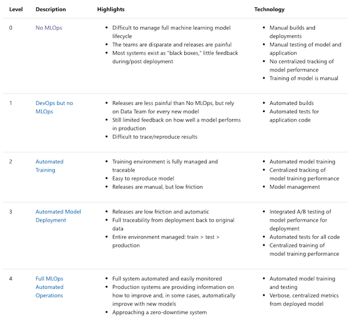
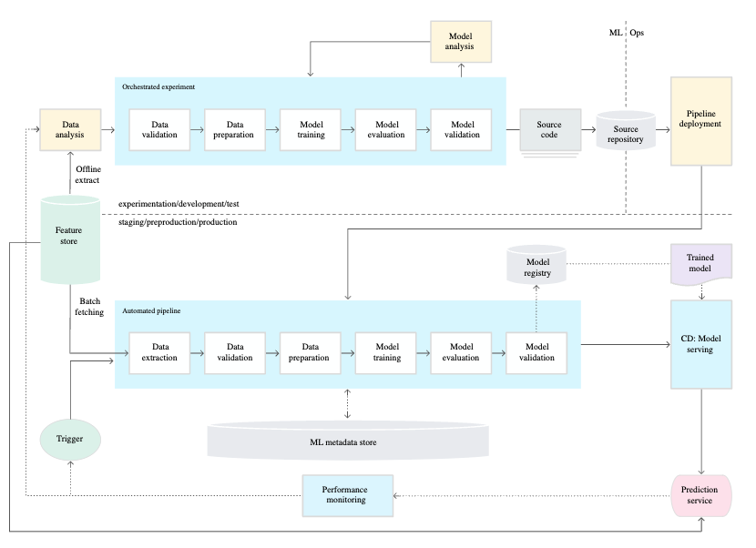
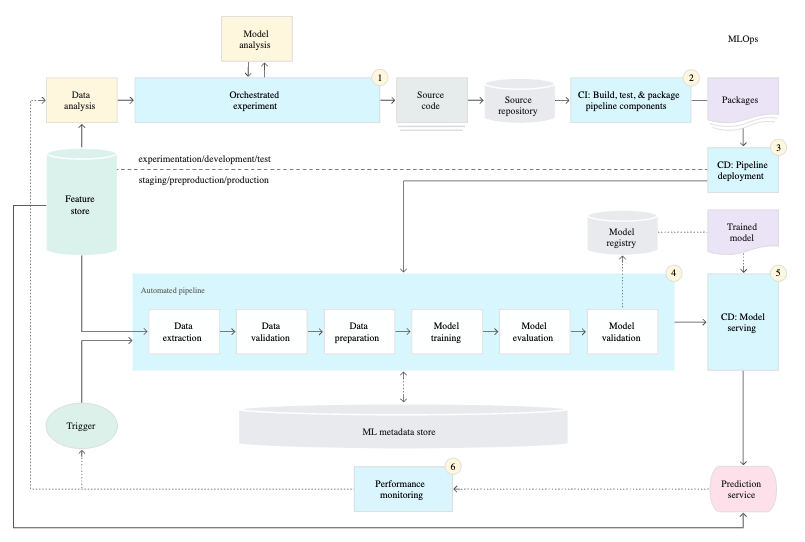

In January 2020, both [Microsoft](https://docs.microsoft.com/en-us/azure/architecture/example-scenario/mlops/mlops-maturity-model) and [Google](https://cloud.google.com/architecture/mlops-continuous-delivery-and-automation-pipelines-in-machine-learning) released what they referred to as 'maturity' models for MLOps. These outlined a series of levels that described the full spectrum of practices among organisations training and deploying machine learning models. A little later that same year, Google released an '[AI Adoption Framework](https://services.google.com/fh/files/misc/ai_adoption_framework_whitepaper.pdf)' that tackled similar ground from a different angle. They offered their take on how to go from worst practices to best practices in terms of MLOps.

These frameworks are commonly referred to when thinking through how an organisation is approaching machine learning workflows, so it's worth being aware of what these models propose as well as whether there are other options for assessing your own practices.

## Everyone Starts at Zero

[Microsoft's model](https://docs.microsoft.com/en-us/azure/architecture/example-scenario/mlops/mlops-maturity-model) is the most fine-grained in terms of how it distinguishes progress through the levels. It outlines five separate levels (starting at zero) that can be used to understand the extent of MLOps adoption and maturity in an organisation.

Google's level 0 corresponds to that of Microsoft, where everything is manual and there is no automation anywhere. Not only are processes script-driven and manual, but the teams involved in working no the various parts of developing or deploying a model are siloed from each other. After models are 'deployed', there is no way of checking how that model is doing or using some kind of feedback loop to catch errors or to roll back if needed.

At this point, the frameworks start to diverge somewhat. Microsoft's level 1 ("DevOps, but no MLOps") describes the beginnings of automation, where releases are still "painful" but builds and tests are automated and there is some limited feedback introduced. The next level is where the training process is automated — with the environment (data, infrastructure, code) versioned and reproducible — making releases of models manual but less painful than before. Some centralised tracking of model performance has also started be introduced at this point.

Level 3 focuses on the automation of model deployment, including A/B (and more complex) testing of models as well as full lineage and traceability of models. The overall environments (from training to test to production) are all fully managed and automated.

Level 4 is the final stage where everything is fully automated, allowing for easy monitoring and where improvements or errors are handled without the need for manual intervention.

## Google's Leap from Level Zero to One

Google's assessment of 'maturity' in MLOps also relates to automation. 

> “The level of automation of these steps defines the maturity of the ML process, which reflects the velocity of training new models given new data or training new models given new implementations.” ([source](https://cloud.google.com/architecture/mlops-continuous-delivery-and-automation-pipelines-in-machine-learning))

To Google, MLOps is therefore about how agile you can be when you’re going through your process. The real challenge, as they see it, "isn't building an ML model, the challenge is building an integrated ML system and to continuously operate it in production”.

Unfortunately, the leap from the fully manual level to level 1 ("ML Pipeline Automation") is a pretty sizeable one. This makes the Google framework harder to use as a diagnostic tool, since in many ways you either are doing MLOps or you aren't; there isn't much in the way of transitional steps between the two.

Level 1 focuses on the automation of the whole machine learning workflow and work cycle for a single pipeline. At this level, everything is completely automated, including the provision for retraining the entire pipeline when needed, full validation across data, code and models and so on.

Level 2 takes this one step further, abstracting another level higher and includes automation for many pipelines. It's quite similar to level one, just with the ability to handle many models being trained, deployed and handled at the same time.

While it is useful to see how Google think about the most 'mature' implementation of MLOps, it doesn't help much if you are seeking to reach that yourself. It doesn't make sense to try to implement everything all at once, especially if you are a small organisation.

A slightly different framing of how machine learning is treated within an organisation can be found in the [Google Cloud AI Adoption Framework white paper](https://services.google.com/fh/files/misc/ai_adoption_framework_whitepaper.pdf), a 37-page report published in June 2020. An organisation with some tangential or singular uses for machine learning is said to be in the 'tactical' phase of adoption. At a certain point the number of these machine learning systems might increase to where there are several active and this is the 'strategic' phase. When machine learning models become a key part of the organisation and their success, then they can be said to have reached the 'transformational' phase. Even though it is a bit more of a business-focused outline of how an organisation goes from little machine learning to a lot, there is still considerable overlap between this and the maturity model mentioned above.

## 