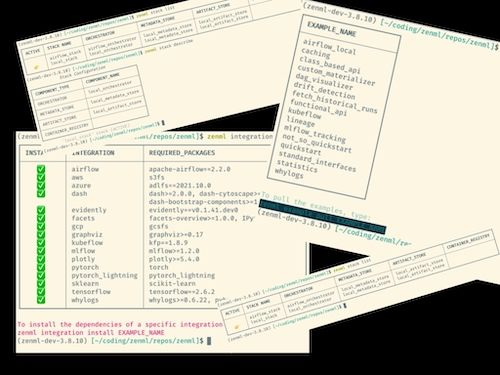

With ZenML 0.6.3, you can now run your ZenML steps on Sagemaker and AzureML! It's normal to have certain steps that require specific hardware on which to run model training, for example, and 

ZenML 0.6.3 brings you the ability to serve models using MLflow deployments as well as an updated CLI interface! For a real continuous deployment cycle, we know that ZenML pipelines should be able to handle everything — from pre-processing to training to serving to monitoring and then potentially re-training and re-serving. The interfaces we created in this release are the foundation on which all of this will build.

We also improved how you interact with ZenML through the CLI. Everything looks so much smarter and readable now with the popular `rich` library integrated into our dependencies.

Smaller changes that you'll notice include updates to our cloud integrations and bug fixes for Windows users. For a detailed look at what's changed, give [our full release notes](https://github.com/zenml-io/zenml/releases/tag/0.6.2) a glance.

# Cloud backend

- AzureML / Sagemaker
- single line to enable a custom step operator
- new concept: step operator
- current limitations
	- currently only one per pipeline
	- Sagemaker & AzureML
- use cases:
	- for when you have a heavy step involving some custom hardware maybe
	- to help speed up the iteration process
- how to get going: see the example, configure stack, add the one line
- 
# Tensorboard visualisation PR
* Add Kubeflow tensorboard viz and fix tensorflow file IO for cloud back-ends by @stefannica in https://github.com/zenml-io/zenml/pull/447
- check KubeFlow example (demo)
- logs history of a model
- interactive UI you leave running in the background
- also can track the curves of your accuracy while your model is still running
- integrate with S3 backends (doesn't matter locally or everyothing on AWS… they're all hosted in Amazon managed services)

1. tensor board as a service (new feature for ZenML) - use it to manage lifecycle.
2. start tensor board button (a KubeFlow feature… same thing in a KubeFlow setting as point #1)

# Integration Tests / Venv

- long ticket. huge GitHub actions refactoring + virtual environment fixtures for our tests
- see the blog alexej wrote on this.

## Dependency Fixes

* Remove tabulate dependency (replaced by rich) by @jwwwb in https://github.com/zenml-io/zenml/pull/436
* Remove support for python 3.6 by @schustmi in https://github.com/zenml-io/zenml/pull/437
* Upgrade TFX to 1.6.1 by @jwwwb in https://github.com/zenml-io/zenml/pull/441
* Upgrade `rich` from 11.0 to 12.0 by @strickvl in https://github.com/zenml-io/zenml/pull/458

## Dev and Test Environment

* Fix potential issue with local integration tests by @schustmi in https://github.com/zenml-io/zenml/pull/428
* Create clean test repos in separate folders by @michael-zenml in https://github.com/zenml-io/zenml/pull/430
* Pytest-fixture for separate virtual environments for each integration test by @AlexejPenner in https://github.com/zenml-io/zenml/pull/405
* Bugfix/fix failing tests due to comments step by @AlexejPenner in https://github.com/zenml-io/zenml/pull/444
* Added --use-virtualenvs option to allow choosing envs to run by @AlexejPenner in https://github.com/zenml-io/zenml/pull/445
* Added basic integration tests for remaining examples by @strickvl in https://github.com/zenml-io/zenml/pull/439
* Another boyscout pr on the gh actions by @AlexejPenner in https://github.com/zenml-io/zenml/pull/455

## Typos

* fix typo by @wjayesh in https://github.com/zenml-io/zenml/pull/432
* Fix typo in mysql password parameter by @pafpixel in https://github.com/zenml-io/zenml/pull/438

## CLI Improvements

* Fix CLI stack component describe/list commands by @schustmi in https://github.com/zenml-io/zenml/pull/450
* Implementing the `explain` subcommand by @bcdurak in https://github.com/zenml-io/zenml/pull/460
* 
## User Experience Improvements

* Log whether a step was cached by @strickvl in https://github.com/zenml-io/zenml/pull/435
* Improve error message when provisioning local kubeflow resources with a non-local container registry. by @schustmi in https://github.com/zenml-io/zenml/pull/442

## What's Changed

* Copy explicit materializers before modifying, log correct class by @schustmi in https://github.com/zenml-io/zenml/pull/434
* Enable generic step inputs and outputs by @schustmi in https://github.com/zenml-io/zenml/pull/440
* Removed old reference to a step that no longer exists by @AlexejPenner in https://github.com/zenml-io/zenml/pull/452
* Correctly use custom kubernetes context if specified by @schustmi in https://github.com/zenml-io/zenml/pull/451
* Ignore type of any tfx proto file by @schustmi in https://github.com/zenml-io/zenml/pull/453
* Added ZenFiles to README by @htahir1 in https://github.com/zenml-io/zenml/pull/457

## ♻️ Continuous Deployment with MLflow

The biggest new feature in the 0.6.2 release is our integration with the parts of MLflow that allow you to serve your models. We [previously added MLflow Tracking](https://blog.zenml.io/zero-five-seven-release/), but now hook into the standard format for packaging machine learning models so that you can deploy them for real-time serving using a range of deployment tools. With the new integration you can locally deploy your models [using a local deployment server](https://mlflow.org/docs/latest/models.html#deploy-mlflow-models).

This is the foundation for the obvious next useful step: non-local deployments using tools like [KServe](https://github.com/kserve/kserve) and [BentoML](https://github.com/bentoml/BentoML). ([Community votes](https://github.com/zenml-io/zenml/discussions/215) on that directed us first towards MLflow, but we realize that there are several other options that are commonly used.)

As part of this new feature, we added a new concept of a 'service'. The service extends the paradigm of a ZenML pipeline to now cover long-running processes or workflows; you are no longer limited to executing run-to-completion pipelines or mini-jobs. With services you can therefore serve the an artifact created by a pipeline and have it reflected in a running component that you can interact with after-the fact. For machine learning, this is what gives us continuous model deployment.

The MLflow deployment integration means you can implement a workflow — for example — where you train a model, make some decision based on the results (perhaps you evaluate the best model) and immediately see the model updated in production as a prediction service.

We're really excited about the production use cases that this feature enables. To learn more, check out [the new documentation page](https://docs.zenml.io/features/continous-training-and-deployment) we just included to guide you in understanding continuous training and continuous deployment. The [`mlflow_deployment` example](https://github.com/zenml-io/zenml/tree/main/examples) is also a great way to understand how to use this new feature. ([Use the CLI](https://blog.zenml.io/examples-cli/) to explore and interact with the examples.)

## Improving our CLI with `rich`

If you've been using the ZenML CLI utility for a while, you'll know that it was functional but maybe not always *delightful*. We've [taken a bit of time](https://github.com/zenml-io/zenml/pull/392) to make it more pleasant to use from the user perspective. We used 'rich' to add a visual uplift to most user-facing parts of the `zenml` terminal interface. 

Tables are easier to read, spinners conceal log messages that you didn't really need to see, and tracebacks from errors raised while using ZenML are now much more feature-filled and easy to parse. Now that we've added `rich` into our dependencies it will be easier to continually improve the CLI going forward.

We'll be writing more about how we integrated with `rich` on the blog in the coming days, so stay tuned for that!

## 🗒 Documentation Updates

As the codebase and functionality of ZenML grows, we always want to make sure [our documentation](https://docs.zenml.io/) is clear, up-to-date and easy to use. We made a number of changes in this release that will improve your experience in this regard:

- Ensure *quickstart* example code is identical across everywhere it is referenced.
- Added core concepts back into the [main glossary](https://docs.zenml.io/reference/glossary) (sorted alphabetically and made concise).
- Added [cloud-specific guide](https://docs.zenml.io/features/cloud-pipelines/guide-aws-gcp-azure) for deploying pipelines.
- Inside the codebase itself, removed some parameters specified in docstrings that no longer existed in code.
- Various spelling and typo corrections.

## ➕ Other Updates, Additions and Fixes

- Our test suite is now more robust. We run our integration tests on `kubeflow` (as well as on the local stack), and integration tests run in separate virtual environments for each integration test.
- We added [some extra parts](https://github.com/zenml-io/zenml/pull/411) to our PR template, which you'll reach when you contribute to the ZenML codebase.
- We fixed a bug where the CLI wasn't working if you didn't have `git` already installed. (This mainly applies to Windows machines, and our bug fix doesn't apply to any of the `zenml example…` functionality, since that requires `git`.)
- Added various logging and informative error messages for edge cases.
- [Fixed a bug](https://github.com/zenml-io/zenml/pull/416) where an IPython REPL would crash when running examples or code that visualized data.
- We now automatically activate integrations when we are unable to find stack components.
- We now [handle the failure](https://github.com/zenml-io/zenml/pull/390) of workflows for cases where `ModuleNotFound` errors are raised.

## 🙌 Community Contributions

We received [a contribution](https://github.com/zenml-io/zenml/pull/438) from [Ben](https://github.com/pafpixel), in which he fixed a typo in our documentation. Thank you, Ben!

## Contribute to ZenML!

Join our [Slack](https://zenml.io/slack-invite/) to let us know what you think we should build next!

Keep your eyes open for future releases and make sure to [vote](https://github.com/zenml-io/zenml/discussions/categories/roadmap) on your favorite feature of our [roadmap](https://zenml.io/roadmap) to make sure it gets implemented as soon as possible.

[Photo by <a href="https://unsplash.com/@eyestetix?utm_source=unsplash&utm_medium=referral&utm_content=creditCopyText">Eyestetix Studio</a> on <a href="https://unsplash.com/s/photos/balloons?utm_source=unsplash&utm_medium=referral&utm_content=creditCopyText">Unsplash</a>]
