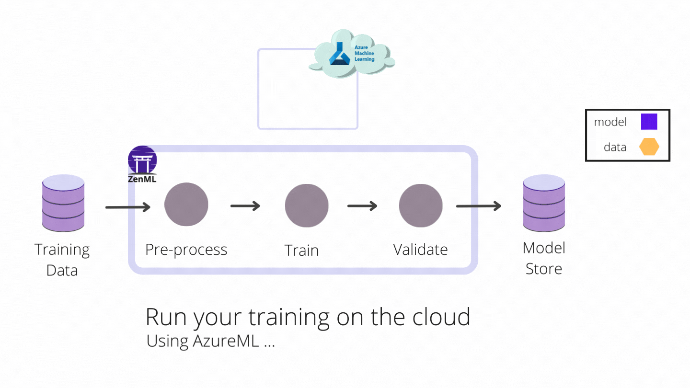

_If you are of a more visual disposition, please check out this blog's [accompanying video tutorial](https://www.youtube.com/watch?v=b5TXRYkdL3w)._

# What is a step operator?

The step operator defers the execution of individual steps in a pipeline to specialized runtime environments that are optimized for Machine Learning workloads.

Sometimes, you need to specify specialized cloud backends ✨ for different steps. One example could be using powerful GPU instances for training jobs or distributed compute for ingestion streams. A `StepOperator` is what allows you to define this custom logic for ZenML to use for each step. 


There are two step operators (for **AzureML** and **AWS Sagemaker**) that are implemented by the ZenML core team and it is very simple to write your own (more on that later).



<div class="embed-responsive embed-responsive-16by9 mb-5">
    <iframe width="560" height="315" src="https://www.youtube.com/embed/04DbbEzE9ig" title="YouTube video player" frameborder="0" allow="accelerometer; autoplay; clipboard-write; encrypted-media; gyroscope; picture-in-picture" allowfullscreen></iframe>
</div>
# I’m confused 🤔. How is it different from an orchestrator?

An orchestrator is a higher level entity than a step operator. It is what executes the 
entire ZenML pipeline code and decides what specifications and backends to use for each step. 

The orchestrator runs the code which launches your step in a backend of your choice. If you don’t specify a step operator, then the step code runs on the same compute instance as your orchestrator.

While an orchestrator defines how and where your entire pipeline runs, a step operator defines how and where an individual 
step runs. This can be useful in a variety of scenarios. An example could be if one step within a pipeline needed to run on a 
separate environment equipped with a GPU (like a trainer step).

Generically, this operator can be registered like any other stack component:

```bash
zenml step-operator register OPERATOR_NAME \
    --type=...
    ...
```

```python
@step(custom_step_operator=OPERATOR_NAME)
def trainer(...) -> ...:
    """Train a model"""
    # This will run on the specified operator name.
```

# Run on all the clouds

<iframe src="https://giphy.com/embed/lrW5C1vjtWKb3X2oom" width="480" height="270" frameBorder="0" class="giphy-embed" allowFullScreen></iframe><p>The step operator makes you feel like this -- <a href="https://giphy.com/gifs/BoschGlobal-like-a-boss-likeabosch-bosch-lrW5C1vjtWKb3X2oom">via GIPHY</a></p>

An example is as follows. Let's say we want to run training as a custom [AWS Sagemaker](https://aws.amazon.com/pm/sagemaker/) 
job. 


# Watch a video tutorial

If 

<div class="embed-responsive embed-responsive-16by9 mb-5">
    <iframe width="560" height="315" src="https://www.youtube.com/embed/b5TXRYkdL3w" title="YouTube video player" frameborder="0" allow="accelerometer; autoplay; clipboard-write; encrypted-media; gyroscope; picture-in-picture" allowfullscreen></iframe>
</div>

<br>

_[Subscribe to the ZenML YouTube Channel](https://www.youtube.com/channel/UCi79n61eV2sVyYxJOqk_bMw)._


[Image credit: Photo by <a
href="https://unsplash.com/@lukaszlada?utm_source=unsplash&utm_medium=referral&utm_content=creditCopyText">lukaszlada</a>
on <a
href="https://unsplash.com/photos/LtWFFVi1RXQ?utm_source=unsplash&utm_medium=referral&utm_content=creditCopyText">Unsplash</a>]
