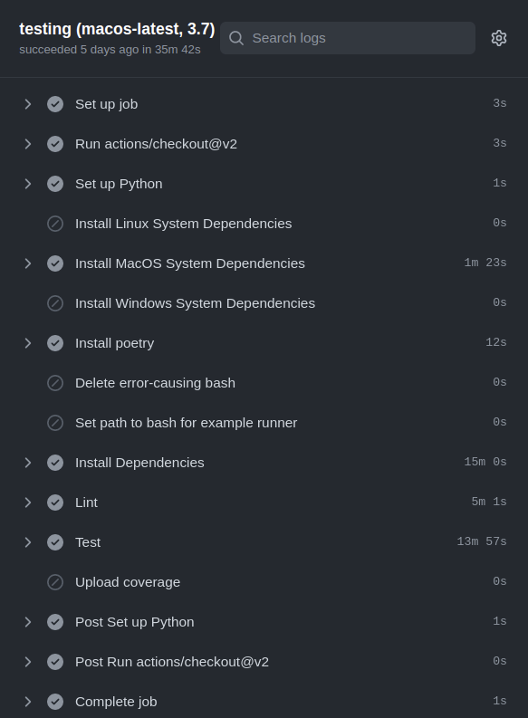
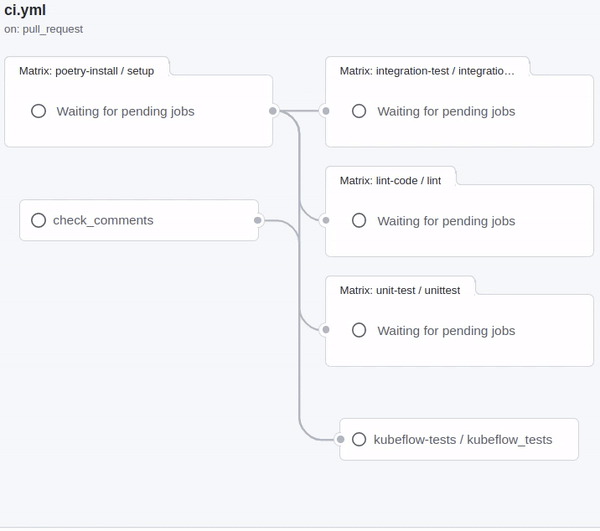

# :round_pushpin: What's the point of Github Actions?

Software projects are complex beasts with a multitude of moving pieces that can affect each other in surprising ways. 
If you're reading this then chances are, you've been part of such projects where you have to build and improve software 
while ensuring you don't break anything in the process. Testing and Code Standards are the main antidote at your 
disposal. As such these two tools should be considered integral parts of the software development lifecycle to allow
for Continuous Integration.

The first thing that pops up when you search for the term 'Continuous Integration' is the following definition:
'Continuous integration (CI) is the practice of automating the integration of code changes from multiple contributors 
into a single software project.' A big part of CI is automated quality control before allowing the new code
to be merged into the productive codebase. This quality control can get arbitrarily complex, layered and even
convoluted. As such it is important to grow your quality control framework at the same pace as your product increases
in scale and complexity.

This quality control can adress multiple different aspects of the code. Static code analysis, otherwise known as 
[linting](https://www.perforce.com/blog/qac/what-lint-code-and-why-linting-important), is one such aspect of code quality 
control. Linting deals with programmatic and stylistic issues, such as making sure typed inputs and outputs match up. 
Unit and integration tests are also important ways of adding quality control your code.

The practice of DevOps aims to seamlessly integrate such quality control workflows into the development workflow. 
When you use Github for code versioning, you can use Github Actions as a tool that can orchestrate these code quality 
checks. Github Actions enables you to define workflows in `yaml` files. A 'workflow' is a recipe of instructions that you
would like to run at a given time. 

'Workflows' can be equipped with triggers that define when it should run. Your workflow could run, for example, when someone makes a 
commit on a branch, creates a pull request for a specific branch or when manually triggered from the UI. Workflows contain one or 
more 'jobs'. 

A 'job' is a collection of instructions that is run on a virtual machine of its own. As such jobs are 
perfectly encapsulated from one another. The user can choose between a few operating systems for each 'job' as part of 
the `job.strategy` attribute. However, when developing a Python library, you might want it to be tested on all operating 
systems and maybe even on multiple Python versions; enter 'strategy matrices'. A matrix allows you to define a set of
environment configurations. In our case we chose three operating systems (Linux, MacOS, Windows) and two different Python 
versions (3.7 and 3.8). The matrix then makes sure that the job is run for all 6 possible permutations of these 
configurations (eg MacOS + Python 3.7). 

Finally, a job consists of one or many `steps`. Such steps can be defined through arbitrary command line commands. 
Bash scripts can be invoked, Python scripts can be called or you can use a plethora of steps produced by the broader 
community (see [Github Action Merketplace](https://github.com/marketplace?type=actions)). These community steps are 
called 'actions'. Steps can be executed conditionally. Importantly, all steps of a job run on the same machine. As such
they can read and write to and from the same filesystem. Information from previous steps can also be directly accessed.

# :steam_locomotive: Where we start our journey

Here at ZenML, we've made it our mission to build a tool that spans the complete development process of machine learning 
solutions in python. Such a lofty vision comes with its own set of challenges. Not least of which is the shear scale 
of other tools that need to be integrated. You might have guessed where this is going. Many Integrated tools implies a 
large amount of integration tests. This is especially true if you also want to verify interoperability.

We start this journey in a very standard, cookie cutter, monolithic workflow. I'm sure many projects start out this way. 
One yaml file defines a workflow that checks out the code, performs linting, unit-testing, integration testing and 
finally uploads test coverage to codecov on a matrix of operating systems and python versions. Here is one such sample 
of what the workflow used to look like.



One of the largest problems we ran into was the different dependencies each step needed and the 
consequential nightmare of unexpected upgrades or downgrades of some low-level packages. This would then lead to some 
confusing error messages and some very long debugging sessions, at the end of which our reaction was something like 
this:


As you might imagine, the team was growing frustrated with the long testing times and the sporadic errors and a solution
needed to be found. Here are five changes we implemented to upgrade our CI pipeline.

## :fast_forward: 1. Speed up your workflows with `Caching`
Caching is a powerful way to speed up repeating processes. We run `poetry install` in one such process that is necessary for 
each aspect of our CI pipeline. We didn't want to commit the `poetry.lock` file to ensure we would keep ZenML compatible 
with the newest versions of packages that we are integrating with and test regardless of the state on the developer's
machine. On average the [Poetry](https://python-poetry.org/) installation would take between 10-15 minutes for each cell on the OS-Python Version
matrix. 
[Time taken by poetry install](../assets/posts/github-actions/dependencies.png)

Using caching we are able to make this step nearly instantaneous, assuming a cached venv is available. See the yaml excerpt
below to see how caching is done within a Github Actions workflow.

```yaml
    ...
      
    - name: Load cached venv
      id: cached-poetry-dependencies
      uses: actions/cache@v2.1.6
      with:
        path: |
          .venv
          poetry.lock
        # Cache the complete venv dir for a given os, python version, pyproject.toml
        key: venv-${{ runner.os }}-python-${{ matrix.python-version }}-${{ hashFiles('pyproject.toml') }}

    - name: Install Project
      shell: bash
      if: steps.cached-poetry-dependencies.outputs.cache-hit != 'true'
      run: poetry install
    
    ...
```

As you can see the cache is saved with a unique key as a function of the runner operating system, the Python version and a hash of the
`pyproject.toml`. As a consequence the cache can be invalidated by changing the `pyproject.toml`. 



The keen-minded among you might have caught on to an inconsistency in my argument from above. We don't commit the 
`poetry.lock` file, as we want to always guarantee compatibility with the bleeding-edge changes of our integrations and
dependencies. But by caching the virtual environment directory as a function of the `pyproject.toml`, aren't we just 
locking on to the versions when we cache for the first time? That is correct, however we now are not dependent on the 
state on a developer's machine; instead we have a state for each combination of OS and Python version. On top of this, we can 
now decide on a cadence by which we periodically invalidate the cache.



## :factory: 2. Modularize your monolith with `Reusable Workflows`
The [Separation of Concerns (SoC)]{https://nalexn.github.io/separation-of-concerns/} is an important principle
in software development. It basically states: "The principle is simple: don’t write your program as one solid block,
instead, break up the code into chunks that are finalized tiny pieces of the system each able to complete a 
simple distinct job." This makes your code more understandable, reusable and maintainable.

In order to grow our github actions that meant splitting the monolithic workflow that was responsible for everything
into multiple, sub-workflows with one purpose each. Luckily, github actions got us coverd.

`Reusable workflows` are a way to use full-fledged workflows as jobs within an overarching workflow.
In our case this means we have one CI workflow that calls the linting, unit test and integration test workflows
respectively. This enables us to use any combination of these sub-workflows but also trigger them separately. What this 
also gives us is perfect encapsulation of each separate job. Now our linting dependencies do not interfere with the
integrations that we must install for our integration tests. This also allows us more fine-grained control over the 
runners, python versions and other peripheral configurations that can now be done at the level of each `reusable 
workflow`.

Here's an excerpt from our `ci.yml` file. Within the jobs section, we simply give each step in the job a name and call the 
corresponding reusable workflow. Within these reusable workflows themselves we just need to make sure to add 
`workflow_call` to the list of triggers under `on:`.

`.github/workflows/lint.yml`
```yaml
name: Integration Test the Examples

on: workflow_call

jobs:
    ...
```

`.github/workflows/ci.yml`
```yaml
jobs:
  poetry-install:
    uses: ./.github/workflows/poetry-install.yml

  lint-code:
    needs: poetry-install
    uses: ./.github/workflows/lint.yml

  unit-test:
    needs: poetry-install
    uses: ./.github/workflows/unit-test.yml

  integration-test:
    needs: poetry-install
    uses: ./.github/workflows/integration-test.yml
```




As you can see the jobs that reference the different workflows have dependencies on one another. Here we make sure the 
`poetry install` only has to be done once per OS/Python version combination before branching into the three separate 
workflows. Currently, each of the sub-workflows are running on the same matrix. 



## :repeat: 3. Avoid code duplication with `Composite Actions`
As we were designing the different reusable workflows it became obvious that we were generating a lot of duplicated 
code. Each workflow would set up Python, do some OS-specific fine-tuning, install Poetry and load the cached venv
or create it. 

This is where composite actions come into play. A composite action condenses multiple steps into one step and makes it
usable as a step across all of your workflows. Here is a small example of how we use it. 

In the `.github` directory we create an `actions` folder which in turn is populated by a folder for each composite 
action that you want to create -- in our case `.github/actions/setup_environment`. Within this folder you then create 
a file with the name `action.yml`. Now you just need to add all your steps to the `runs` section and add the 
`using: "composite"` entry to it. 
`

`.github/actions/setup_environment/action.yaml`
```yaml
runs:
  using: "composite"
  steps:
    - name: Set up Python
      uses: actions/setup-python@v2
      with:
        python-version: ${{ matrix.python-version }}

    - name: Install Poetry
      uses: snok/install-poetry@v1
      with:
        virtualenvs-create: true
        virtualenvs-in-project: true

    ...
```

All that is left to do now is reference this action from within your workflows to start using it.

`.github/workflows/lint.yml`
```yaml
    ...
      
    - name: Setup environment with Poetry
    uses: ./.github/actions/setup_environment

    ...
```

You might be asking yourself: "What is the difference between these `composite actions` and `reusable workflows`?" Short 
answer is, `composite actions` are a collection of commands while `reusable workflows` also contain information on where
and how to be executed. For more information check out [this](https://chris48s.github.io/blogmarks/github/2021/11/06/composite-actions-reusable-workflows.html#:~:text=A%20composite%20action%20is%20presented,separately%20in%20the%20summary%20output.)
blogpost that goes a bit more in detail on teh differences.

## :speech_balloon: 4. Make github actions fun with`Comment Interaction`

It is hard finding the correct automized triggers for your workflows. "Should we run this on every pull request?
Should we only run this on PRs from `dev` to `main`? Should we run this only for changes within a given directory?" 
These are some questions you'll inevitably run into while growing with your CI pipeline. All these questions are useful 
ways to critically examine the motivations and reasons behind each part of your CI pipeline. 

Automating most of these triggers helps ensure your code deployment runs smoothly with guaranteed checks
in place. However, there are times when you want to have some more fine-grained control.

We ran into one such case at ZenML. One of our integrations is Kubeflow Pipelines. This integration needs
to spin up a cluster of pods using [k3d](https://k3d.io/) in order to deploy Kubeflow Pipelines. Then all of our other integration tests
are run on this cluster. This whole process takes about 1 hour to run and so it is not something we want running for each 
push on each PR. Instead, we want to have some control over when it is appropriate. 

The first part of the fix to this problem is to include `workflow_dispatch` as one of the triggers for our reusable workflow that is
dedicated to Kubeflow Pipelines integration tests. In order to make this even easier and more integrated into our 
normal workflow surrounding pull requests, we also added the `pull-request-comment-trigger` action to our CI pipeline.

Given a specific comment on a pull request, the test gets activated for this PR, meaning that each commit on that PR 
will now trigger the specified Kubeflow Pipelines integration test. 

As we are using the step as a basis to decide if a certain workflow should be executed, it needs to be part of a job of 
its own. As such we are explicitly defining the output of the `check_comments` job, so it can be used to conditionally 
run the Kubeflow tests job. 

`.github/workflows/ci.yml`
```yaml
    ...
    
on:
  pull_request:
    types: [opened, synchronize]
  issue_comment:
    types: [created]
    
    ...

jobs:
  
  ... 
  
  check_comments:
    runs-on: ubuntu-latest
    outputs:
      kf_trigger: ${{ steps.check.outputs.triggered }}
    steps:
      - uses: khan/pull-request-comment-trigger@master
        id: check
        with:
          trigger: 'LTKF!'
          reaction: rocket
        env:
          GITHUB_TOKEN: '${{ secrets.GITHUB_TOKEN }}'

  kubeflow-tests:
    needs: [poetry-install, check_comments]
    # Run this one only when pull-request-comment-trigger was triggered
    if: ${{ needs.check_comments.outputs.kf_trigger == 'true' }}
    uses: ./.github/workflows/kubeflow.yml
```



In our case, if you want to run integration tests on kubeflow pipelines specifically, you simply comment 'LTKF!', short
for 'Let The Kubes Flow'.

You may have noticed that there is also a reaction that can be specified `reaction: rocket`. This might be more gimmick 
than anything. But isn't it the tiny things like this that can take your code from being functional to next level of
delightful?

## :recycle: 5. Reduce wasted compute resources by avoiding unwanted `Concurrency`

I'm sure this has happened to you before. After some intense hours coding away you are ready to commit and oush your
work. Mere seconds after you have pushed and opened your PR you realize that you left something in the code that does 
not belong. No problem, you think, and within seconds you make the change, commit and push. 

Trust me, I've been there more times than I care to admit. In these cases I would go into the Github Actions view and
manually cancel the Github Action of the first push to free up the runners. But there is an easier way. 
By defining what the Github Action does in case of concurrency, this can be handled automatically. In our case, we want 
to cancel the action of the older commit, as we want to know if the most recent code version passes our CI pipeline.


```yaml
    ...

    concurrency:
      # New commit on branch cancels running workflows of the same branch
      group: ${{ github.workflow }}-${{ github.ref }}
      cancel-in-progress: true

    ...
```

# :rocket: Our Final Process (for now)

When I set out on the journey to improve our CI pipelines, the Github Actions weren't even part of the plan. 
All I wanted to do was create a [pytest](https://docs.pytest.org/) fixture that creates a separate virtual environment for each integration test
(If this is something that interests you, let us know, and we'll do a separate blogpost on that whole story).
The changes to our Github Actions just happened naturally on the side. The whole process did feel a bit like 
[this](https://www.youtube.com/watch?v=AbSehcT19u0) though.

As of early March 2022 this is the new CI pipeline that we use here at [ZenML](https://github.com/zenml-io/zenml) and the 
feedback from my colleagues -- fellow engineers -- has been very positive overall. I am sure there will be tweaks, changes and refactorings in the future, but for
now, this feels Zen. 



Check it out yourself [here](https://github.com/zenml-io/zenml/blob/develop/.github/workflows/ci.yml) and feel free to 
drop in on [Slack](https://zenml.io/slack-invite/) and let us know if this helped you or if you have tips on how we can 
do even better.

*Alexej Penner is a Machine Learning Engineer at ZenML.*
