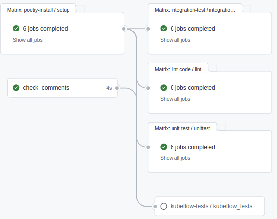

...

As ZenML continuously grows and expands its codebase and especially the integrations with other tools, it is vital to 
also expand our testing framework. Github Actions are an important cog in the Continuous Testing and Continuous 
Integration machine that we have set up. Originally, we were using one monolythic workflow to
perform linting, unit-testing, integration testing and uploading coverage to codecov on a matrix of operating systems 
and python versions. Here is one such sample of what the workflow used to look like.


One of the largest problems we ran into was the different dependencies each step needed and the 
consequential nightmare of unexpected up or downgrades of some low-level packages. This would then lead to some 
confusing error messages and some very long debugging sessions, at the end of which our reaction was something like 
this:


As you might imagine, the team was growing frustrated with the long testing times and the sporadic errors and a solution
needed to be found. Here are 5 changes we implemented to upgrade our CI-pipeline.

## 1. Caching
Caching is a powerful way to speed up repeating processes. `Poetry install` in one such process that is necessary for 
each aspect of our CI pipeline. We didn't want to commit the poetry.lock file to ensure we would keep ZenML compatible 
with the newest versions of packages that we are integrating with and test regardless of the state on the developers
machine. On average the poetry installation would take between 10-15 minutes for each cell on the OS-Python Version
matrix. 
[Time taken by poetry install](../assets/posts/github-actions/dependencies.png)

Using caching we are able to make this step nearly instantaneous, given a cached venv is available. See the yaml excerpt
below to see how caching is done within a github actions workflow.

```yaml
    ...
      
    - name: Load cached venv
      id: cached-poetry-dependencies
      uses: actions/cache@v2.1.6
      with:
        path: |
          .venv
          poetry.lock
        # Cache the complete venv dir for a given os, python version, pyproject.toml
        key: venv-${{ runner.os }}-python-${{ matrix.python-version }}-${{ hashFiles('pyproject.toml') }}

    - name: Install Project
      shell: bash
      if: steps.cached-poetry-dependencies.outputs.cache-hit != 'true'
      run: poetry install
    
    ...
```

As you can see the cache is saved with a unique key as a function of the runner os, the python version and a hash of the
pyproject.toml. As a consequence the cache can be invalidated by changing the pyproject.toml. 

The keen minded among you might have caught on to an inconsistency in my argument from above. We don't commit the 
poetry.lock file, as we want to always guarantee compatibility with the bleeding edge changes of our integrations and
dependencies. But by caching the virtual environment directory as a function of the pyproject.toml, aren't we just 
locking on to the versions when we cache for the first time? 

...



...

## 2. Reusable Workflows
Reusable workflows are a way to use full fledged workflows as jobs within an overarching workflow.
In our case this means we have one CI-workflow that calls the Linting, Unit-Test and Integration-Test workflows
respectively. This enables us to use any combination of these sub-workflows but also trigger them separately. What this 
also gives us is perfect encapsulation of each separate job. Now our linting dependencies do not affect the
integrations that we must install for our integration tests. This also allows us more fine grained control over the 
runners, python versions and other peripheral configurations that can now be done at the level of each reusable 
workflow.

To ensure that our examples run within a kubeflow pipelines orchestrator we do not need to run integration tests one 
each operating system. Within our new system the kubeflow pipelines integration tests run only on ubuntu. 

Here's an excerpt from our ci.yml. Within the jobs section, we simply give each step in the job a name and call the 
corresponding reusable workflow. Within these reusable workflows themselves we just need to make sure to add 
`workflow call` to the list of triggers under `on:`.

```yaml
jobs:
  poetry-install:
    uses: ./.github/workflows/poetry-install.yml

  lint-code:
    needs: poetry-install
    uses: ./.github/workflows/lint.yml

  unit-test:
    needs: poetry-install
    uses: ./.github/workflows/unit-test.yml

  integration-test:
    needs: poetry-install
    uses: ./.github/workflows/integration-test.yml
```



```yaml
name: Integration Test the Examples

on: workflow_call

jobs:
    ...
```

As you can see the jobs that reference the different workflows have dependencies on one another. Here we make sure the 
poetry install only has to be done once per os/python-version combination before branching into the 3 separate 
workflows. Currently each of the sub-workflows are running on the same matrix. One downside of this approach is that the
poetry-install job is only considered done, when all 6 matrix cells are complete. This means even if the ubuntu/py3.8 
runner is done with the `poetry-install` after 1 minute, the ubuntu/py3.8 runner for `lint-code` can only start once 
every other runner on the `poetry-install` job are done. 


## 3. Composite Actions
As we were designing the different reusable workflows it became obvious that we were generating a lot of duplicated 
code. Each workflow would set up python, do some os specific fine-tuning, install poetry and load the cached venv
or create it. 

This is where composite actions come into play. A composite workflow condenses multiple steps into one step and makes it
usable as a step across all of your workflows. Here is a small example of how we use it. 

In the `.github` directory we create an `actions` folder which in turn is populated by a folder for each composite 
action that you want to create. In our case `.github/actions/setup_environment`. Within this folder you then create 
a file with the name `action.yml`. Now you just need to add all your steps to the `runs` section and add the 
`using: "composite"` entry to it. 
`

```yaml
runs:
  using: "composite"
  steps:
    - name: Set up Python
      uses: actions/setup-python@v2
      with:
        python-version: ${{ matrix.python-version }}

    - name: Install Poetry
      uses: snok/install-poetry@v1
      with:
        virtualenvs-create: true
        virtualenvs-in-project: true

    ...
```

All that is left to do now is reference this action from within your workflows to start using it.

```yaml
    ...
      
    - name: Setup environment with Poetry
    uses: ./.github/actions/setup_environment

    ...
```

## 4. Comment Interaction

It is hard finding the correct automized triggers for your workflows. "Should we run this on every pull request?
Should we only run this on PRs from dev to main? Should we run this only for changes within a given directory?". 
These are some questions you'll inevitably run into, while growing with your CI pipeline. All these questions are great 
ways to critically examine the motivations and reasons behind each part of your CI pipeline. 

Automating most of these triggers is a great way to ensure your code deployment runs smoothly with guaranteed checks
in place. However, there are times when you want to have some more fine-grained control.

We at ZenML ran into one such case. One of our integrations is kubeflow pipelines. This integration needs
to spin up a cluster of pods using k3d in order to deploy kubeflow pipelines. Then all of our other integration tests
are run on this cluster. This whole process takes about 1 hour to run. This is not something we want running for each 
push on each PR. Instead, we want to have some control over when it is appropriate. 

The first step there is, to include `workflow_dispatch` as one of the triggers of our reusable workflow that is
dedicated to kubeflow pipelines integration tests. In order to make this even easier and more integrated into our 
normal workflow surrounding pull requests, we also added the `pull-request-comment-trigger` action to our ci-pipeline.

Given a specific comment on a pull request, the test gets activated for this pr, meaning that each commit on that pr
will now trigger the specified kubeflow integration test. 

As we are using the step as a basis to decide if a certain workflow should be executed, it needs to be part of a job of 
its own. As such we are explicitly defining the output of the check_comments job, so it can be used to conditionally 
run the kubeflow-tests job. 

```yaml
    ...
    
on:
  pull_request:
    types: [opened, synchronize]
  issue_comment:
    types: [created]
    
    ...

jobs:
  
  ... 
  
  check_comments:
    runs-on: ubuntu-latest
    outputs:
      kf_trigger: ${{ steps.check.outputs.triggered }}
    steps:
      - uses: khan/pull-request-comment-trigger@master
        id: check
        with:
          trigger: 'LTKF!'
          reaction: rocket
        env:
          GITHUB_TOKEN: '${{ secrets.GITHUB_TOKEN }}'

  kubeflow-tests:
    needs: [poetry-install, check_comments]
    # Run this one only pull-request-comment-trigger was triggered
    if: ${{ needs.check_comments.outputs.kf_trigger == 'true' }}
    uses: ./.github/workflows/kubeflow.yml
```



You may have noticed that there is also a reaction that can be specified `reaction: rocket`. This might be more gimmick 
than anything. But isn't it the tiny things like this that can take your code from being functional to next level of
delightful?

## 5. Dealing with Concurrency

I'm sure this has happened to you before. After some intense hours coding away you are ready to commit and oush your
work. Mere seconds after you have pushed and opened your PR you realize, that you left something in the code, that does 
not belong. No problem, you think, and within seconds you make the change, commit and push. 

Trust me, I've been there more times than I care to admit. In these cases I would go into the github actions view and
manually cancel the github action of the first push, to free up the runners. But there is an easier way. 
By defining what the github action does in case of concurrency, this can be handled automatically. In our case, we want 
to cancel the action of the older commit, as we want to know if the most recent code version passes our CI pipeline.


```yaml
    ...

    concurrency:
      # New commit on branch cancels running workflows of the same branch
      group: ${{ github.workflow }}-${{ github.ref }}
      cancel-in-progress: true

    ...
```


## Conclusion

When I set out on the journey improving our CI pipelines, the github actions weren't even part of the plan. 
All I wanted to do was create a pytest fixture that creates a separate virtual environment for each integration test
(If this is something that interests you, let us know, and we'll do a separate blogpost on that whole story).
The changes to our github actions just happened naturally on the side. The whole process did feel a bit like 
[this](https://www.youtube.com/watch?v=AbSehcT19u0) though.

As of 02.03.2022 this is the new ci pipeline that we use here at [ZenML](https://github.com/zenml-io/zenml) and the 
feedback has been very positive overall. I am sure there will be tweaks, changes and refactorings in the future, but for
now, this feels Zen. 



Check it out yourself [here](https://github.com/zenml-io/zenml/blob/develop/.github/workflows/ci.yml) and feel free to 
drop in on [Slack](https://zenml.io/slack-invite/) and let us know if this helped you or even if you know how we can do 
even better.

*Alexej Penner is a Machine Learning Engineer at ZenML.*
