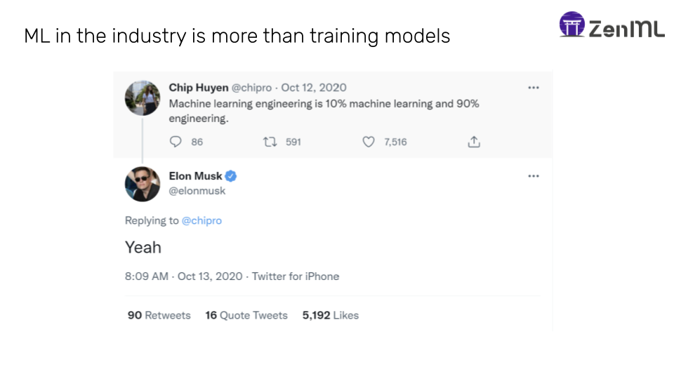
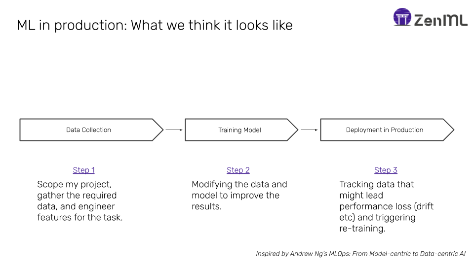
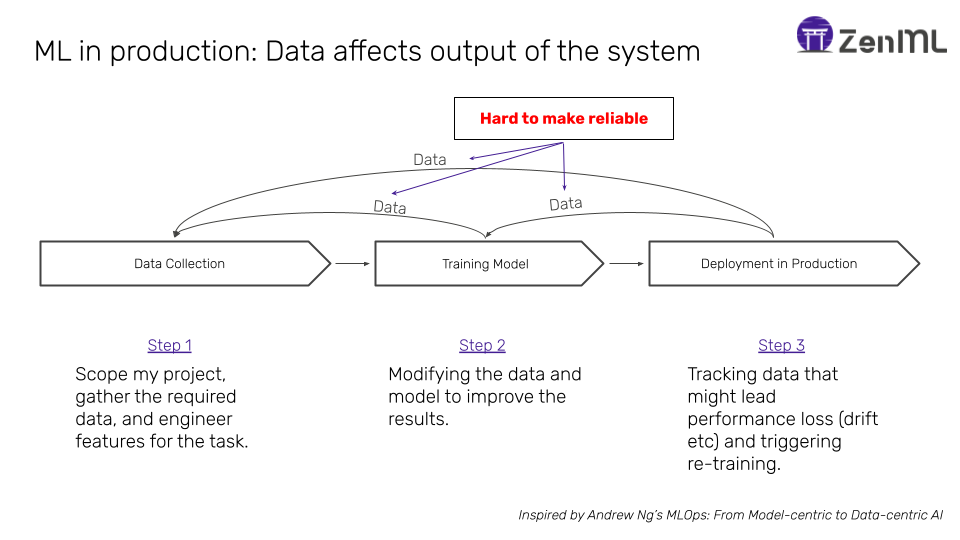
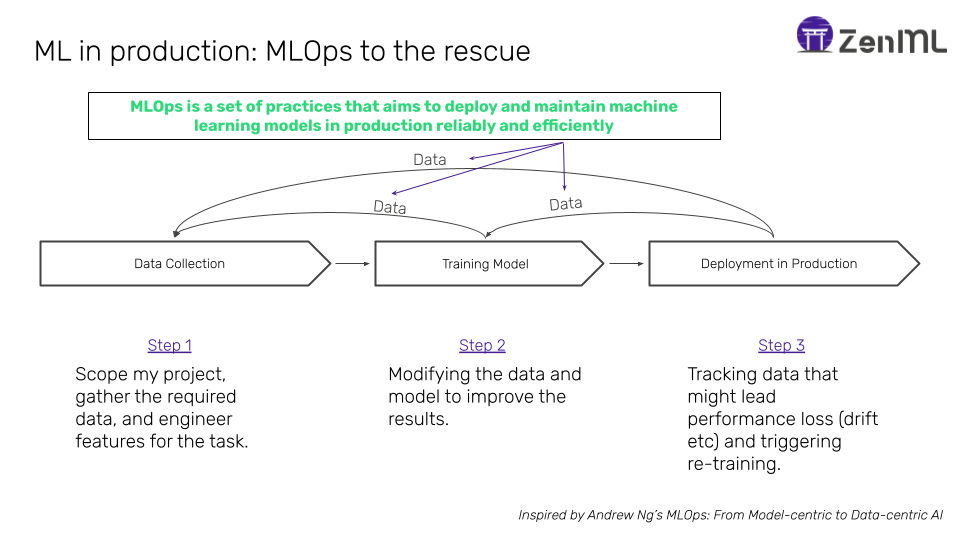
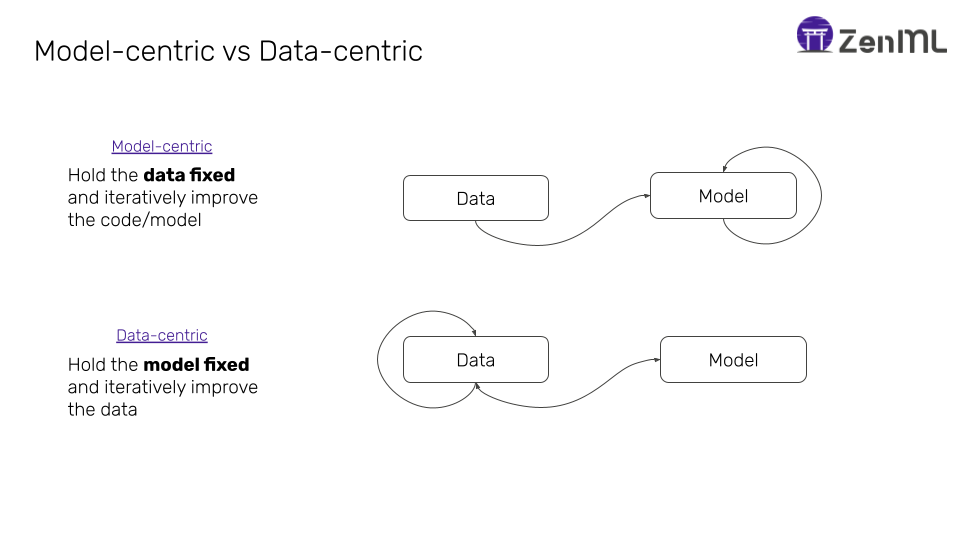

There is an ever-increasing plethora of resources around MLOps and an increasing amount regarding the shift from 
model-centric to data-centric machine learning. However, few speak about the link between data-centric machine learning 
and how it is driving MLOps practices today. In this article, I would like to make a case for data-centric MLOps, and 
how a shift for data science from script-driven development to pipeline-driven development is one of the best ways to 
set a ML team up for MLOps success.

# MLOps is not just about deploying model

The need for MLOPs 

  

If not exposed to real world ML systems, one can be forgiven with simplifying ML development by breaking it down into the following relatively simple processes. 

  

Taken in their silos, these processes don't sound too hard: 

- Feature engineering is getting easier with excellent tools from the modern data stack or using advanced platforms like feature stores.
- The training loop is made easier by thousands of tools that help in the iterative process, from experiment tracking tools like MLflow and Weights&Bases, to advanced frameworks like PyTorch Lightning.
- Deploying models is also getting easier with the advent of advanced tools like Seldon Core, or managed services like in the major 
cloud provider.

However, the reality is that the process looks more like this:

  

It is in these gaps where MLOps ultimately lives. It is not enough to do this process once: A successful ML team needs to execute this 
process over and over again, and in a manner that the system can be trusted.

  

# Post-deployment Woes

When looked at from this perspective, it is clear that the trouble really starts after the first deployment is 
already done.

Here are just a few examples

- Latency problems
- Maintaining fairness and avoiding bias
- Lack of explaiability and auditability
- Painfully slow development cycles
- Model, concepts, and data drifts

# Model-centric vs Data-centric Machine Learning

Andrew Ng recently popularized the term data-centric machine learning with his excellent talk in 2020. Watch the full video 
below:

<iframe width="560" height="315" src="https://www.youtube.com/embed/06-AZXmwHjo" title="YouTube video player" frameborder="0" allow="accelerometer; autoplay; clipboard-write; encrypted-media; gyroscope; picture-in-picture" allowfullscreen></iframe>

  

# Towards data-centric ML(Ops): From scripting to pipelines

A concrete shift to data-centric machine learning often involves a ML team shifting focus from script-based development to 
pipeline-based development. Machine learning lends itself very nicely to developing in terms of pipelines because most development does consist of a sequence of steps carried out in order.

Here it is important to make a distinction between data-driven pipelines vs task-driven pipelines.

Said another way, this means that serious teams develop ML code as chunks of steps, using some form of tooling to isolate the orchestration of execution of steps from each other. This has the following benefits:

Often this means stepping out of a notebook environment, or finding some way of transporting notebook code to such a paradigm. 

# Takeaways

So, in short, here is the link between MLOps and data-centric machine learning:

- ML in production is different from ML in research and has a different set of challenges.
- These challenges are growing in relevance as adoption in ML increases.
- MLOps helps solve these problems.
- MLOps is rooted in being more data-centric than model-centric.
- Developing in pipelines helps in being more data-centric.

I hope that helps to clarify the link between these two popular terms, and gives beginner MLOps practitioners an indication of where to take their efforts as they develop internal ML tooling for their organizations.

Shamless plug: If you'd like to start the shift towards data-centric machine learning by developing ML pipelines, then you might want to take a look at [ZenML](https://github.com/zenml-io/zenml). It is designed with the following goals:

- Be simple and intuitive to give a simple path towards data-centric machine learning. 
- Be infrastructure and tooling agnostic across the MLOps stack.
- Start writing your pipeline in a notebook and carry it easily into the cloud with minimum effort.

## Resources

Learning MLOps

- MadewithML
- Fullstack deep learning
- Chip Huyen CS329
- ZenBytes

## References

Some images inspired by Andrew Ng's "From Data-centric to Model-centric Machine Learning" on YouTube: https://www.youtube.com/watch?v=06-AZXmwHjo