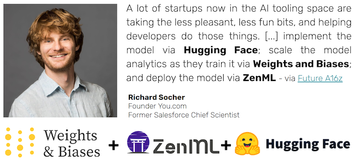

We missed the last release blog, so we're making it up with a longer one today.
ZenML 0.7.2 and 0.7.3 are both a doozy in terms of new and exciting features, 
from exciting new integrations to better stack management. Read on to learn more!

## 📊 Experiment Tracking Components

[PR 530](https://github.com/zenml-io/zenml/pull/530) adds a new stack component to ZenML's ever-growing list: 
`experiment_trackers` allows users to configure your experiment tracking tools with ZenML. Examples of experiment tracking 
tools are [Weights & Biases](https://wandb.ai), [MLflow](https://mlflow.org), [Neptune](https://neptune.ai), amongst others.

Existing users might be confused as ZenML has had MLflow and wandb support for a while now without such a component. However, this 
component allows users more control over the configuration of MLflow and wandb with the new `MLFlowExperimentTracker` and 
`WandbExperimentTracker` components. This allows these tools to work in more scenarios than the currently limiting local use-cases.

As an example, let's take the `MLFlowExperimentTracker`. Users can add it to the stack as follows:

```bash
zenml experiment-tracker register local_mlflow_tracker  --type=mlflow
zenml stack create mlflow_local_stack -o default -m default -a default -e local_mlflow_tracker
```

And the above will be pointed towards a local MLflow instance. 

However, let's say you want to have a stack that points to a shared MLflow instance. 
You can simply create a new stack now pointing to that configuration:

```bash
zenml experiment-tracker register remote_mlflow_tracker  --type=mlflow 
zenml experiment-tracker register gcp_mlflow \
    --type=mlflow \
    --tracking_uri=https://mlflow-dot-zenml-mlflow-man.ew.r.appspot.com/ \
    --tracking_token=<YOUR_TOKEN>

zenml stack create mlflow_remote_stack -o default -m default -a default -e remote_mlflow_tracker
```

And that's it, we have a shared experiment tracking component in our stack.
We have tested this on a deployed MLflow instance on GCP using the default orchestrator. Pro-tip: MLflow can be deployed 
easily with one click using this [awesome repo by Artefactory](https://github.com/artefactory/one-click-mlflow/).

## 🤗 HuggingFace Support + Weights & Biases + ZenML 💗 By The Community

The latest ZenML release brings two amazing new integrations with HuggingFace
and Weights & Biases. Both these 
integrations were contributions from the growing ZenML community and we could not be more grateful 🙏! In a timely 
fashion, [Richard Socher](https://de.wikipedia.org/wiki/Richard_Socher) gave a shoutout to all three companies in his [latest interview with Future by 
a16z](https://future.a16z.com/a-decade-of-deep-learning-ai-startup/).



[HuggingFace](https://huggingface.co) models are now supported to be passed through ZenML pipelines 
[see full example](https://github.com/zenml-io/zenml/tree/main/examples/huggingface). 
Huge shoutout to [@Ankur3107](https://github.com/Ankur3107) for PR [#467](https://github.com/zenml-io/zenml/pull/467).

You can also now track your pipeline runs with [Weights & Biases](https://wandb.ai) with the new `enable_wandb` decorator 
[see full example](https://github.com/zenml-io/zenml/tree/main/examples/wandb_tracking). 
Huge shoutout to [@soumik12345](https://github.com/soumik12345) for PR [#486](https://github.com/zenml-io/zenml/pull/486).

## 🔎 XGBoost and LightGBM support

[XGBoost](https://xgboost.readthedocs.io/en/stable/) and [LightGBM](https://lightgbm.readthedocs.io/) are one of the 
most widely used boosting algorithm libraries out there. That's why we introduced new materializers for both in the latest 
ZenML release! Now you can pass the following objects into your steps:

```python
import xgboost as xgb
import lightgbm as lgb

@step
def predictor_xgboost(model: xgb.Booster, mat: xgb.DMatrix) -> np.ndarray:
    """Makes predictions on a trained XGBoost booster model."""
    return model.predict(mat)

@step
def predictor_lightgbm(model: lgb.Booster, mat: lgb.Dataset) -> np.ndarray:
    """Makes predictions on a trained LightGBM booster model."""
    return model.predict(np.random.rand(7, 28))
```

Check out [both examples here](https://github.com/zenml-io/zenml/tree/main/examples) and PRs [#544](https://github.com/zenml-io/zenml/pull/544) 
and [#538](https://github.com/zenml-io/zenml/pull/538) for more details.

## 📂 Parameterized S3FS support to enable non-AWS S3 storage (minio, ceph)

A big complaint of the [S3 Artifact Store](https://github.com/zenml-io/zenml/blob/main/src/zenml/integrations/s3/artifact_stores/s3_artifact_store.py) integration was that it was hard to parameterize it in a way that it supports 
non-AWS S3 storage like [minio](https://min.io/) and [ceph](https://docs.ceph.com/en/latest/radosgw/s3/). The latest release 
made this super simple! When you want to register an S3ArtifactStore from the CLI, you can now pass in  
`client_kwargs`, `config_kwargs` or `s3_additional_kwargs` as a JSON string. For example:

```shell
zenml artifact-store register my_s3_store --type=s3 --path=s3://my_bucket \
    --client_kwargs='{"endpoint_url": "http://my-s3-endpoint"}'
```

See PR [#532](https://github.com/zenml-io/zenml/pull/532) for more details.

## 🧱 New CLI commands to update stack components

We added functionality to allow users to update stacks that already exist. This shows the basic workflow:

```shell
zenml orchestrator register local_orchestrator2 -t local
zenml stack update default -o local_orchestrator2
zenml stack describe default
zenml container-registry register local_registry --type=default --uri=localhost:5000
zenml container-registry update local --uri='somethingelse.com'
zenml container-registry rename local local2
zenml container-registry describe local2
zenml stack rename default new_default
zenml stack update new_default -c local2
zenml stack describe new_default
zenml stack remove-component -c
```
More details are in the [CLI docs](https://apidocs.zenml.io/0.7.3/cli/). 
Users can add new stack components to a pre-existing stack, or they can modify 
already-present stack components. They can also rename their stack and individual stack components.

## 🐛 Seldon Core authentication through ZenML secrets

The Seldon Core Model Deployer stack component was updated in this release
to allow the configuration of ZenML secrets with credentials that authenticate
Seldon to access the Artifact Store. The Seldon Core integration provides three
different secret schemas for the three flavors of Artifact Store: AWS, GCP, and Azure,
but custom secrets can be used as well. For more information on how to use this
feature please refer to our [Seldon Core deployment example](https://github.com/zenml-io/zenml/tree/main/examples/seldon_deployment).

Lastly, we had numerous other changes such as ensuring the PyTorch materializer works across all artifact stores 
and the Kubeflow Metadata Store can be easily queried locally.

## 🙌 Talk to Us

Join our [Slack](https://zenml.io/slack-invite/) to be part of the growing ZenML community. We would love to 
talk to you and see if ZenML is helping you, and get your input as to where it should go next!

[Photo by <a href="https://unsplash.com/@amyshamblen?utm_source=unsplash&utm_medium=referral&utm_content=creditCopyText">Amy Shamblen</a> on <a href="https://unsplash.com/s/photos/balloons?utm_source=unsplash&utm_medium=referral&utm_content=creditCopyText">Unsplash</a>] 
