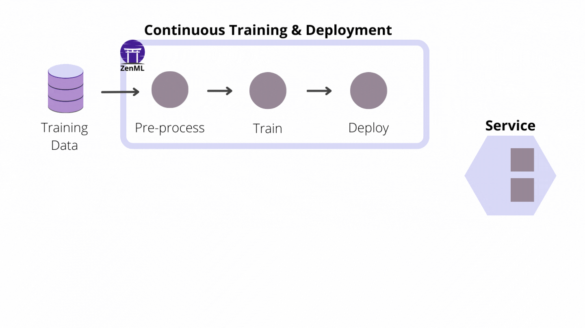
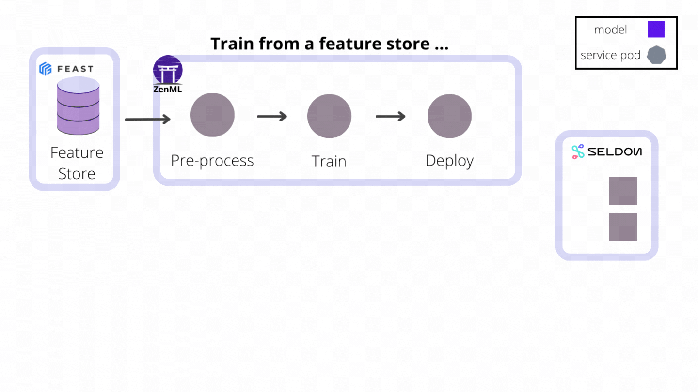

As MLOps start getting more attention and organizations start developing across the MLOps maturity model (read more in our blog about [MLOps maturity models](https://blog.zenml.io/mlops-maturity-models/), the terms Continuous Integration, Continuous Training and Continuous Deployment (CI/CT/CD) get more relevant since MLOps is all about applying DevOps principles to ML systems.

In the next following lines, we will try to understand what does the terms CI/CT/CD means in the context of ML Pipelines and how it differs from DevOps, and see how ZenML is pushing forward to make ML assets first-class citizens of CI/CD Systems - ZenML Model deployers as an example.


💡 ``we can maybe write DevOps vs MLOps article``

## What is Continuous Integration and Continuous Delivery/Deployment (CI/CD)?

Continuous integration is a set of practices that revolve around automating the building and testing and validating phase for new code, automating the process ensures that new code is always of production-ready quality which accelerates the releasing cycle. 

Continuous delivery refers to the automated packaging and delivery of new code from the testing and development environment to the staging or production environment.

Continuous Deployment is the following step of continuous delivery which means every piece of code that passes the previous two phases can be deployed automatically into production.

### ****What does make CI/CD for ML systems different than other software systems****

To emphasize the difference between CI/CD for ML and other software, we must first understand that the ML system is also a software system and shares many commonalities with traditional systems, but the fact that ML is not only about code but also about data and perhaps even more about data than code (read more about [Data centric AI](https://blog.zenml.io/data-centric-mlops/) and how it's leading MLOps World) makes ML systems about code and data versioning and tracking different algorithms, features, modeling techniques, and hyperparameters to maintain maximum code reproducibility and reusability. Within ML we need to validate and test data in addition to unit and integration testing. 
Not like other applications model delivery and deployment is not the end of the process, we need to monitor these models to ensure that they are still performing at the expected level, especially since ML performance can degrade over time 

``(article on data drift and concept drift) and automatically retrain itself if necessary.``

Translated with www.DeepL.com/Translator (free version)

based on all this we can identify CI/CD for ML systems as the following:

**CI**: Automate the testing and validation for code, data, and models.

**CD**: Automate delivering and packaging of custom systems and deploy them when certain criterion in production is fulfilled.

**CT**: new process and practices which deals with automating training of ML models.




## ZenML and CI/CT/CD Systems

As it is an extensible open-source MLOps framework to create production-ready machine learning pipelines ZenML is pushing forward to make created pipelines  CI/CT/CD paradigms supported and that is done by automating the model preparation and model training and model deployment. With the Built-in functionalities like [Schedules](https://github.com/zenml-io/zenml/blob/main/docs/book/introduction/core-concepts.md), [Model Deployers](https://github.com/zenml-io/zenml/blob/main/docs/book/introduction/core-concepts.md#model-deployer) and [Services](https://github.com/zenml-io/zenml/blob/main/docs/book/introduction/core-concepts.md#service) you can create end-to-end ML workflows with Continuous Training and Deployment that deploys your model in a local environment with MLFlow integration or even in production level environment like Kubernetes with Seldon core integration.

**Pipeline schedule ZenML window to Continuous Training:** 

?? need help on this 🙂

[https://giphy.com/embed/SKcxqI1GiASU783uT2](https://giphy.com/embed/SKcxqI1GiASU783uT2)

**Model Deployers interacting with services for Continuous Deployment:**

Model Deployers integrate with external tools, services or platforms responsible for online model serving. And by Online serving, we mean the process of hosting and loading machine-learning models as part of a managed web service and providing access to the models through an API endpoint like HTTP or GRPC. Taking into consideration that there are some scenarios where data scientists training the models may not be experienced software developers with a background in service-oriented design or in Kubernetes. ZenML Abstraction for Model Deployers deals with functionality concerning the life-cycle management and tracking of external model deployment servers (e.g. processes, containers, Kubernetes " deployments etc.)

and using [MLFlow](https://mlflow.org/docs/latest/models.html#deploy-mlflow-models) and [Seldon Core](https://github.com/SeldonIO/seldon-core) as two examples of Model Deployers already provided by ZenML as an integration, with many other Model Deployers to follow. All users have to do is run pipelines with acceptance criteria, and models get deployed instantly.




To achieve this model deployers play 3 major roles as stack components:

1. holding all the stack related configuration attributes required to interact with the remote model serving tool, service or platform (e.g. hostnames, URLs, references to credentials, other client-related configuration parameters)
    
    ```bash
    #MLFlow model deployer as a stack component
    zenml integration install mlflow
    zenml model-deployer register mlflow --type=mlflow
    zenml stack register local_with_mlflow -m default -a default -o default -d mlflow
    zenml stack set local_with_mlflow
    
    #Seldon core model deployer as a stack component
    zenml integration install seldon
    zenml model-deployer register seldon --type=seldon \
    --kubernetes_context=zenml-eks --kubernetes_namespace=zenml-workloads \
    --base_url=http://abb84c444c7804aa98fc8c097896479d-377673393.us-east-1.elb.amazonaws.com
    ...
    zenml stack register seldon_stack -m default -a aws -o default -d seldon
    ```
    
2. implements the continuous deployment logic necessary to deploy models in a way that updates an existing model server that is already serving a previous version of the same model instead of creating a new model server for every new model version. Every model server that the Model Deployer provisions externally to deploy a model is represented internally as a `Service` object that may be accessed for visibility and control over a single model deployment. This functionality can be consumed directly from ZenML pipeline steps, but it can also be used outside of the pipeline to deploy ad-hoc models.
    
    ```python
    from zenml.environment import Environment
    from zenml.integrations.seldon.model_deployers import SeldonModelDeployer
    from zenml.integrations.seldon.services.seldon_deployment import (
        SeldonDeploymentConfig,
        SeldonDeploymentService,
    )
    from zenml.steps import (
        STEP_ENVIRONMENT_NAME,
        BaseStepConfig,
        StepEnvironment,
        step,
    )
    
    @step(enable_cache=True)
    def seldon_model_deployer_step(
        context: StepContext,
        model: ModelArtifact,
    ) -> SeldonDeploymentService:
        model_deployer = SeldonModelDeployer.get_active_model_deployer()
    
        # get pipeline name, step name and run id
        step_env = Environment()[STEP_ENVIRONMENT_NAME])
    
        service_config=SeldonDeploymentConfig(
            model_uri=model.uri,
            model_name="my-model",
            replicas=1,
            implementation="TENSORFLOW_SERVER",
            secret_name="seldon-secret",
            pipeline_name = step_env.pipeline_name,
            pipeline_run_id = step_env.pipeline_run_id,
            pipeline_step_name = step_env.step_name,
        )
    
        service = model_deployer.deploy_model(
            service_config, replace=True, timeout=300
        )
    
        print(
            f"Seldon deployment service started and reachable at:\n"
            f"    {service.prediction_url}\n"
        )
    
        return service
    ```
    
3. the Model Deployer acts as a registry for all Services that represent remote model servers. External model deployment servers can be listed and filtered using a variety of criteria, such as the name of the model or the names of the pipeline and the step that was used to deploy the model. The Service objects returned by the Model Deployer can be used to interact with the remote model server, e.g. to get the operational status of a model server, the prediction URI that it exposes, or to stop or delete a model server.
    
    ```python
    from zenml.integrations.seldon.model_deployers import SeldonModelDeployer
    
    model_deployer = SeldonModelDeployer.get_active_model_deployer()
    services = model_deployer.find_model_server(
        pipeline_name="continuous-deployment-pipeline",
        pipeline_step_name="seldon_model_deployer_step",
        model_name="my-model",
    )
    if services:
        if services[0].is_running:
            print(
                f"Seldon deployment service started and reachable at:\n"
                f"    {service.prediction_url}\n"
            )
        elif services[0].is_failed:
            print(
                f"Seldon deployment service is in a failure state. "
                f"The last error message was: {service.status.last_error}"
            )
        else:
            print(f"Seldon deployment service is not running")
    
            # start the service
            services[0].start(timeout=100)
    
        # delete the service
        model_deployer.delete_service(services[0].uuid, timeout=100, force=False)
    ```
    
    And with ZenML CLI we can interact with list of served models, start, stop or delete deployments that the active model deployer is responsible for.
    
    ```bash
    $ zenml served-models list
    ┏━━━━━━━━┯━━━━━━━━━━━━━━━━━━━━━━━━━━━━━━━━━━━━━━┯━━━━━━━━━━━━━━━━━━━━━━━━━━━━━━━━┯━━━━━━━━━━━━━━━━━━━━━━━━━━━━┓
    ┃ STATUS │ UUID                                 │ PIPELINE_NAME                  │ PIPELINE_STEP_NAME         ┃
    ┠────────┼──────────────────────────────────────┼────────────────────────────────┼────────────────────────────┨
    ┃   ✅   │ 8cbe671b-9fce-4394-a051-68e001f92765 │ continuous_deployment_pipeline │ seldon_model_deployer_step ┃
    ┗━━━━━━━━┷━━━━━━━━━━━━━━━━━━━━━━━━━━━━━━━━━━━━━━┷━━━━━━━━━━━━━━━━━━━━━━━━━━━━━━━━┷━━━━━━━━━━━━━━━━━━━━━━━━━━━━┛
    
    $ zenml served-models describe 8cbe671b-9fce-4394-a051-68e001f92765
                              Properties of Served Model 8cbe671b-9fce-4394-a051-68e001f92765                          
    ┏━━━━━━━━━━━━━━━━━━━━━━━━┯━━━━━━━━━━━━━━━━━━━━━━━━━━━━━━━━━━━━━━━━━━━━━━━━━━━━━━━━━━━━━━━━━━━━━━━━━━━━━━━━━━━━━━━━┓
    ┃ MODEL SERVICE PROPERTY │ VALUE                                                                                  ┃
    ┠────────────────────────┼────────────────────────────────────────────────────────────────────────────────────────┨
    ┃ MODEL_NAME             │ mnist                                                                                  ┃
    ┠────────────────────────┼────────────────────────────────────────────────────────────────────────────────────────┨
    ┃ MODEL_URI              │ s3://zenfiles/seldon_model_deployer_step/output/884/seldon                             ┃
    ┠────────────────────────┼────────────────────────────────────────────────────────────────────────────────────────┨
    ┃ PIPELINE_NAME          │ continuous_deployment_pipeline                                                         ┃
    ┠────────────────────────┼────────────────────────────────────────────────────────────────────────────────────────┨
    ┃ PIPELINE_RUN_ID        │ continuous_deployment_pipeline-11_Apr_22-09_39_27_648527                               ┃
    ┠────────────────────────┼────────────────────────────────────────────────────────────────────────────────────────┨
    ┃ PIPELINE_STEP_NAME     │ seldon_model_deployer_step                                                             ┃
    ┠────────────────────────┼────────────────────────────────────────────────────────────────────────────────────────┨
    ┃ PREDICTION_URL         │ http://abb84c444c7804aa98fc8c097896479d-377673393.us-east-1.elb.amazonaws.com/seldon/… ┃
    ┠────────────────────────┼────────────────────────────────────────────────────────────────────────────────────────┨
    ┃ SELDON_DEPLOYMENT      │ zenml-8cbe671b-9fce-4394-a051-68e001f92765                                             ┃
    ┠────────────────────────┼────────────────────────────────────────────────────────────────────────────────────────┨
    ┃ STATUS                 │ ✅                                                                                     ┃
    ┠────────────────────────┼────────────────────────────────────────────────────────────────────────────────────────┨
    ┃ STATUS_MESSAGE         │ Seldon Core deployment 'zenml-8cbe671b-9fce-4394-a051-68e001f92765' is available       ┃
    ┠────────────────────────┼────────────────────────────────────────────────────────────────────────────────────────┨
    ┃ UUID                   │ 8cbe671b-9fce-4394-a051-68e001f92765                                                   ┃
    ┗━━━━━━━━━━━━━━━━━━━━━━━━┷━━━━━━━━━━━━━━━━━━━━━━━━━━━━━━━━━━━━━━━━━━━━━━━━━━━━━━━━━━━━━━━━━━━━━━━━━━━━━━━━━━━━━━━━┛
    
    $ zenml served-models get-url 8cbe671b-9fce-4394-a051-68e001f92765
      Prediction URL of Served Model 8cbe671b-9fce-4394-a051-68e001f92765 is:
      http://abb84c444c7804aa98fc8c097896479d-377673393.us-east-1.elb.amazonaws.com/seldon/zenml-workloads/zenml-8cbe67
    1b-9fce-4394-a051-68e001f92765/api/v0.1/predictions
    
    $ zenml served-models delete 8cbe671b-9fce-4394-a051-68e001f92765
    ```
    
## CONCLUSION

[ADD SOMETHING HERE]
