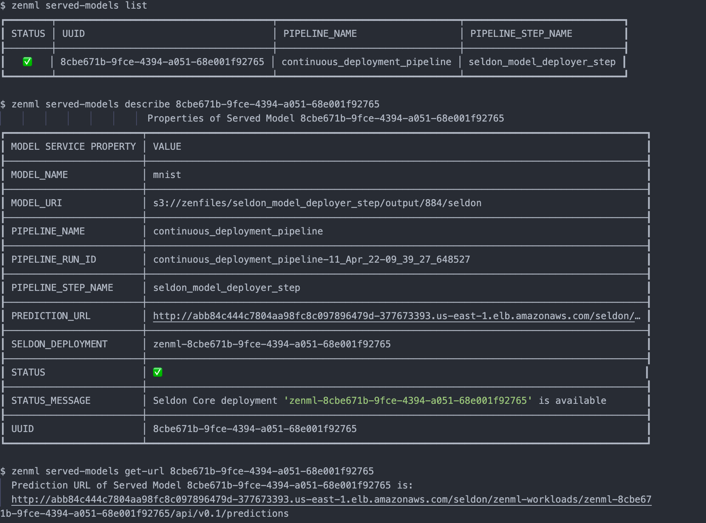

As MLOps start getting more attention and organizations start growing their own understanding of the MLOps maturity model, the terms Continuous Integration, Continuous Training and Continuous Deployment (CI/CT/CD) become more relevant since MLOps is all about applying DevOps principles to ML systems. (Read more about MLOps maturity models [on the blog](https://blog.zenml.io/mlops-maturity-models/).)

In this blogpost I will show what the terms CI, CT and CD mean in the context of machine learning pipelines, explore how MLOps differs from DevOps, and see how ZenML makes machine learning assets first-class citizens of CI/CD systems. I'll use ZenML's model deployers to illustrate this.

# What is Continuous Integration and Continuous Delivery / Deployment (CI/CD)?

Continuous Integration is a set of practices that revolve around automating the building and testing and validating phase for new code. Automating the process ensures that new code is always of production-ready quality which accelerates the release cycle: your product or assets get out into the world faster.

Continuous Delivery refers to the automated packaging and delivery of new code from the testing and development environment to the staging or production environment.

Continuous Deployment is the step that follows continuous delivery which means every piece of code that passes the previous two phases can be deployed automatically into production.

# What's so special about CI/CD for ML systems?

To emphasize the difference between CI/CD for ML and other software, we must first understand that the ML system is also a software system and shares many commonalities with traditional systems. A crucial difference, however, is the fact that ML is not only about code but also about data and perhaps even more about data than code. (Read more in [our blog on data-centric AI](https://blog.zenml.io/data-centric-mlops/).)  ML systems therefore have to handle code *and* data versioning, track different algorithms, features, modeling techniques, and hyperparameters to maintain maximum code reproducibility and reusability. For ML systems we need to validate and test data for machine learning in addition to running basic unit and integration tests.

Even once our model or application is deployed and being used, these systems are living things and require continuous monitoring to ensure that they are still performing as expected. (Performance can degrade over time as a result of data drift or concept drift, a downstream consequence of how central data is to how machine learning works.)

Based on all this we can identify CI/CD for ML systems as consisting of the following:

- **CI**: Automate the testing and validation for code, data, and models.
- **CD**: Automate delivering and packaging of custom systems and deploy them when certain criterion in production is fulfilled.
- **CT**: new process and practices which deals with automating training of ML models.


# How ZenML enables CI/CT/CD

As an extensible open-source MLOps framework to create production-ready machine learning pipelines, ZenML building a world where CI/CT/CD paradigms for ML pipelines are supported from the get-go. We do this by automating the model preparation and model training and model deployment. With the built-in functionalities like [Schedules](https://github.com/zenml-io/zenml/blob/main/docs/book/introduction/core-concepts.md), [Model Deployers](https://github.com/zenml-io/zenml/blob/main/docs/book/introduction/core-concepts.md#model-deployer) and [Services](https://github.com/zenml-io/zenml/blob/main/docs/book/introduction/core-concepts.md#service) you can create end-to-end ML workflows with Continuous Training and Deployment that deploys your model in a local environment with MLFlow integration or even in a production-grade environment like Kubernetes with our [Seldon Core](https://docs.seldon.io/projects/seldon-core/en/latest/index.html) integration.

## Pipeline schedules as the door to Continuous Training

In the context of a ZenML pipeline, pipeline scheduling refers to the process of automating pipelines so that they are executed at fixed times, dates or intervals. 

If ML pipelines fire automatically this will allow users or teams to have continuous training on new (fresh) data. (For example, every two weeks, take the latest data from an API and train a new model on it.)

<iframe src="https://giphy.com/embed/SKcxqI1GiASU783uT2" width="480" height="270" frameBorder="0" class="giphy-embed" allowFullScreen></iframe>

## Model Deployers interacting with services for Continuous Deployment

Model Deployers integrate with external tools, services or platforms responsible for online model serving. And by online serving we mean the process of hosting and loading machine-learning models as part of a managed web service and providing access to the models through an API endpoint like HTTP or GRPC. ZenML understands there are some scenarios where data scientists training the models may not be experienced software developers with a background in service-oriented design or in Kubernetes. The ZenML abstraction for Model Deployers handles the functionality concerning the life-cycle management and tracking of external model deployment servers (e.g. processes, containers, Kubernetes deployments and so on.).

[MLFlow](https://mlflow.org/docs/latest/models.html#deploy-mlflow-models) and [Seldon Core](https://github.com/SeldonIO/seldon-core) are two examples of Model Deployers already provided by ZenML as an integration, with other Model Deployers to follow. All users have to do is run pipelines with the appropriate and easy-to-use configuration, and models get deployed instantly.


To achieve this end, model deployers play three major roles as stack components:

1. They hold all the stack-related configuration attributes required to interact with the remote model serving tool, service or platform (e.g. hostnames, URLs, references to credentials, other client-related configuration parameters)
    
    ```shell
    #MLFlow model deployer as a stack component
    zenml integration install mlflow
    zenml model-deployer register mlflow --type=mlflow
    zenml stack register local_with_mlflow -m default -a default -o default -d mlflow
    zenml stack set local_with_mlflow
    
    # Seldon core model deployer as a stack component
    zenml integration install seldon
    zenml model-deployer register seldon --type=seldon \
    --kubernetes_context=zenml-eks --kubernetes_namespace=zenml-workloads \
    --base_url=http://abb84c444c7804aa98fc8c097896479d-377673393.us-east-1.elb.amazonaws.com
    ...
    zenml stack register seldon_stack -m default -a aws -o default -d seldon
    ```
    
2. They implement the Continuous Deployment logic necessary to deploy models in a way that updates an existing model server that is already serving a previous version of the same model instead of creating a new model server for every new model version. Every model server that the Model Deployer provisions externally to deploy a model is represented internally as a `Service` object that may be accessed for visibility and control over a single model deployment. This functionality can be consumed directly from ZenML pipeline steps, but it can also be used outside of the pipeline to deploy ad-hoc models.
    
    ```python
    from zenml.environment import Environment
    from zenml.integrations.seldon.model_deployers import SeldonModelDeployer
    from zenml.integrations.seldon.services.seldon_deployment import (
        SeldonDeploymentConfig,
        SeldonDeploymentService,
    )
    from zenml.steps import (
        STEP_ENVIRONMENT_NAME,
        BaseStepConfig,
        StepEnvironment,
        step,
    )
    
    @step(enable_cache=True)
    def seldon_model_deployer_step(
        context: StepContext,
        model: ModelArtifact,
    ) -> SeldonDeploymentService:
        model_deployer = SeldonModelDeployer.get_active_model_deployer()
    
        # get pipeline name, step name and run id
        step_env = Environment()[STEP_ENVIRONMENT_NAME])
    
        service_config=SeldonDeploymentConfig(
            model_uri=model.uri,
            model_name="my-model",
            replicas=1,
            implementation="TENSORFLOW_SERVER",
            secret_name="seldon-secret",
            pipeline_name = step_env.pipeline_name,
            pipeline_run_id = step_env.pipeline_run_id,
            pipeline_step_name = step_env.step_name,
        )
    
        service = model_deployer.deploy_model(
            service_config, replace=True, timeout=300
        )
    
        print(
            f"Seldon deployment service started and reachable at:\n"
            f"    {service.prediction_url}\n"
        )
    
        return service
    ```
    
3. The Model Deployer acts as a registry for all services that represent remote model servers. External model deployment servers can be listed and filtered using a variety of criteria, such as the name of the model or the names of the pipeline and the step that was used to deploy the model. The service objects returned by the Model Deployer can be used to interact with the remote model server, e.g. to get the operational status of a model server, the prediction URI that it exposes, or to stop or delete a model server.
    
    ```python
    from zenml.integrations.seldon.model_deployers import SeldonModelDeployer
    
    model_deployer = SeldonModelDeployer.get_active_model_deployer()
    services = model_deployer.find_model_server(
        pipeline_name="continuous-deployment-pipeline",
        pipeline_step_name="seldon_model_deployer_step",
        model_name="my-model",
    )
    if services:
        if services[0].is_running:
            print(
                f"Seldon deployment service started and reachable at:\n"
                f"    {service.prediction_url}\n"
            )
        elif services[0].is_failed:
            print(
                f"Seldon deployment service is in a failure state. "
                f"The last error message was: {service.status.last_error}"
            )
        else:
            print(f"Seldon deployment service is not running")
    
            # start the service
            services[0].start(timeout=100)
    
        # delete the service
        model_deployer.delete_service(services[0].uuid, timeout=100, force=False)
    ```
    
    And with the ZenML CLI we can interact with list of served models, start, stop or delete deployments that the active model deployer is responsible for.
        
    
    
## How we built a CT/CD customer satisfaction ML system with ZenML

The e-commerce sector is rapidly evolving as internet accessibility increases in different parts of the world. As a result, the demand for online shopping has grown. Businesses want to know how satisfied their customers are with their products and services to make better decisions. Machine learning plays a significant role in various aspects of business like sales prediction, customer segmentation, product recommendation, customer satisfaction and so on. In this example, we have built a model that can predict customer satisfaction based on data provided by customers. We use ZenML's MLflow integration to [track the model's performance](https://github.com/zenml-io/zenml/tree/main/examples/mlflow_tracking) and [to deploy the model](https://github.com/zenml-io/zenml/tree/main/examples/mlflow_deployment) for online prediction. Finally, we deploy and interact with a web application that consumes a deployed model with [Streamlit](https://streamlit.io/).


<p align="center">
  See the full project code <a href="https://github.com/zenml-io/zenfiles/tree/main/customer-satisfaction">in our ZenFiles</a>
</p>

### How does it work?

Let's start with the main pipeline definition, a basic ZenML pipeline:

```python
def run_training():
    ...
    train_pipeline(
        ingest_data(),
        clean_data().with_return_materializers(cs_materializer),
        train_model(),
        evaluation(),
    ).run()
```

This pipeline will run the following steps:

- `ingest_data`: This step will ingest the data from the source and return a data frame; the CSV file is in the `data` folder.
- `clean_data`: This step will clean the data and remove the unwanted columns. It removes columns that contribute less to the target variable and fills null values with mean.
- `model_train`: This step will train different models like XGBoost, LightGBM, and random forest. I am also using MLflow to track our model performance, parameters, and metrics and for saving the model.
- `evaluation`: This step will evaluate the model and save the metrics using MLflow auto-logging into the Artifact store. Auto-logging can be used to compare the performance of different models and decide to select the best model. It will also help in doing an error analysis of our chosen model.

We have another pipeline, defined in `deployment_pipeline.py`, that extends the training pipeline and implements a continuous deployment workflow. It ingests and processes input data, trains a model and then (re)deploys the prediction server that serves the model if it meets our evaluation criteria. The criterion that we have chosen is a configurable threshold on the [mean squared error](https://scikit-learn.org/stable/modules/generated/sklearn.metrics.mean_squared_error.html#sklearn.metrics.mean_squared_error) of the training.

```python
deployment = continuous_deployment_pipeline(
    ingest_data(),
    clean_data().with_return_materializers(cs_materializer),
    train_model(),
    evaluation(),
    deployment_trigger=deployment_trigger(
        config=DeploymentTriggerConfig(
            min_accuracy=min_accuracy,  # set a min threshold for deployment
        )
    ),
    model_deployer=mlflow_model_deployer(...),  # use mlflow to deploy
)
deployment.run()
```

In the deployment pipeline, ZenML's [MLflow tracking integration](https://github.com/zenml-io/zenml/tree/main/examples/mlflow_tracking) is used for logging the hyperparameter values and the trained model itself and the model evaluation metrics — as MLflow experiment tracking Artifacts — into the local MLflow backend. This pipeline also launches a local MLflow deployment server to serve the latest MLflow model if its accuracy is above a configured threshold.

The MLflow deployment server runs locally as a daemon process that will continue to run in the background after the example execution is complete. When a new pipeline is run which produces a model that passes the accuracy threshold validation, the pipeline automatically updates the currently running MLflow deployment server to serve the new model instead of the old one. While this ZenFile trains and deploys a model locally, other ZenML integrations such as the [Seldon](https://github.com/zenml-io/zenml/tree/main/examples/) deployer can also be used similarly to deploy the model in a more production setting (such as on a Kubernetes cluster).

To round it off, we deploy a [Streamlit](https://streamlit.io/) application that consumes the latest model service asynchronously from the pipeline logic. This can be done easily with ZenML within the StreamLit code:

```python
service = load_last_service_from_step(
    pipeline_name="continuous_deployment_pipeline",
    step_name="model_deployer",
    running=True,
)
...
service.predict(...)  # Predict on incoming data from the application
```
This project comes with a live demo built with [Streamlit](https://streamlit.io/) which you can find [here](https://share.streamlit.io/ayush714/customer-satisfaction/main).


The app on the live demo simulates what happens when predicting the customer satisfaction score for a given customer. You can input the features of the product listed below and get the customer satisfaction score.

## Conclusion

ML pipelines add extra challenges to the DevOps CI/CD paradigms because they taking care of the code as well as data. When you use ZenML you can create models that get trained and deployed continuously in any environment without worrying about any of the underlying complexities.

Start your MLOps journey today with `zenml go` and explore how we're working to solve real-world machine learning problems as [an open-source framework](https://github.com/zenml-io/zenml).

[Join our Slack](https://zenml.io/slack-invite/) and show us your projects and tell us more about your experiences with ZenML!