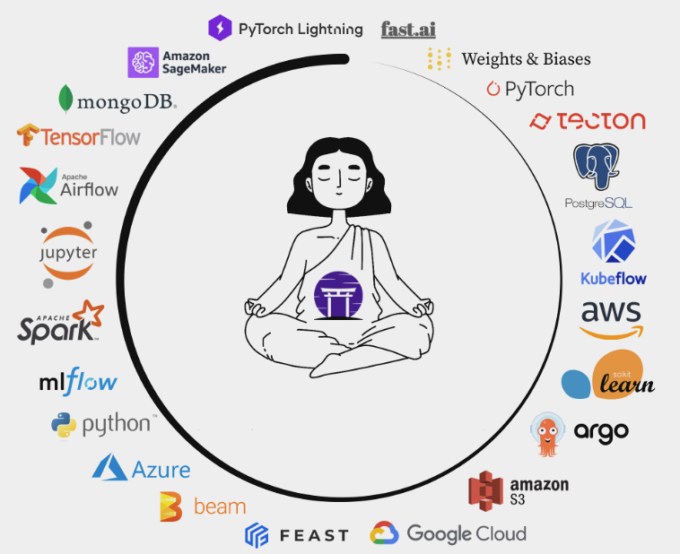

The journey that machine learning projects embark on from inception until the
moment our machine learning models are continuously trained and deployed to
production with the desired quality and performance characteristics is a long
and perilous one. Without proper planning and guidance, too many projects fail
to reach their full potential and end up in drift limbo, or they accrue an
unmanageable amount of technical debt and complexity along the way which makes
them nearly impossible to maintain and evolve in the long run.

If the history of traditional software development is any indication, MLOps
frameworks should be the much needed solution that ML practitioners and AI/ML
teams need to manage the extensive and often difficult to navigate ecosystem
of ML tools. But not all libraries and tools labeled as MLOps frameworks are
created equal. Some only focus on tool orchestration while others are limited in
the range of tools they can integrate with and are not easily extensible. This
article begins with highlighting a set of important traits that mature MLOps
frameworks should exhibit if they hope to withstand the rigors of ML projects
running in production. The article concludes by evaluating ZenML as an MLOps
framework that stands up well to these evaluation criteria.

## The Burdens of Unhindered Development

To advance a machine learning project past the initial stages of ideation and
experimentation, a continuously growing set of features, tools and technologies
are required. Experiment tracking is needed to record, recall and share results.
Getting the model accuracy up to acceptable levels in decent time often
involves employing distributed data processing, model training and
hyper-parameter search techniques. For online inference, a model serving system
must be present, followed by monitoring, data profiling and drift detection.
Some form of orchestration is crucial to getting all these features to interact
and function in sync to achieve a continuous automated workflow. This brief
description barely scratches the surface of what is required to build a
successful MLOps platform and we haven't even mentioned the infrastructure
layer with all its intricacies.

<iframe src="https://giphy.com/embed/Yq2SKEsscV85lPRJdu" width="480" height="360" frameBorder="0" class="giphy-embed" allowFullScreen></iframe>
If it looks complicated, it probably is<a href="https://giphy.com/gifs/Yq2SKEsscV85lPRJdu">via GIPHY</a>

Confronted with this overwhelming complexity, AI/ML teams usually go one of
two ways: either they adopt a full fledged managed MLOps platform and benefit
from the guarantees that they offer from day one, or they construct their own
custom MLOps system by incrementally connecting together the tool components
mandated by their particular needs and preserving a high degree of control over
tooling and infrastructure choices in the process.

While there certainly are downsides and advantages to both approaches, we argue
that enrolling an MLOps framework is a great compromise between the two. It
avoids inheriting the technical debt of reinventing the wheel without taking
away any of the benefits of flexible and extensible tooling. 

## Are MLOps Platforms the Answer?

Before we begin to dive into MLOps frameworks, it will be worth revisiting
the limitations of MLOps *platforms* to set down some basic references and
expectations.

### The Downsides of Managed MLOps Platforms

Adopting a managed MLOps platform has a lot of appeal, especially if we want to
avoid the overhead of having to manage our own tools and infrastructure.
Cloud based platforms like Amazon SageMaker, Azure Machine Learning and Google
Cloud AI Platform are immediately available and can significantly accelerate
the machine learning project development with a fraction of the cost of
building and operating a custom made platform. However, there are several
drawbacks to adopting a managed MLOps platform, some quite subtle, that should
not be easily overlooked.

Managed platforms are opinionated, general purpose solutions that are not
tailored to specific needs. Adopting a managed platform when our project
is still in the early stages of development and we only have a vague idea of
the challenges ahead carries a high risk. Even when the requirements are clear,
incompatibilities may not become evident until much later, when it's too late to
alter course.

<iframe src="https://giphy.com/embed/mTXSKTk3BsT6w" width="480" height="360" frameBorder="0" class="giphy-embed" allowFullScreen></iframe>
Seemed like a good idea at the time...<a href="https://giphy.com/gifs/mTXSKTk3BsT6w">via GIPHY</a>

Another disadvantage of managed platforms is that they are inflexible and slow
to change. They might provide 80% of the functionality we require, but it is
often the case that the missing 20% provides functionality that is mission
critical for machine learning projects. The closed design and architecture
nature of managed platforms makes it difficult to make even the most trivial
changes. To compensate for this lack of flexibility, we often have to design
custom, inefficient and difficult to maintain mechanisms that add technical debt
to the project.

### The Pitfalls of DIY MLOps Platforms

Switching to the other side of the coin, MLOps platforms that are built in house
are more flexible and easier to adapt to future requirements but retain many of
the disadvantages of their managed counterparts. For one, they are usually
constructed to respond to a very concrete set of necessities and implemented
with a focus on functionality and fast results often limited by budgetary
restrictions. Flexibility is classified as a luxury that few organizations want
to invest in, resulting in systems that are equally opinionated and rigid.

This limitation of DYI platforms does not become apparent until the machine
learning project needs to do a strategic shift to respond to a change in
customer behavior or requirements, or to incorporate a newer or more performant
set of tools and technologies. Refactoring any platform to reflect external
changes in requirements or to adapt it to new projects can be challenging and
costly.

## The Zen of MLOps Frameworks

The machine learning ecosystem is still in a state of rapid evolution and being
locked into a rigid platform is not advisable if you want to stay ahead of
the curve. Revolutionary machine learning tools and techniques are continuously
emerging and evolving, and the need for a flexible and easily extensible MLOps
framework is indisputable.

MLOps frameworks are a particular category of integration frameworks. To put it
simply, they coordinate the movement of code, data, models and other machine
learning artifacts between software components that are otherwise not directly
compatible and interoperable.

The defining characteristic of integration frameworks is the ability to
identify functional and architectural patterns repeated in a large set of
libraries or systems and to leverage these patterns to define a representative
set of high-level abstractions implemented by said libraries or systems through
an extensible set of adapters. This strategy of extracting simplicity out of
complexity is key to the success of any integration framework and has been
proven time and time again by democratizing remarkable technological advances
such as virtualization, containerization, cloud, cloud-native and serverless
computing.

The recent 0.8.0 ZenML release marks a major shift in perspective that the
project has been undergoing for the past couple of months. The focus was moved
away from merely orchestrating a growing [list of available integrations](https://docs.zenml.io/advanced-guide/integrations)
and towards making ZenML a vastly extensible MLOps framework that addresses all
the shortcomings of MLOps platforms. In the second part of this article, we
rationalize the principles that MLOps frameworks must abide by and explore how
we designed and continuously reinvent ZenML to be their concrete embodiment.

### Portable Pipelines

The various phases that ML projects go through from early prototyping to
production have varying requirements and constraints concerning the set of
involved tools and technologies. Early-stage experimentation probably doesn't
need access to centralized storage or powerful distributed processing systems.
In contrast, a project running in production might need to use not one, but many
different tooling and infrastructure configurations targeting different
production environments suitable for large-scale data processing pipelines,
distributed storage, orchestration and model deployment.

MLOps frameworks must make the transition from experimentation to production
as smooth as possible, to reduce or even eliminate the need for costly
code refactoring.

ZenML makes a stellar job of decoupling the ML pipeline code from the tooling
and infrastructure required to run it. With ZenML, you can start experimenting
with a local Stack from day one, and then gradually switch to using more
production ready Stacks as your project grows and its requirements get more
demanding. All this with nearly zero code changes!

### Representative Abstractions

MLOps frameworks detach the user experience from the underlying complexity by
defining relatable and easy to use high-level machine learning abstractions.
These abstractions must be easy to understand and use and above all they must be
evocative of the set of concepts that ML and practitioners deal with on a daily
basis. ZenML uses [an expressive range of machine learning concepts](https://docs.zenml.io/core-concepts) that are continuously distilled and evolved from the classes of
problems tackled by the ML tooling ecosystem.

At the same time, the ZenML team acknowledges that AI/ML teams are an amalgam of
diverse roles and responsibilities and their challenges are not only technical
but equally organizational. We design the ZenML framework abstractions as the
foundation of a common machine learning software development language that all
roles involved in the machine learning project lifecycle can learn, understand
and relate to, from Data Scientists and ML Engineers to Operations and Site
Reliability Engineers. More than an MLOps framework, ZenML is also
[a collaboration framework](https://docs.zenml.io/collaborate/collaborate).

### Highly Customizable through Extensible Design

MLOps frameworks must be extensible by definition. Integration boundaries must
be clearly delineated and modeled as separate libraries or modules, with well
defined interfaces that can be extended and tailored to specific functionality
needs.

At ZenML, we follow the [S.O.L.I.D.](https://en.wikipedia.org/wiki/SOLID)
and [Clean Architecture](https://blog.cleancoder.com/uncle-bob/2012/08/13/the-clean-architecture.html)design principles to maintain a loose coupling between core and external
components and ensure that the framework is easy to extend and customize.
All ZenML Stack components have well defined and well documented interfaces.
This makes it possible to [extend ZenML to add new Stack component implementations](https://docs.zenml.io/extending-zenml/stacks-components-flavors)
without having to modify the core code and without invalidating any of the
inter-operability guarantees that ZenML provides. The following are some
examples of the extensibility options supported by ZenML:

* you can [add a new Artifact Store flavor](https://docs.zenml.io/extending-zenml/artifact-store)
by defining a few basic IO operations and seamlessly transition your existing
code to use the storage backend of your choice.
* if you need to use a custom pipeline orchestration tool that is not already
included in ZenML's list of integrations, you can
[write your own Orchestrator plugin](https://docs.zenml.io/extending-zenml/orchestrator)
* to serve models using the model deployment tool of your choosing,
the [Model Deployer interface can be extended](https://docs.zenml.io/extending-zenml/model-deployer)
to accommodate any library or platform that serves that function.

The extensibility of ZenML gives ML practitioners the freedom of DYI with all
the benefits of inter-operability and makes ZenML a powerful tool for building
MLOps systems specifically tailored to the needs of any ML project.

## Talk to Us

MLOps frameworks are created for and shaped by their users. If you would like to
be part of the future of MLOps and ZenML, make sure to join our
[Slack](https://zenml.io/slack-invite/) to be part of the growing ZenML
community and to contribute your feedback and ideas. We would love to talk to
you and see if ZenML is helping you, and get your input as to where it should go
next!