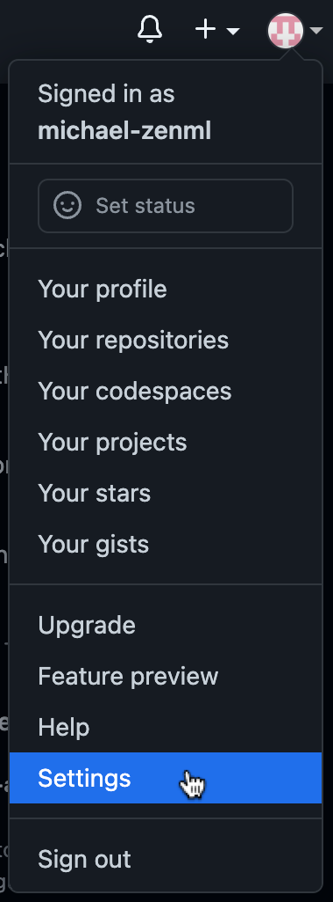
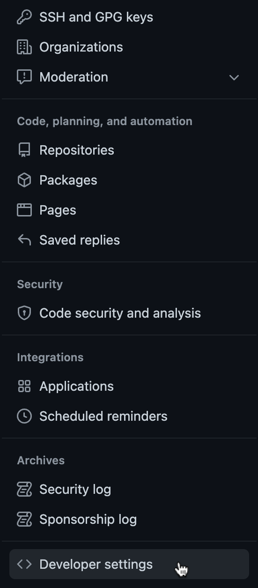
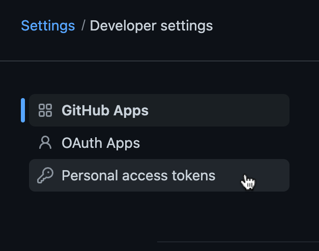
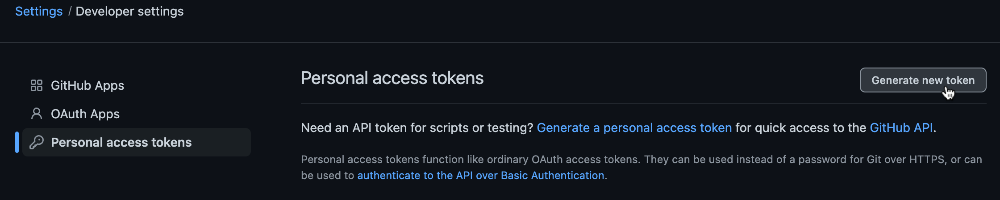
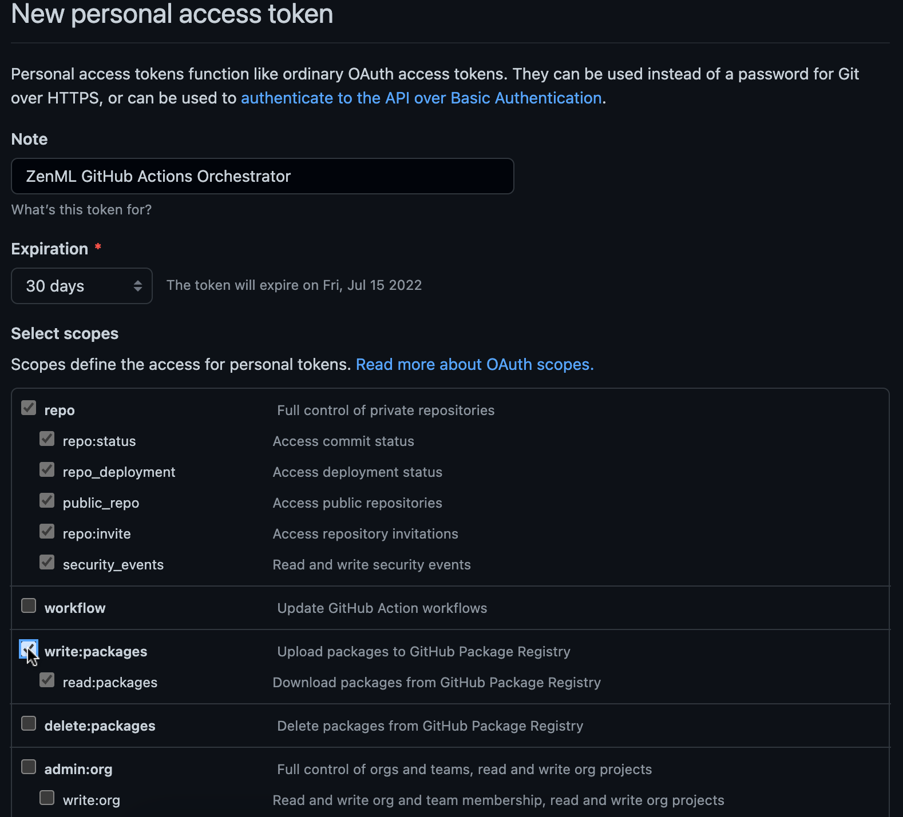
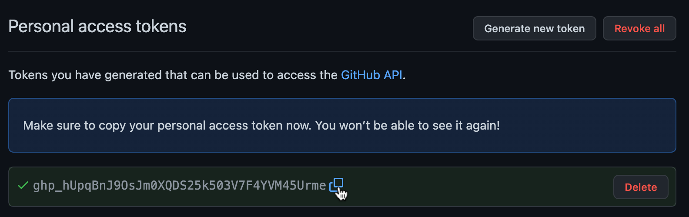

Move over Kubeflow! GitHub Actions is the new sheriff in town!

We're really proud of our Kubeflow integration. It gives you a ton of power and flexibility and is a production-ready tool. But we also know that for many of you it's one step too many. Setting up a Kubernetes cluster is probably nobody's ideal way to spend their time, and it certainly requires some time investment to maintain.

We thought this was a concern worth addressing so I worked to build an alternative during the ZenHack Day we recently ran. [GitHub Actions](https://docs.github.com/en/actions) is a platform that allows you to execute arbitrary software development workflows right in your GitHub repository. It is most commonly used for CI/CD pipelines, but using the GitHub Actions orchestrator ZenML now enables you to easily run and schedule your machine learning pipelines as GitHub Actions workflows.

## GitHub Actions: best in class for what?

Most technical decisions come with various kinds of tradeoffs, and it's worth taking a moment to assess why you might want to use the GitHub Actions orchestrator in the first place.

Let's start with the downsides:

- You don't have as much flexibility as with a tool like Kubeflow in terms of specifying exactly what kinds of hardware are used to run your steps.
- The orchestrator itself runs on the hardware that GitHub Actions provides (generously and [for free](https://github.blog/2019-08-08-github-actions-now-supports-ci-cd/)). This isn't the fastest or or most performant infrastructure setup, and it generally is much slower than even your local CPU machine. There are also memory and storage constraints to [the machines they provide](https://docs.github.com/en/actions/using-github-hosted-runners/about-github-hosted-runners#supported-runners-and-hardware-resources) as GitHub Actions runners.
- GitHub offers no guarantees about when your actions will be executed; at peak times you might be waiting a while before the hardware is allocated and provisioned to run. If you are planning on running ZenML pipelines on a schedule (every ten minutes, for example) then this might not work as expected.

So what's the point, then? These are indeed some serious downsides. Firstly and foremostly, there's the cost: running your pipelines on GitHub Actions is **free**. If you're interested in running your pipelines in the cloud on serverless infrastructure, there's probably no easier way to get started than to try out this orchestrator.

You are also spared the pain of maintaining a Kubernetes cluster. Once you've configured it (see below for instructions) there's basically nothing you have to do on an ongoing basis. I hope you're sold on trying it out and want to get started, so let's not hold off any more.

(Note that some of the commands in this tutorial rely on environment variables or a specific working directory from previous commands, so be sure to run them in the same shell. In this tutorial we're going to use [Microsoft's Azure platform](https://azure.microsoft.com/) for cloud storage and our MySQL database, but it works just as well on AWS or GCP.

## Prerequisites

This tutorial assumes that you have:

* Docker installed
* `git` installed
* Python installed (3.7-3.9)
* a GitHub account

## Azure Setup

### Create an account
### Create an Azure Blob Storage Container


Note down:
- <ACCOUNT_NAME>
- <ACCOUNT_KEY>
- <BLOB_STORAGE_CONTAINER_PATH>

### Host a MySQL database

Azure Database for MySQL


Note down: 
- <USERNAME>
- <PASSWORD>
- <HOST>
- <DATABASE_NAME>

Download:
- <PATH_TO_SSL_SERVER_CERTIFICATE>
- <SSL_CLIENT_CERTIFICATE>
- <SSL_CLIENT_KEY>

## GitHub Setup


### Fork the tutorial repository


```bash
git clone <>
cd <>
```


### Create a GitHub Personal Access Token

Next up, we'll need to create a [GitHub Personal Access Token](https://docs.github.com/en/authentication/keeping-your-account-and-data-secure/creating-a-personal-access-token) that ZenML will use to authenticate with the GitHub API in order to store secrets and upload Docker images.

1) Go to https://github.com, click on your profile image in the top right corner and select `Settings`:

2) Scroll to the bottom and click on `Developer Settings` on the left side:

3) Select `Personal access tokens` and click on `Generate new token`:


4) Give your token a descriptive name for future reference and select the `repo` and `write:packages` scopes:

5) Scroll to the bottom and click on `Generate token`. This will bring you to a page that allows you to copy your newly generated token:


Now that we've got our token, let's store it in an environment variable for future steps. We'll also store our GitHub username that this token was created for. Replace the `<PLACEHOLDERS>` in the following command and run it:
```bash
export GITHUB_USERNAME=<GITHUB_USERNAME>
export GITHUB_AUTHENTICATION_TOKEN=<PERSONAL_ACCESS_TOKEN>
```

### Login to the Container registry

When we'll run our pipeline later, ZenML will build a Docker image for us which will be used to execute the steps of the pipeline. In order to access this image inside GitHub Actions workflow, we'll push it to the GitHub container registry. Running the following command will use the personal access token created in the previous step to authenticate our local Docker client with this container registry:
```bash
docker login ghcr.io -u $GITHUB_USERNAME -p $GITHUB_AUTHENTICATION_TOKEN
```

## ZenML Setup

Now that we're done setting up and configuring all our infrastructure and external dependencies, it's time to install ZenML and configure a ZenML stack that connects all these elements together.

### Installation

Let's install ZenML and all the additional packages that we're going to need to run our pipeline:
```bash
pip install zenml
zenml integration install github azure
```

### Registering the stack

A [ZenML stack](https://docs.zenml.io/advanced-guide/stacks-components-flavors) consists of many components which all play a role in making your ML pipeline run in a smooth and reproducible manner. Let's register all the components that we're going to need for this tutorial!

* The **orchestrator** is responsible for running all the steps in your machine learning pipeline. In this tutorial we'll use the new GitHub Actions orchestrator which, as the name already indicates, uses GitHub Actions workflows to orchestrate your ZenML pipeline. Registering the orchestrator is as simple as running the following command:
    ```bash
    zenml orchestrator register github_orchestrator --flavor=github  
    ```

* We'll also need to configure a **container registry** which will point ZenML to a Docker registry to store the images that ZenML builds in order to run your pipeline. Luckily, your GitHub account already comes with a free container registry! To register it simply run:
    ```bash
    zenml container-registry register github_container_registry \
        --flavor=github \
        --automatic_token_authentication=true \
        --uri=ghcr.io/$GITHUB_USERNAME
    ```

* The **secrets manager** is used to securely store all your credentials so ZenML can use them to authenticate with other components like your metadata or artifact store. We're going to use a secrets manager implementation that stores these credentials as [encrypted GitHub secrets](https://docs.github.com/en/actions/security-guides/encrypted-secrets):
    ```bash
    zenml secrets_manager register github_secrets_manager \
        --flavor=github \
        --owner=$GITHUB_USERNAME \
        --repository=zenml-github-actions-tutorial
    ```

* **Metadata stores** keep track of all the metadata associated with pipeline runs. They enable [ZenML's caching functionality](https://docs.zenml.io/developer-guide/caching) and allow us to query the parameters and inputs/outputs of steps of past pipeline runs. We'll register the MySQL database we created before with the following command (after replacing the `<PLACEHOLDERS>` with the values we [noted down](#host-a-mysql-database)):
    ```bash
    zenml metadata-store register azure_metadata_store \
        --flavor=mysql \
        --secret=azure_mysql_secret \
        --host=<HOST> \
        --database=<DATABASE_NAME> \
    ```

* The **artifact store** stores all the artifacts that get passed as inputs and outputs of your pipeline steps. To register our blob storage container, replace the `<BLOB_STORAGE_CONTAINER_PATH>` placeholder in the following command with the path we saved when [creating the blob storage container](#create-an-azure-blob-storage-container) and run it:
    ```bash
    zenml artifact-store register azure_artifact_store \
        --flavor=azure \
        --authentication_secret=azure_store_auth \
        --path=<BLOB_STORAGE_CONTAINER_PATH>
    ```

These are all the components that we're going to use for this tutorial, but ZenML offers additional components like:
* **Step operators** to run individual steps of your pipeline in specialized environments.
* **Model deployers** to deploy your trained machine learning model in production.
* And many more. Check out [our docs](https://docs.zenml.io/advanced-guide/stacks-components-flavors#stacks) for a full list of available components.

With all components registered, we can now create and activate our ZenML stack. This makes sure ZenML knows which components to use when we're going to run our pipeline later.
```bash
zenml stack register github_actions_stack \
    -o github_orchestrator \
    -s github_secrets_manager \
    -c github_container_registry \
    -m azure_metadata_store \
    -a azure_artifact_store \
    --set
```

### Registering the secrets

Once the stack is active, we can register the secrets that ZenML needs to authenticate with some of our stack components.

Let's start with the secret for our metadata store. For this, we'll use some of the information we've saved when [hosting the MySQL database](#host-a-mysql-database) earlier. More specifically, we're going to the need:
- the username and password to authenticate with the MySQL database
- paths to the three SSL certificates that we downloaded

Replace the `<PLACEHOLDERS>` in the following command with those concrete values and run it:
```bash
# the `@` prefix in front of the SSL certificate paths tells ZenML to load the secret value from a file instead of using the string that was passed as the argument value
zenml secret register azure_mysql_secret \
    --schema=mysql \
    --user=<USERNAME> \
    --password=<PASSWORD> \
    --ssl_ca=@<PATH_TO_SSL_SERVER_CERTIFICATE> \
    --ssl_cert=@<PATH_TO_SSL_CLIENT_CERTIFICATE> \
    --ssl_key=@<PATH_TO_SSL_CLIENT_KEY>
```

For the artifact store secret, we're going to need the **account name** and **account key** that we saved when we [created our blob storage container](#create-an-azure-blob-storage-container).
Replace the `<PLACEHOLDERS>` in the following command with those concrete values and run it:
```bash
zenml secret register azure_store_auth \
    --schema=azure \
    --account_name=<ACCOUNT_NAME> \
    --account_key=<ACCOUNT_KEY>
```

## Run the pipeline

That was quite a lot of setup, but luckily we're (almost) done now.
Let's execute the python script that "runs" our pipeline and take a look at what happens:
```bash
python run.py
```

1) ZenML will build a Docker image with our pipeline code and all the requirements installed and push it to the GitHub container registry.
2) The orchestrator will write a [GitHub Actions workflow file](https://docs.github.com/en/actions/using-workflows/about-workflows) to the directory `.github/workflows`. Pushing this workflow file will trigger the executing of your ZenML pipeline. We'll explain later at how to automate this step, but for our first pipeline run there is one last configuration step we need to do.

### ...

Now that our Docker image is pushed, we need to allow GitHub Actions to pull this image:
1) Head to `https://github.com/users/<GITHUB_USERNAME>/packages/container/package/zenml-github-actions` (replace `<GITHUB_USERNAME>` with your GitHub username) and select `Package settings` on the right side:
2) In the `Manage Actions access` section, click on `Add Repository`:
3) TODO

### Commit and push the workflow

Congratulations on coming so far! Now all that's left to do is commit and push the workflow file:
```bash
git add .github/workflows
git commit -m "Add ZenML pipeline workflow"
git push
```

If we now go to our GitHub repository and click on the `Actions` tab, we should see our pipeline running! 🎉

TODO: images

## Automate the committing and pushing

If we want the orchestrator to automatically commit and push the workflow file for us, we can enable it with the following command:
```bash
zenml orchestrator update github_orchestrator --push=true
```

After this update, calling `python run.py` should automatically build and push a Docker image, commit and push the workflow file which will in turn run our pipeline on GitHub Actions.

[*Image Credit: Photo by [Roman Synkevych](https://unsplash.com/@synkevych) on [Unsplash](https://unsplash.com/s/photos/github)*]