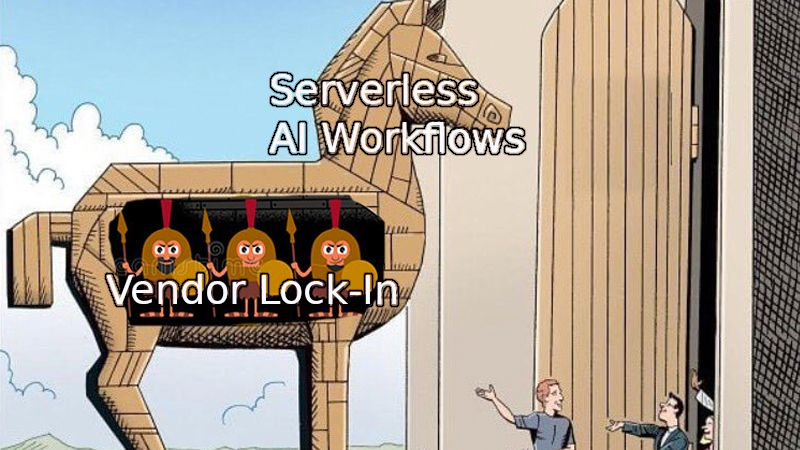
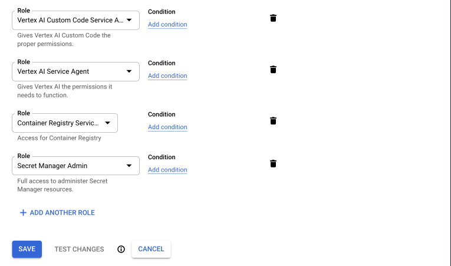

# Serverless MLOps with Vertex AI

A serverless architecture allows you to run code without having to directly
manage infrastructure. This helps the developer focus on the code without
worrying about managing infrastructure or costs racking up for continuously
running (virtual) machines. Additionally, serverless architectures can quickly
scale up to meet the changing needs for computation.
[Vertex AI pipelines](https://cloud.google.com/vertex-ai/docs/pipelines/introduction)
is Googles' very own serverless pipeline orchestration tool that we will be
using today.

However, the advantages are only part of the story. As much as serverless
architectures can help you quickly scale, they come with a hidden cost: vendor
lock-in. As you build your processes and services around the provider specific
APIs and you become more and more dependent on the specific provider with
significant costs associated with a potential switch.



But fret not, ZenML is the perfect abstraction layer that will make it as easy
as pie to quickly switch your pipeline orchestration from local to vertex AI to
any of our other Orchestrators.

## Prerequisites

This tutorial assumes that you have:

* [Python](https://www.python.org/) installed (version 3.7-3.9)
* [Docker](https://www.docker.com/) installed and running
* Access to a [gcp](https://cloud.google.com/) project space
* [gcloud CLI](https://cloud.google.com/sdk/gcloud) installed on your machine
  and authenticated

## Starting locally

To get started we will set everything up locally to initially run our pipeline
on our own machine. To do so we first have to install zenml, the `sklearn`
integration, and we also initialize a zenml repo.

```shell
pip install zenml
zenml integration install sklearn
zenml init
```

Now we create a python file with the following contents in the same
directory where we ran `zenml init`:

```python
import os
import re

import numpy as np
import pandas as pd
from scipy.sparse import csr_matrix
from sklearn.base import BaseEstimator, ClassifierMixin
from sklearn.feature_extraction.text import CountVectorizer
from sklearn.linear_model import LogisticRegression

from zenml.integrations.constants import SKLEARN
from zenml.pipelines import pipeline
from zenml.steps import Output, step

TRAIN_PATH = os.path.join(os.path.dirname(__file__), "data", "train.csv")
TEST_PATH = os.path.join(os.path.dirname(__file__), "data", "test.csv")


def clean_text(text: str):
    return re.sub(r"\W", " ", text.lower())


@step
def importer() -> Output(
    X_train=np.ndarray, X_test=np.ndarray, y_train=np.ndarray, y_test=np.ndarray
):
    train = pd.read_csv(TRAIN_PATH)
    test = pd.read_csv(TEST_PATH)

    X_train = train["x"].apply(clean_text).to_numpy()
    X_test = test["x"].apply(clean_text).to_numpy()
    y_train = train["y"].to_numpy()
    y_test = test["y"].to_numpy()

    return (X_train, X_test, y_train, y_test)


@step
def vectorizer(
        train: np.ndarray, test: np.ndarray
) -> Output(count_vec=BaseEstimator, X_train=csr_matrix, X_test=csr_matrix):
    count_vec = CountVectorizer(ngram_range=(1, 4), min_df=3)
    train = count_vec.fit_transform(train)
    test = count_vec.transform(test)
    return count_vec, train, test


@step
def trainer(
        X_train: csr_matrix,
        y_train: np.ndarray,
) -> ClassifierMixin:
    model = LogisticRegression(solver="liblinear")
    model.fit(X_train, y_train)
    return model


@step
def predictor(
        transformer: BaseEstimator,
        model: ClassifierMixin,
        X: np.ndarray,
) -> np.ndarray:
    X = transformer.transform(X)
    return model.predict(X)


@pipeline(required_integrations=[SKLEARN])
def training_pipeline(importer, vectorizer, trainer, predictor):
    X_train, X_test, y_train, y_test = importer()
    vec_transformer, X_train_vec, X_test_vec = vectorizer(X_train, X_test)
    model = trainer(X_train_vec, y_train)
    predictor(vec_transformer, model, X_test)

if __name__ == "__main__":
    pipe = training_pipeline(importer(), vectorizer(), trainer(), predictor())
    pipe.run()
```

Finally, we can run this python file:

```shell
python run.py
```

And voilà, we've run our machine learning pipeline locally. Not too impressive, 
but buckle up, we'll take this same pipeline to the next level momentarily. 

## Setup of GCP Project and Resources

Before we can orchestrate our pipeline using Vertex AI we will need to set up 
all the required resources and permissions on GCP. This is a one time effort
that you will not need to repeat. Feel free to skip and adjust these steps 
as you see fit. 

To start we will create a new gcp project for the express purpose of having all 
our resources encapsulated into one overarching entity. 

Click on the project select box


Create a `New Project`


and name your project


It will take some time for your project to be created. Once it is
created you will need to enable billing for the project so that you can set
up all required resources.

You will need the project name and project id in the following steps again.

* The project name will be referred to as <gcp_project_name>
* The [project ID](https://support.google.com/googleapi/answer/7014113?hl=en)
  will be referred to as <gcp_project_id>

### CloudSQL

* Why? ...

Search `cloud sql` or use this link `https://console.cloud.google.com/sql/


Choose MySQL


Name the instance, give it a root password and configure it and allow public
connections


Make sure to only allow SSL connections and create and download
client certificates


Add a new user account for ZenML to use


In the Overview page you can find the public IP address


For the creation of the [ZenML Metadata Store](#zenml-metadata-store) you
will need the following data:

* Public IP
* Username
* Password
* The three SSL certificates (server-ca.pem, client-key.pem, client-cert.pem)

### Cloud Storage

* Why? ...

Search `cloud storage` or use this link
`https://console.cloud.google.com/storage/`


Once the bucket is created, you can find the storage URI as follows.


For the creation of the [ZenML Artifact Store](#zenml-artifact-store) you
will need the following data:

* gsutil URI

### Container Registry

Search `container registry` or use this link
`https://console.cloud.google.com/marketplace/product/google/containerregistry.googleapis.com`


You can find your container registry host (`<registry_host>`) under settings of
your projects' container registry


For the creation of the [ZenML Metadata Store](#zenml-container-registry) you
will need the following data:

URI - this is constructed as follows
`<registry_host>/<gcp_project_name>/<custom_name>` with the `<custom_name>`
being configurable for each different project that you might want to run.

### Secret Manager

* Search `secret manager` or use this link
  `https://console.cloud.google.com/marketplace/product/google/secretmanager.googleapis.com`


You won't need to do anything else here. The Secret Manager will be uniquely
identifiable by the `<gcp_project_id>` .

### Vertex AI

Search `vertex ai` or use this link
`https://console.cloud.google.com/vertex-ai`.


Make sure you choose the appropriate region for your location. You will need
to remember this location for the [ZenML Orchestrator](#zenml-orchestrator).

## Set up Permissions

With all the resources set up you will now need to set up a service account with
all the right permissions. This service account will need to be able to
access all the different resources that we have set up so far.

Start by searching for `IAM` in the search bar or use this link:
`https://console.cloud.google.com/iam-admin`. Here you will need to create a
new Service Account.


First off you'll need to name the service account. Make sure to give it a
clear name and description.


This service account will need to have the roles of:
`Vertex AI Custom Code Service Agent`, `Vertex AI Service Agent` and
`Secret Manager Admin` (for some reason the `Secret Manager Secret Accessor`
role is not enough here).



Finally, you need to make sure your own account will have the right to `run-as`
this service account. It probably also makes sense to give yourself the right to
manage this service account to perform changes later on.


Finally, you can now find your new service account in the `IAM` tab. You'll need
the Principal when creating your [ZenML Orchestrator](#zenml-orchestrator).


## Setting up the ZenML Stack

With everything on the GCP side done, we can now jump into the ZenML side.

### ZenML metadata-store

The `DB_HOST_IP` is the public IP Address of your Database `xx.xx.xxx.xxx`.
The `DB_PORT` is `3306` by default - set this in case this default does not
apply to your database instance. The `DB_NAME` is the name of the database that
you have created in [GCP](#cloudsql) as the metadata store. The `mysql_secret`
will be created once the secrets manager is created and the stack is active.

```shell

zenml metadata-store register gcp_metadata_store --flavor=mysql --host=<DB_HOST_IP> --port=<DB_PORT> --database=<DB_NAME> --secret=mysql_secret
```

### ZenML artifact-store

The PATH_TO_YOUR_GCP_BUCKET is the path to your GCP bucket in the following
format `gs://xxx` .

```shell
zenml artifact-store register gcp_artifact_store --flavor=gcp --path=<gsutil-URI>
```

### ZenML container-registry

The CONTAINER_REGISTRY_URI will have a format like this `eu.gcr.io/xxx/xxx`.
Refer to the [gcp container registry](#container-registry)

```shell
zenml container-registry register gcp_registry --flavor=gcp --uri=<CONTAINER_REGISTRY_URI>
```

### ZenML secret-manager

For the secrets manager, all we'll need is the gcp PROJECT_ID.

```shell
zenml secrets-manager register gcp_secrets_manager --flavor=gcp_secrets_manager --project_id=<PROJECT_ID>
```

### ZenML orchestrator

The orchestrator needs the PROJECT_ID and the GCP_LOCATION in which to run the
Vertex AI pipeline. Additionally, you should set the WORKLOAD_SERVICE_ACCOUNT
to the service account you created with secret manager access, it will be in
the format: xxx@xxx.iam.gserviceaccount.com.

```shell
zenml orchestrator register vertex_orch --flavor=vertex --project=<PROJECT_ID> --location=<GCP_LOCATION> --workload_service_account=<SERVICE_ACCOUNT>
```

### Combine your stack

Our stack components are ready to be configured and set as the active stack.

```shell
zenml stack register gcp_vertex_stack -m gcp_metadata_store -a gcp_artifact_store -o vertex_orch -c gcp_registry -x gcp_secrets_manager --set
```

### Configure the `mysql_secret`

With the stack up and running, we can now supply the credentials for the
mysql metadata store. You generated the SSL certificates when setting up the
[CloudSQL](#cloudsql) within the GCP UI.

```shell
zenml secret register mysql_secret --schema=mysql --user=<DB_USER> --password=<PWD> \
  --ssl_ca=@</PATH/TO/DOWNLOADED/SERVER-CERT> \
  --ssl_cert=@</PATH/TO/DOWNLOADED/CLIENT-CERT> \
  --ssl_key=@</PATH/TO/DOWNLOADED/CLIENT-KEY>
```

## Running

You're ready to run your code on Vertex AI now.

