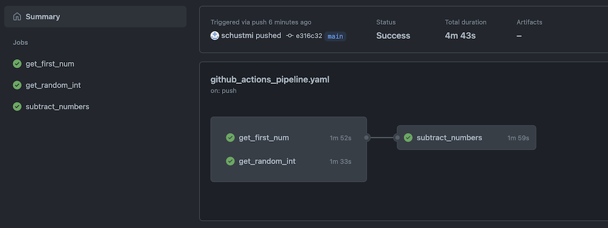
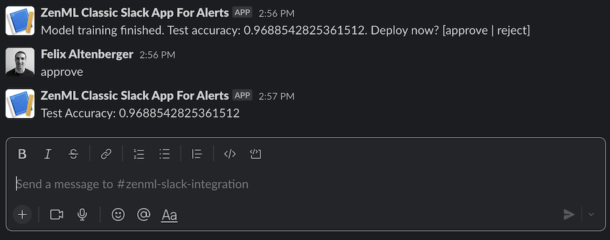
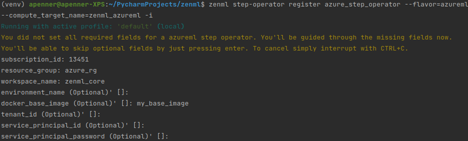

With 0.10.0, we've added Data Validators as a new stack component and an implementation for Great Expectations to kick things off. This release also brings 
the highly-requested Kubernetes Orchestrator and a Vault secret manager!

Beyond this, as usual we included a number of smaller bugfixes and documentation changes to cumulatively improve experience of using ZenML as a user. 
For a detailed look at what's changed, give [our full release notes](https://github.com/zenml-io/zenml/releases/tag/0.9.0) a glance.

## 🎉 Great Expectations as the new Data Validator

Want to run data quality checks as part of a ZenML pipeline? We've got you covered! We introduce Data Validators and an integration which 
allows you to seamlessly connect Great Expectations so that it uses whatever Artifact Store is configured in the active stack to store 
its persistent information: data validation rules (expectations suites), data validation results (checkpoint results), and generated data documentation 
providing a unified view on these artifacts and the general state of the data quality in a project.

In addition, there are two new standard steps:

* a Great Expectations profiler that can be used to automatically generate Expectation Suites from input datasets.
* a Great Expectations validator that uses an existing Expectation Suite to validate an input dataset.

A ZenML visualizer that is tied to the generated Great Expectations data docs is also included and can be used to visualize the expectation suites and 
checkpoint results created by pipeline steps 😍

Got feedback or just want to let us know how you feel? [Connect with us](https://zenml.io/slack-invite/) or join us for a [Community Meetup](https://www.eventbrite.de/e/zenml-meet-the-community-tickets-354426688767?utm-campaign=social&utm-content=attendeeshare&utm-medium=discovery&utm-term=listing&utm-source=cp&aff=escb) 👋 which happens every Wednesday!

## Kubernetes Native Orchestrator

We've heard you! With this new addition to our increasing list of orchestrators, you can now run your ZenML pipelines natively on your Kubernetes Cluster. 
It's amazing but don't take my word for it; try it on your own or wait for the dedicated blog post that we've planned, 
which, by the way, also features a little surprise to make it easier for you to follow along 😉

There's a lot to love about this integration.
* Every step gets executed in its own pod and the logs from all of them are streamed to your terminal!
* You can schedule pipeline runs as CRON jobs.
* It automatically spins up a MySQL metadata store for you when you do `zenml stack up`!

We can't wait to hear your thoughts on this 🙂

## ⌨️ CLI Improvements

Barely a release passes without some user-facing CLI improvements, and this one is no exception. We added two small changes that just might bring a bit of UI 🌞 to your day:

- When registering and updating stack components through the CLI, the configuration attribute values can now also be loaded from files (by using the @path/to/file syntax).

- We previously added the ability to update a pre-existing stack in place, but sometimes you want to duplicate a stack and make a slight modification to one you already configured. In this release we've given you that option with the easy `zenml stack copy` command.

## 📖 Documentation & User Guides

User-facing documentation is really important for us at ZenML, and we keep our main documentation page up-to-date. With the latest release, we've made sure we're just as consistent with the internal code documentation in the form of docstrings. We've added CI checks using [`pydocstyle`](http://www.pydocstyle.org/en/stable/) and [`darglint`](https://github.com/terrencepreilly/darglint) that ensure that all our functions and modules include correct and consistently presented docstrings.

We switched out how we check for spelling errors, too, and we're now using [`pyspelling`](https://facelessuser.github.io/pyspelling/) everywhere to make sure we stay typo-free!

This release includes a number of other smaller documentation fixes and additions.

## ➕ Other Updates, Additions and Fixes

The latest release include several smaller features and updates to existing functionality:

- Schedules can now be defined using 'cron' expressions
- The detection of whether a step was cached or not is now done without querying the metadata store. This reduces the step execution by ~10secs.
- We now allow for the passing of authentication credentials to all artifact stores and container registries as secrets
- We made the dependencies that are part of the ZenServer optional. If you wish to install the ZenServer, be sure to use the following command: `pip install zenml[server]`.
- We fixed some broken or deprecated CLI commands listed in our examples.
- We made some internal changes to how code is organized within the core `src/zenml` directory, notably for the `utils` module and for all the cloud integrations.

## 🙌 Community Contributions

We received several new community contributions during this release cycle. We mentioned Gabriel's Vertex AI orchestrator above already, but we also saw the following contributions:

* [@anencore94](https://github.com/anencore94) made their first contribution in [https://github.com/zenml-io/zenml/pull/644](https://github.com/zenml-io/zenml/pull/644)
* [@hectorLop](https://github.com/hectorLop) made their first contribution in [https://github.com/zenml-io/zenml/pull/648](https://github.com/zenml-io/zenml/pull/648)
* [@gabrielmbmb](https://github.com/gabrielmbmb) made their first contribution in [https://github.com/zenml-io/zenml/pull/640](https://github.com/zenml-io/zenml/pull/640)
* [@ketangangal](https://github.com/ketangangal) made their first contribution in [https://github.com/zenml-io/zenml/pull/628](https://github.com/zenml-io/zenml/pull/628)
* [@Reed-Schimmel](https://github.com/Reed-Schimmel) made their first contribution in [https://github.com/zenml-io/zenml/pull/684](https://github.com/zenml-io/zenml/pull/684)

## 👩‍💻 Contribute to ZenML!

Join our [Slack](https://zenml.io/slack-invite/) to let us know if you have an
idea for a feature or something you'd like to contribute to the framework.

We have a [new home for our
roadmap](https://zenml.io/roadmap) where you can vote on your favorite upcoming
feature or propose new ideas for what the core team should work on. You can vote
without needing to log in, so please do let us know what you want us to build!

[Photo by <a href="https://unsplash.com/@allisonh328">Allison Louise</a> on <a href="https://unsplash.com/photos/xABgmlX4ABE">Unsplash</a>]
