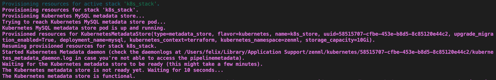
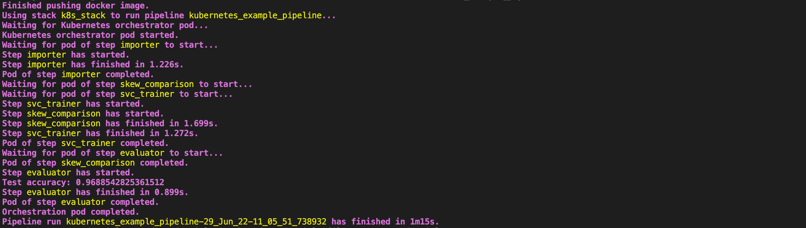
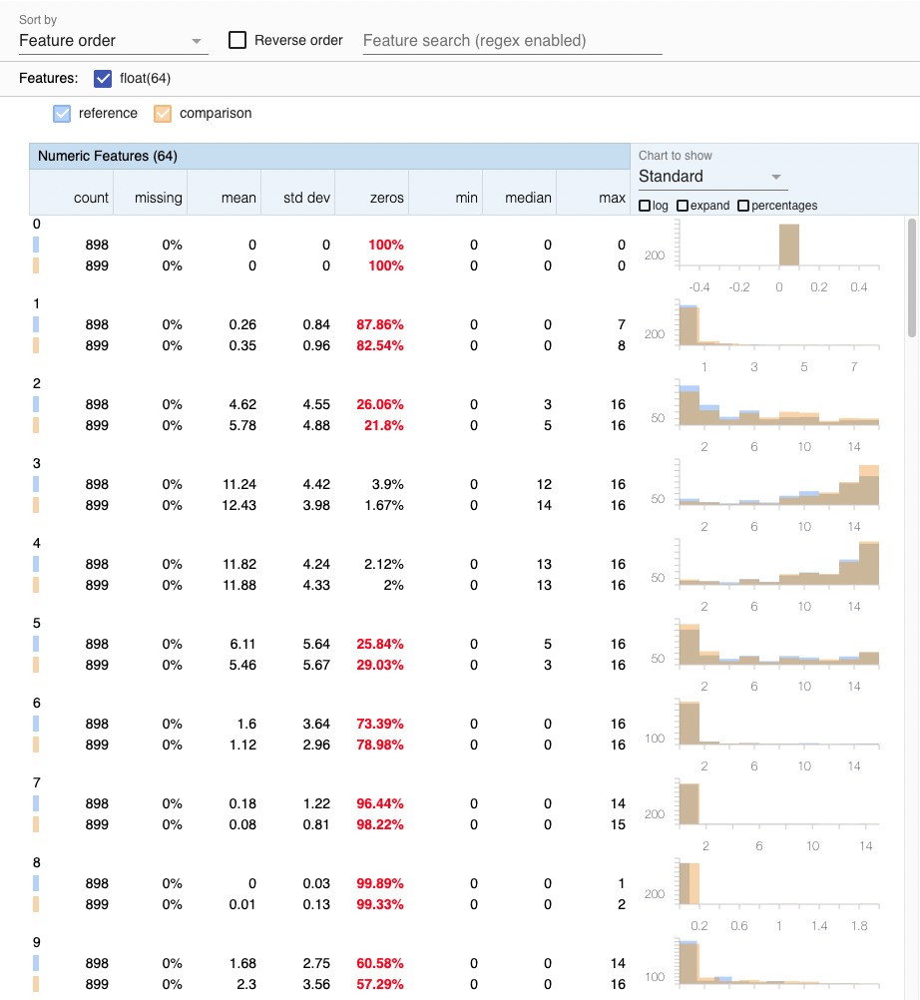
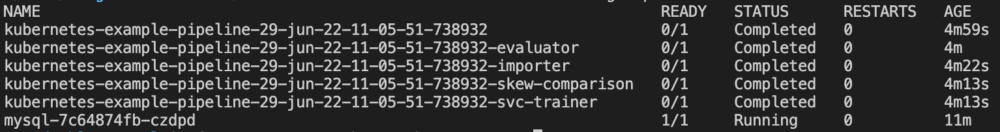

Orchestrating ML workflows natively in Kubernetes has been one of the most
requested features at ZenML.
We have heard you and have just released a brand new Kubernetes-native
orchestrator for you, which executes each pipeline step in a separate pod,
streams the logs of all pods to your terminal, and even supports CRON job
scheduling.
Moreover, we have even added a new Kubernetes metadata store that you can
use with the orchestrator to save your ML metadata in a fresh MySQL database
automatically deployed within your Kubernetes cluster.

Now, why would we want to orchestrate ML workflows natively in Kubernetes in
the first place when ZenML already integrates with 
[Kubeflow](https://www.kubeflow.org/), which can run jobs on Kubernetes for us?
Well, Kubeflow is an awesome, battle-tested tool, and it certainly is the most
production-ready Kubernetes orchestration tool out there. 
However, Kubeflow also comes with a lot of additional requirements and general
added complexity that not every team might want:
- Kubeflow Pipelines (kfp) alone requires a list of 21 other packages aside from
Kubernetes
- It includes a UI that you might not need as well as a lot of
Google Cloud specific functionality that is essentially dead code if you are 
using a different cloud provider.
- Most importantly, someone must install it on your cluster, configure it, 
and actively manage it.

If you are looking for a minimalist, lightweight way of running ML workflows on
Kubernetes, then this post is for you:
By the time we are done, you will be able to orchestrate ML pipelines on 
Kubernetes without any additional packages apart from the
[official Kubernetes Python API](https://github.com/kubernetes-client/python).

Best of all, if you build out the stack described in this tutorial and
then later want to switch to a Kubeflow setup, it will be as easy as changing
the orchestrator in your ZenML stack with a single line of code, so you are not
locked into anything!

So, let's get into it and use the new Kubernetes-native orchestrator and
metadata store to easily run ML workflows in a distributed and scalable cloud 
setting on AWS.
To do so, we will provision various resources on AWS: an S3 bucket for artifact
storage, an ECR container registry, as well as an Amazon EKS cluster, on which 
the Kubernetes-native components will run.

The following figure shows an overview of the MLOps stack we will build
throughout this tutorial:


## Setting Up AWS Resources

In this example, we will use AWS as our cloud provider of choice and provision
an EKS Kubernetes cluster, an S3 bucket to store our ML artifacts,
and an ECR container registry to manage the Docker images that Kubernetes 
needs.
However, this could also be done in a similar fashion on any other cloud 
provider.

### Requirements

In order to follow this tutorial, you need to have the following software
installed on your local machine:

* [Python](https://www.python.org/) (version 3.7-3.9)
* [Docker](https://www.docker.com/)
* [kubectl](https://kubernetes.io/docs/tasks/tools/)
* [AWS CLI](https://docs.aws.amazon.com/cli/latest/userguide/getting-started-install.html)

### Taking the Highway

If you're looking for a really quick way to have all the resources deployed and ready, we have something interesting for you!
We are building a set of "recipes" for the most popular MLOps stacks so that you can get to the execution phase faster. 

Take a look at `[mlops-stacks](https://github.com/zenml-io/mlops-stacks)` by ZenML 😍. It's open-source and maintained by the ZenML core team.

Now, coming back to the setup, you can leverage the ["eks-s3-seldon-mlflow"](https://github.com/zenml-io/mlops-stacks/tree/main/eks-s3-seldon-mlflow) recipe for this example. 

> **Note**
> You need to have Terraform installed to conitnue.

Follow these steps and you'll have your stack ready to be registered with ZenML!

1. Clone the repository. 
2. Move into the "eks-s3-seldon-mlflow" directory and run the following command.
   ```
   terraform init
   ```
   This will download some provider information to your repository and can take up to a minute to run.

3. After the `init` has completed, you can now apply your resources. For that, execute this command.
    ```
    terraform apply
    ```
    This will give you an overview of all resources that will be created. Select "yes" and just sit back 😉
    It can take up to 20 minutes to set everything up.
    
4. Your stack is now ready! 🚀 

You can skip directly to the stack registration section now! 😎

---

If you want more insight into how each of the stack components are built and would want to create them manually, follow along.

### EKS Setup

First, create an EKS cluster on AWS according to
[this AWS tutorial](https://docs.aws.amazon.com/eks/latest/userguide/create-cluster.html).

Next, configure your local `kubectl` to connect to the EKS cluster we just
created:

```bash
aws eks --region <AWS_REGION> update-kubeconfig
    --name <AWS_EKS_CLUSTER>
    --alias <KUBE_CONTEXT>
```

### S3 Bucket Setup

Next, let us create an S3 bucket where our ML artifacts can later be stored.
You can do so by following
[this AWS tutorial](https://docs.aws.amazon.com/AmazonS3/latest/userguide/create-bucket-overview.html).

The path for your bucket should be in this format `s3://your-bucket`.

Now we still need to authorize our EKS cluster to access the S3 bucket we just
created.
For simplicity, we will do this by simply assigning an `AmazonS3FullAccess` 
policy to the cluster node group's IAM role.

### ECR Container Registry Setup

Since each Kubernetes pod will require a custom Docker image, we will
also set up an ECR container registry to manage those.
You can do so by following
[this AWS tutorial](https://docs.aws.amazon.com/AmazonECR/latest/userguide/get-set-up-for-amazon-ecr.html).

In order to push container images to ECR, we now still need to authenticate our
local docker CLI:

```bash
aws ecr get-login-password --region <AWS_REGION> | docker login 
    --username AWS 
    --password-stdin 
    <ECR_REGISTRY_NAME>
```

## Run an example with ZenML
Let's now see the Kubernetes-native orchestration in action with a simple
example using ZenML.

The following code defines a four-step pipeline that loads NumPy training and 
test datasets, checks them for training-serving skew with Facets, trains a 
sklearn model on the training set, and then evaluates it on the test set:

```python
import numpy as np
import pandas as pd
from sklearn.base import ClassifierMixin
from sklearn.svm import SVC

from zenml.integrations.facets.visualizers.facet_statistics_visualizer import (
    FacetStatisticsVisualizer,
)
from zenml.integrations.sklearn.helpers.digits import get_digits
from zenml.pipelines import pipeline
from zenml.repository import Repository
from zenml.steps import Output, step


@step
def importer() -> Output(
    X_train=np.ndarray, X_test=np.ndarray, y_train=np.ndarray, y_test=np.ndarray
):
    """Loads the digits array as normal numpy arrays."""
    X_train, X_test, y_train, y_test = get_digits()
    return X_train, X_test, y_train, y_test


@step
def svc_trainer(
    X_train: np.ndarray,
    y_train: np.ndarray,
) -> ClassifierMixin:
    """Train a sklearn SVC classifier."""
    model = SVC(gamma=0.001)
    model.fit(X_train, y_train)
    return model


@step
def evaluator(
    X_test: np.ndarray,
    y_test: np.ndarray,
    model: ClassifierMixin,
) -> float:
    """Calculate the accuracy on the test set"""
    test_acc = model.score(X_test, y_test)
    print(f"Test accuracy: {test_acc}")
    return test_acc


@step
def skew_comparison(
    reference_input: np.ndarray,
    comparison_input: np.ndarray,
) -> Output(reference=pd.DataFrame, comparison=pd.DataFrame):
    """Convert data from numpy to pandas for skew comparison."""
    columns = [str(x) for x in list(range(reference_input.shape[1]))]
    return pd.DataFrame(reference_input, columns=columns), pd.DataFrame(
        comparison_input, columns=columns
    )


@pipeline(
    enable_cache=False,
    required_integrations=["sklearn", "facets"],
)
def kubernetes_example_pipeline(importer, trainer, evaluator, skew_comparison):
    """data loading -> train -> test with skew comparison in parallel."""
    X_train, X_test, y_train, y_test = importer()
    model = trainer(X_train=X_train, y_train=y_train)
    evaluator(X_test=X_test, y_test=y_test, model=model)
    skew_comparison(X_train, X_test)


if __name__ == "__main__":
    kubernetes_example_pipeline(
        importer=importer(),
        trainer=svc_trainer(),
        evaluator=evaluator(),
        skew_comparison=skew_comparison(),
    ).run()

    repo = Repository()
    runs = repo.get_pipeline(pipeline_name="kubernetes_example_pipeline").runs
    last_run = runs[-1]
    train_test_skew_step = last_run.get_step(name="skew_comparison")
    FacetStatisticsVisualizer().visualize(train_test_skew_step)
```

In order to run this code later, simply copy it into a file called `run.py`.

Next, install zenml, as well as its `sklearn`, `facets`, `kubernetes`, `aws`,
and `s3` integrations:

```bash
pip install zenml
zenml integration install sklearn facets kubernetes aws s3 -y
```

### Registering a ZenML Stack
To bring the Kubernetes orchestrator, metadata store, and all the AWS
infrastructure together, we will register them in a ZenML stack.

First, initialize ZenML in the same folder where you created the `run.py` file:
```shell
zenml init
```

Next, register the Kubernetes orchestrator and metadata store using the
`<KUBE_CONTEXT>` you defined when setting up your EKS cluster above:

```bash
zenml orchestrator register k8s_orchestrator
    --flavor=kubernetes
    --kubernetes_context=<KUBE_CONTEXT>
    --kubernetes_namespace=zenml
    --synchronous=True
```
```bash
zenml metadata-store register k8s_store 
    --flavor=kubernetes
    --kubernetes_context=<KUBE_CONTEXT>
    --kubernetes_namespace=zenml
    --deployment_name=mysql
```

Similarly, use the `<ECR_REGISTRY_NAME>` and `<REMOTE_ARTIFACT_STORE_PATH>` you
defined when setting up the ECR and S3 components to register them in ZenML.

```bash
zenml container-registry register ecr_registry 
    --flavor=default 
    --uri=<ECR_REGISTRY_NAME>
```
```bash
zenml artifact-store register s3_store 
    --flavor=s3 
    --path=<REMOTE_ARTIFACT_STORE_PATH>
```

Now we can bring everything together in a ZenML stack:

```bash
zenml stack register k8s_stack 
    -m k8s_store 
    -a s3_store 
    -o k8s_orchestrator 
    -c ecr_registry
```

Let's set this stack as active, so we use it by default for the remainder of
this tutorial:

```shell
zenml stack set k8s_stack
```

### Spinning Up Resources
Once all of our components are defined together in a ZenML stack, we can spin
them all up at once with a single command:
```bash
zenml stack up
```

In our case, this will provision the metadata store by deploying the MySQL
database within the EKS cluster and forward the respective ports.

If everything went well, you should see logs messages similar to the following
in your terminal:



In particular, look for the last line that says
`The Kubernetes metadata store is functional.`

### Running the Example

Having all of our MLOps components registered in a ZenML stack makes it now
trivial to run our example on Kubernetes in the cloud.
Simply execute the following command:

```bash
python run.py
```

This will first build a Docker image locally, including your ML pipeline code
from `run.py`, then push this to the ECR, and then execute everything on the
EKS cluster.

If all went well, you should now see the logs of all Kubernetes pods in your
terminal, similar to what is shown below.



Additionally, a window should have opened in your local browser where you can
see a training-serving skew Analysis in Facets like the following:



When running `kubectl get pods -n zenml`, you should now also be able to see
that a pod was created in your cluster for each pipeline step:



## Cleanup

### Delete Example Run Pods
If you just want to delete the pods created by the example run, execute the 
following command:

```bash
kubectl delete pods -n zenml -l pipeline=kubernetes_example_pipeline
```

### Delete ZenML Metadata Store
If you also want to delete the MySQL metadata store, run:

```bash
zenml stack down --force
```

### Delete AWS Resources
Lastly, if you even want to deprovision all of the infrastructure we created,
simply delete the respective resources in your AWS console.

TODO: in-depth tutorial with screenshots

## Conclusion

In this tutorial, we learned about orchestration on Kubernetes, set up EKS, ECR,
and S3 resources on AWS, and saw how this enables us to run arbitrary ML
pipelines in a scalable cloud environment.
Using ZenML, we were able to do all of this without having to change a single
line of our ML code. 
Furthermore, it will now be almost trivial to switch out stack components
whenever our requirements change.

If you have any questions or feedback regarding this tutorial, let us know
[here](https://zenml.hellonext.co/p/github-actions-orchestrator-tutorial-feedback) 
or join our 
[weekly community hour](https://www.eventbrite.com/e/zenml-meet-the-community-tickets-354426688767).
If you want to know more about ZenML 
or see more examples, check out our [docs](https://docs.zenml.io) and
[examples](https://github.com/zenml-io/zenml/tree/main/examples) or 
join our [Slack](https://zenml.io/slack-invite/).
