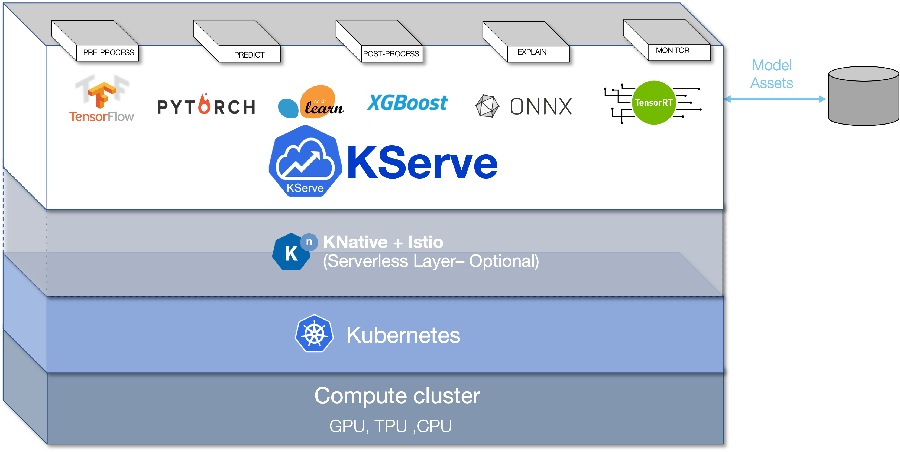

The 0.12.0 release contains our [KServe](https://github.com/kserve/kserve) integration. KServe opens the door to highly scalable, simple, pluggable production ML serving.

We've been working on minor bug fixes and improving our [docs page](https://docs.zenml.io/) to improve your experience with ZenML.

We also added functionality to specify hardware resources on a step level to control the amount of memory, CPUs and GPUs that each ZenML step has access to. 

We've also added functionality to determines if secrets are shared with other ZenML Secrets Managers using the same backend.

As always, we've also included various bug fixes and lots of improvements to the documentation and our examples.

For a detailed look at what's changed, give [our full release notes](https://github.com/zenml-io/zenml/releases/tag/0.12.0) a glance.

## 🌪 KServe Integration
The spotlight in this release is the ZenML Kserve integration.
This integration lets you define pipeline steps to scale up your model by serving your ML models on Kubernetes using any of your favourite ML framework like Tensorflow, XGBoost, Scikit-Learn, PyTorch from within ZenML!




## 📌 Specify Resources Per Step

Some steps of your machine learning pipeline might be more resource-intensive and require special hardware to execute.
In this release you can now specify the resources (such as the amount of memory, CPU and GPU) to allocate on a step level in your pipeline.

To allocate resources to a specific step in your pipeline, simply specify `resource_configuration` in the `step` decorator:

```python
from zenml.steps import step, ResourceConfiguration
@step(resource_configuration=ResourceConfiguration(cpu_count=8, gpu_count=2))
def training_step(...) -> ...:
    # train a model
```

This currently works on `KubeflowOrchestrator` and `VertexOrchestrator`, but will be extended in the upcoming weeks to support the `KubernetesOrchestrator`.

## 🤫 Scoped Secrets

Additionally, we've added support for scoped secrets in our AWS, GCP and Vault Secrets Managers. These updated Secrets Managers allow you to configure a scope which determines if secrets are shared with other ZenML Secrets Managers using the same backend.


## ➕ Other Updates, Additions and Fixes

The latest release includes several smaller features and updates to existing functionality:


* Fix Links on the examples by @safoinme in https://github.com/zenml-io/zenml/pull/782
* Fix broken links in source code by @schustmi in https://github.com/zenml-io/zenml/pull/784
* Invalidating artifact/metadata store if there is a change in one of them by @bcdurak in https://github.com/zenml-io/zenml/pull/719
* Fixed broken link in README by @htahir1 in https://github.com/zenml-io/zenml/pull/785
* Embed Cheat Sheet in a separate docs page by @fa9r in https://github.com/zenml-io/zenml/pull/790
* Add data validation documentation by @stefannica in https://github.com/zenml-io/zenml/pull/789
* Add local path for mlflow experiment tracker by @schustmi in https://github.com/zenml-io/zenml/pull/786
* Improve Docker build logs. by @fa9r in https://github.com/zenml-io/zenml/pull/793
* Allow standard library types in steps by @stefannica in https://github.com/zenml-io/zenml/pull/799
* Added small description by @AlexejPenner in https://github.com/zenml-io/zenml/pull/801
* Replace the restriction to use Repository inside step with a warning by @stefannica in https://github.com/zenml-io/zenml/pull/792
* Adjust quickstart to data validators by @fa9r in https://github.com/zenml-io/zenml/pull/797
* Add utility function to deprecate pydantic attributes by @schustmi in https://github.com/zenml-io/zenml/pull/778
* Fix the mismatch KFP version between Kubeflow and GCP integration by @safoinme in https://github.com/zenml-io/zenml/pull/796
* Made mlflow more verbose by @htahir1 in https://github.com/zenml-io/zenml/pull/802
* Fix links by @dnth in https://github.com/zenml-io/zenml/pull/798
* KServe model deployer integration by @stefannica in https://github.com/zenml-io/zenml/pull/655
* retrieve pipeline requirement within running step by @safoinme in https://github.com/zenml-io/zenml/pull/805
* Fix `--decouple_stores` error message by @strickvl in https://github.com/zenml-io/zenml/pull/814
* Support subscripted generic step output types by @fa9r in https://github.com/zenml-io/zenml/pull/806
* Allow empty kubeconfig when using local kubeflow orchestrator by @schustmi in https://github.com/zenml-io/zenml/pull/809
* fix the secret register command in kserve docs page by @safoinme in https://github.com/zenml-io/zenml/pull/815
* Annotation example (+ stack component update) by @strickvl in https://github.com/zenml-io/zenml/pull/813
* Per-step resource configuration by @schustmi in https://github.com/zenml-io/zenml/pull/794
* Scoped secrets by @stefannica in https://github.com/zenml-io/zenml/pull/803
* Adjust examples and docs to new pipeline and step fetching syntax by @fa9r in https://github.com/zenml-io/zenml/pull/795


## 👩‍💻 Contribute to ZenML!

Join our [Slack](https://zenml.io/slack-invite/) to let us know if you have an
idea for a feature or something you'd like to contribute to the framework.

We have a [new home for our roadmap](https://zenml.io/roadmap) where you can vote on your favorite upcoming
feature or propose new ideas for what the core team should work on. You can vote
without needing to log in, so please do let us know what you want us to build!

<!-- [Photo by <a href="https://unsplash.com/photos/8joHt2OJTKA?utm_source=unsplash&utm_medium=referral&utm_content=creditCopyText">Wengang Zhai</a> on <a href="https://unsplash.com/s/photos/balloons?utm_source=unsplash&utm_medium=referral&utm_content=creditCopyText">Unsplash</a>] -->
