The latest [ZenML 0.12.0 release](https://blog.zenml.io/zero-twelve-zero-release/) extends the model deployment story in ZenML by supporting now KServe additionally to already existing MLFlow and Seldon Core, the new integration will allow users to serve, manage and interact with models within the KServe platform, while it also takes care of preparing PyTorch, TensorFlow, and Scikit-Learn models to the right format that Runtimes servers expect. 

By the end of this post you'll learn how to:
1. Install the KServe platform on a Kubernetes cluster.
2. Setup a production-ready MLOps stack with GCP and ZenML with KServe.
3. Create continuous machine learning pipelines that train, evaluate, deploy and run inference on a PyTorch model.

[KServe](https://kserve.github.io/) -- formally known as KFServing -- is a Kubernetes-based model inference platform built for highly-scalable deployment use cases. It provides a standardized inference protocol across ML frameworks while supporting a serverless architecture with autoscaling including Scale to Zero on GPUs. KServe uses a simple and pluggable production serving architecture for production ML serving that includes prediction, pre-/post-processing, monitoring, and explainability. These functionalities and others make KServe one of the most interesting open source tools in the MLOps landscape. 

Now let’s see why would you want to use KServe as your ML serving platform:

- You are looking to deploy your model with an advanced Kubernetes-based model inference platform, built for highly scalable use cases.
- You want to handle the lifecycle of the deployed model with no downtime, with automatic scale-up and scale-down capabilities for CPUs and GPUs.
- Looking for out-of-the-box model serving runtimes that are easy to use, or easy to deploy models from the well-known frameworks (e.g. TensorFlow, PyTorch, Scikit-learn, XGBoost, etc..)
- You want more advanced deployment strategies like A/B testing, canary deployments, ensembles, and
[transformers](https://kserve.github.io/website/0.9/modelserving/v1beta1/transformer/torchserve_image_transformer/).
- you want to overcome the model deployment Scalability problems. (Read more about KServe Multi-Model Serving or [ModelMesh](https://kserve.github.io/website/0.9/modelserving/mms/modelmesh/overview/).

If you think KServe is the right deployment tool for your MLOps stack or you just want to experiment or learn how to deploy models into a Kubernetes cluster without too much configuration, this post is for you.

## Requirements

In this example, we will use GCP as our cloud provider of choice and provision a GKE Kubernetes cluster and a GCS bucket to store our ML artifacts. (This could also be done in a similar fashion on any other cloud provider.)

This guide expects the following prerequisites:

- [Python](https://www.python.org/) installed (version 3.7-3.9)
- Access to a [GCP](https://cloud.google.com/) project space
- [gcloud CLI](https://cloud.google.com/sdk/gcloud) installed on your machine and authenticated

## Setting up GCP Resources

Before we can deploy our models in KServe we will need to set up all the required resources and permissions on GCP. This is a one-time effort that you will not need to repeat. Feel free to skip and adjust these steps as you see fit.

To start we will create a new GCP project for the express purpose of having all our resources encapsulated into one overarching entity.

Click on the project select box

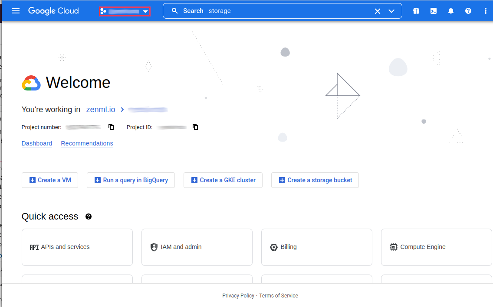

Create a `New Project`

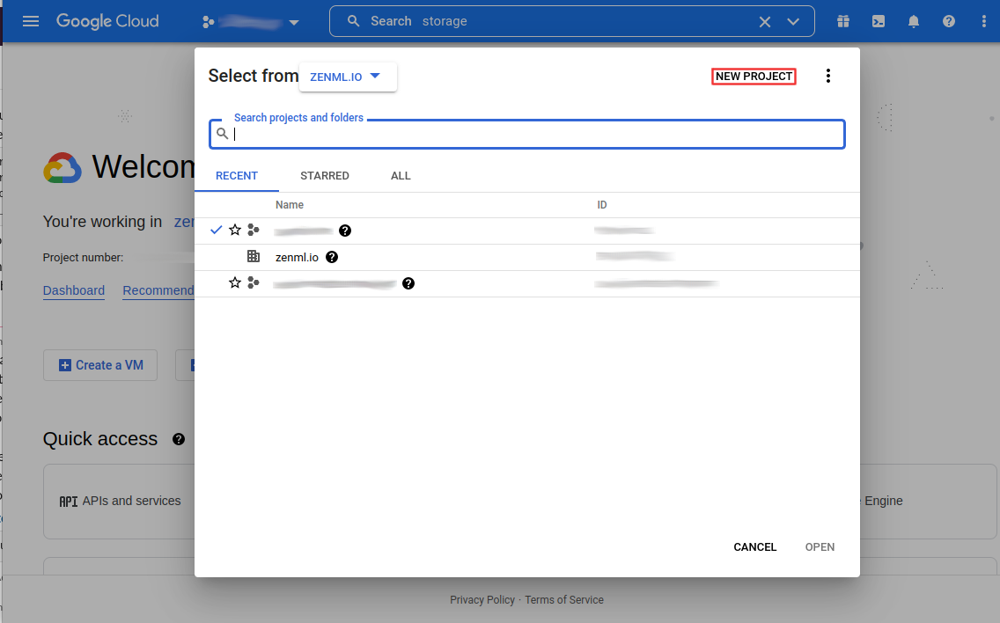

Give the project a name and click on create. The process may take some time. Once that is done, you will need to enable billing for the project so that you can set up all required resources.
### Setting Up GKE

We’ll start off by creating a GKE Standard cluster


Optionally, give the cluster a name, otherwise leave everything as it is since this cluster is only for demo purposes.

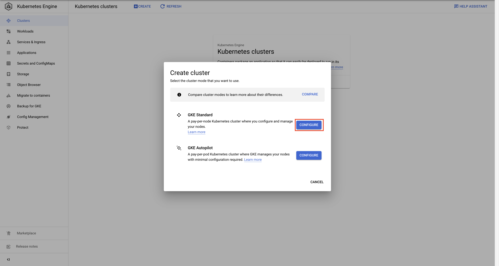

### Cloud Storage

Search `cloud storage` or use this [link](https://console.cloud.google.com/storage/).

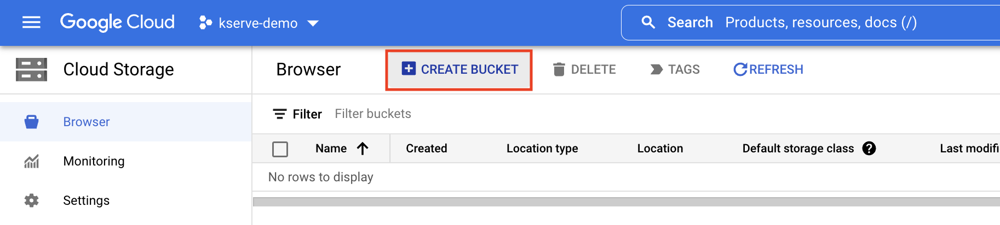

Once the bucket is created, you can find the storage URI as follows:

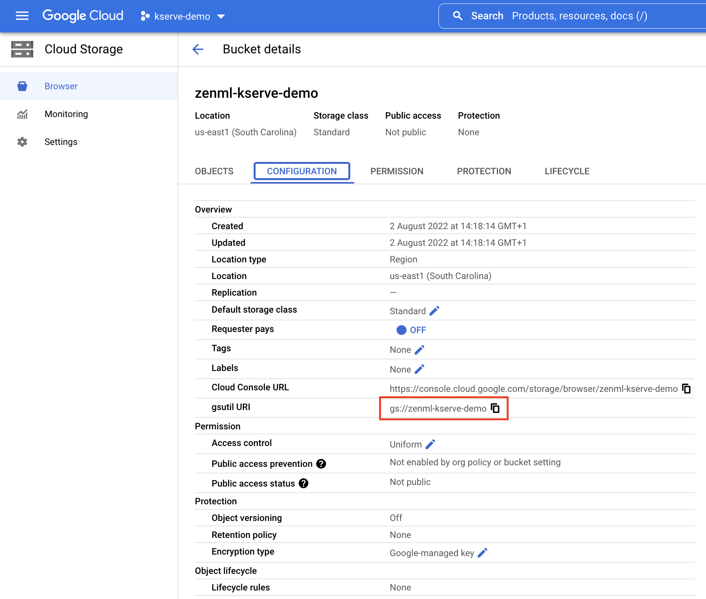

For the creation of the [ZenML Artifact Store](https://blog.zenml.io/vertex-ai-blog/#zenml-artifact-store) you will need the following data:

- gsutil URI

### Setting Up Permissions

With all the resources set up, you will now need to set up a service account with all the right permissions. This service account will need to be able to access all the different resources that we have set up so far.

Start by searching for `IAM` in the search bar or use this link: `https://console.cloud.google.com/iam-admin`. Here you will need to create a new Service Account.

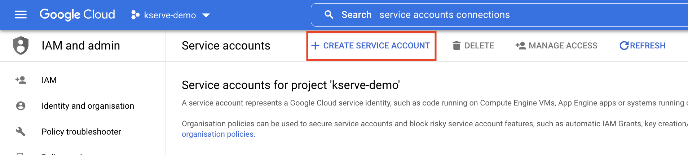

First off you’ll need to name the service account. Make sure to give it a clear name and description.

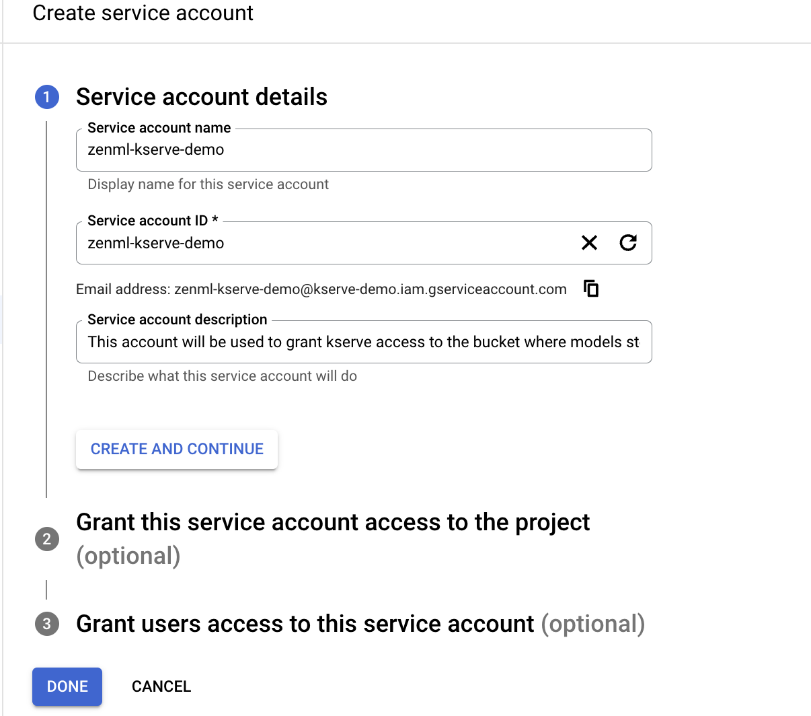

This service account will need to have the role of `Storage Admin`.

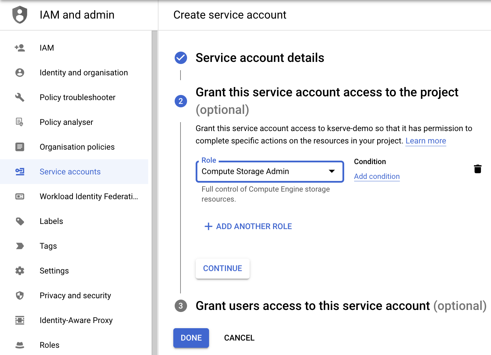

Finally, you need to make sure your own account will have the right to `run-as` this service account. It probably also makes sense to give yourself the right to manage this service account to perform changes later on.

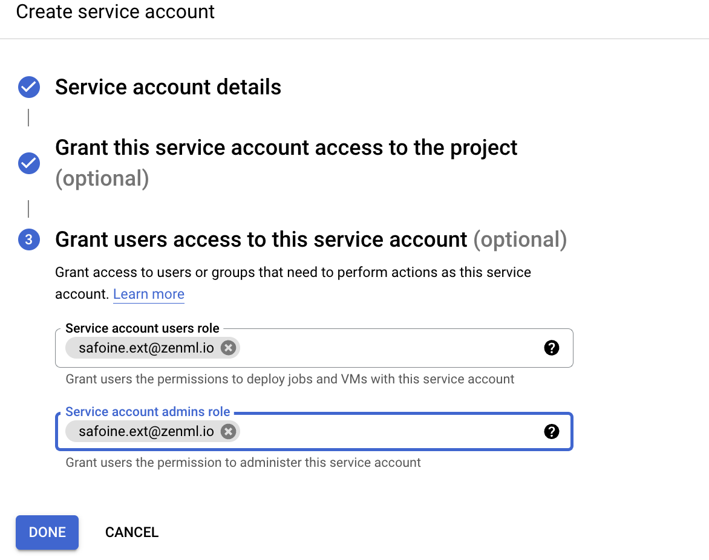

Finally, you can now find your new service account in the `IAM` tab. You’ll need the Principal when creating your ZenML Model Deployer.

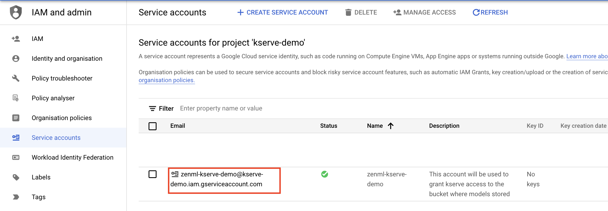

We will have to download the service account key; we are going to use this key to grant KServe access to the (ZenML) artifact store.

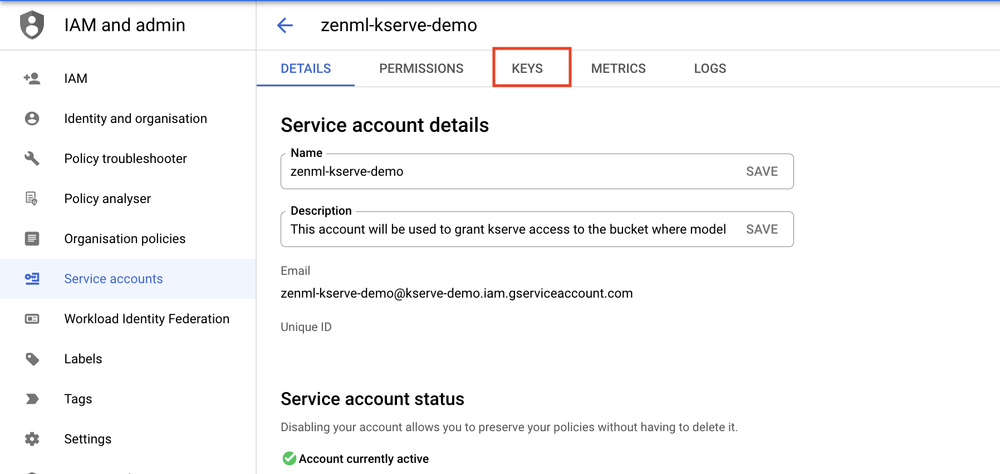

We can click on the service account then keys and create a new key and select JSON format.

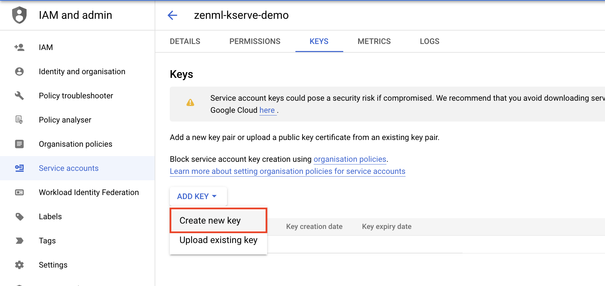

## Setting Up KServe and ZenML Stack

Now that we have everything done on the GCP side, we will jump to how we can install KServe on the GKE cluster and then set up our MLOps stack with ZenML CLI

### Installing KServe on GKE

The first thing we need to do is to connect to the GKE cluster. (As mentioned above, this assumes that we have already installed and authenticated with the gcloud CLI.)

We can get the right command to connect to the cluster on the Kubernetes Engine page.

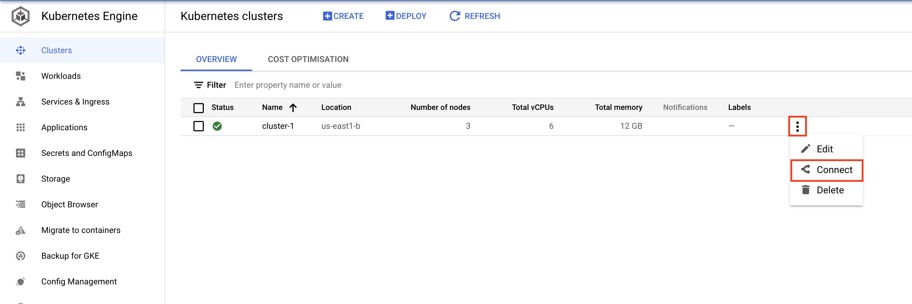

Now we can copy the command and run it from our terminal

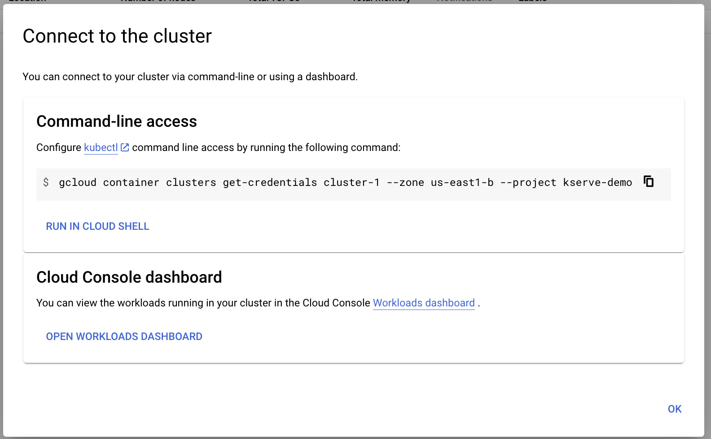

1. Install Istio:

We need to download [istioctl](https://istio.io/latest/docs/setup/getting-started/#download). 
Install Istio v1.12.1 (required for the latest KServe version):

```bash
curl -L https://istio.io/downloadIstio | ISTIO_VERSION=1.12.1  sh -
cd istio-1.12.1
export PATH=$PWD/bin:$PATH
# Installing Istio without sidecar injection
istioctl install -y
```

2. Installing the Knative Serving component:

```bash
# Install the required custom resources
kubectl apply -f https://github.com/knative/serving/releases/download/knative-v1.6.0/serving-crds.yaml
# Install the core components of Knative Serving
kubectl apply -f https://github.com/knative/serving/releases/download/knative-v1.6.0/serving-core.yaml
```

Install an [Istio networking layer](https://knative.dev/docs/install/installing-istio/):

```bash
# Install a properly configured Istio
kubectl apply -l knative.dev/crd-install=true -f https://github.com/knative/net-istio/releases/download/knative-v1.6.0/istio.yaml
kubectl apply -f https://github.com/knative/net-istio/releases/download/knative-v1.6.0/istio.yaml
# Install the Knative Istio controller
kubectl apply -f https://github.com/knative/net-istio/releases/download/knative-v1.6.0/net-istio.yaml
# Fetch the External IP address or CNAME
kubectl --namespace istio-system get service istio-ingressgateway
```

Verify the installation:

```bash
kubectl get pods -n knative-serving

"""
activator-59bff9d7c8-2mgdv               1/1     Running     0          11h
autoscaler-c574c9455-x7rfn               1/1     Running     0          3d
controller-59f84c584-mm4pp               1/1     Running     0          3d
domain-mapping-75c659dbc7-hbgnl          1/1     Running     0          3d
domainmapping-webhook-6d9f5996f9-hcvcb   1/1     Running     0          3d
net-istio-controller-76bf75d78f-652fm    1/1     Running     0          11h
net-istio-webhook-9bdb8c6b9-nzf86        1/1     Running     0          11h
webhook-756688c869-79pqh                 1/1     Running     0          2d22h
"""
```
3. Install Cert Manager:

```bash
kubectl apply -f https://github.com/cert-manager/cert-manager/releases/download/v1.9.1/cert-manager.yaml
```

4. Finally, install KServe:

```bash
# Install KServe
kubectl apply -f https://github.com/kserve/kserve/releases/download/v0.9.0/kserve.yaml
# Install KServe Built-in ClusterServingRuntimes
kubectl apply -f https://github.com/kserve/kserve/releases/download/v0.9.0/kserve-runtimes.yaml
```

### Testing KServe Deployment

To test that the installation is functional, you can use this sample KServe
deployment:

1. Create a namespace:

```bash
kubectl create namespace kserve-test
```

2. Create an `InferenceService`:

```bash
kubectl apply -n kserve-test -f - <<EOF
apiVersion: "serving.kserve.io/v1beta1"
kind: "InferenceService"
metadata:
  name: "sklearn-iris"
spec:
  predictor:
    model:
      modelFormat:
        name: sklearn
      storageUri: "gs://kfserving-examples/models/sklearn/1.0/model"
EOF
```

3. Check `InferenceService` status:

```bash
kubectl get inferenceservices sklearn-iris -n kserve-test

"""
NAME           URL                                                 READY   PREV   LATEST   PREVROLLEDOUTREVISION   LATESTREADYREVISION                    AGE
sklearn-iris   http://sklearn-iris.kserve-test.example.com         True           100                              sklearn-iris-predictor-default-47q2g   7d23h
"""
```

4. Determine the ingress IP and ports:

```bash
kubectl get svc istio-ingressgateway -n istio-system
NAME                   TYPE           CLUSTER-IP       EXTERNAL-IP      PORT(S)   AGE
istio-ingressgateway   LoadBalancer   172.21.109.129   130.211.10.121   ...       17h
```

Extract the HOST and PORT where the model server exposes its prediction API:

```bash
# For GKE clusters, the host is the GKE cluster IP address.
export INGRESS_HOST=$(kubectl -n istio-system get service istio-ingressgateway -o jsonpath='{.status.loadBalancer.ingress[0].ip}')
# For EKS clusters, the host is the EKS cluster IP hostname.
export INGRESS_HOST=$(kubectl -n istio-system get service istio-ingressgateway -o jsonpath='{.status.loadBalancer.ingress[0].hostname}')

export INGRESS_PORT=$(kubectl -n istio-system get service istio-ingressgateway -o jsonpath='{.spec.ports[?(@.name=="http2")].port}')

```

5. Perform inference

Prepare your inference input request inside a file:

```bash
cat <<EOF > "./iris-input.json"
{
  "instances": [
    [6.8,  2.8,  4.8,  1.4],
    [6.0,  3.4,  4.5,  1.6]
  ]
}
EOF
```

Use `curl` to send a test prediction API request to the server:

```bash
SERVICE_HOSTNAME=$(kubectl get inferenceservice sklearn-iris -n kserve-test -o jsonpath='{.status.url}' | cut -d "/" -f 3)
curl -v -H "Host: ${SERVICE_HOSTNAME}" http://${INGRESS_HOST}:${INGRESS_PORT}/v1/models/sklearn-iris:predict -d @./iris-input.json
```

You should see something like this as the prediction response:

```json
{"predictions": [1, 1]}
```

### Installing ZenML Integrations

First, we need to do is install the integration we will be using to run this demo.

```bash
zenml integration install tensorflow pytorch gcp kserve
```

### ZenML Artifact Store

The **artifact store** stores all the artifacts that get passed as inputs and outputs of your pipeline steps. To register our blob storage container:

```bash
zenml artifact-store register gcp_artifact_store --flavor=gcp --path=<gsutil-URI>
```

### ZenML Secrets Manager

The **secrets manager** is used to securely store all your credentials so ZenML can use them to authenticate with other components like your metadata or artifact store.

```bash
zenml secrets-manager register local --flavor=local
```

### ZenML Model Deployer

The Model Deployer is the stack component responsible for serving, managing and interacting with models. For this demo we are going to register KServe Model Deployer flavor:

```bash
zenml model-deployer register kserve_gke --flavor=kserve \
  --kubernetes_context=gke_kserve-demo_us-east1-b_cluster-1 \ 
  --kubernetes_namespace=zenml-workloads \
  --base_url=$INGRESS_URL \
  --secret=kserve_secret
```

### Registering the Stack

Our stack components are ready to be configured and set as the active stack.

```bash
zenml stack register local_gcp_kserve_stack -m default -a gcp -o default -d kserve_gke -x local --set
```

### Registering Model Deployer Secret

Our current stack is using GCS as our Artifact Store which means our trained models will be stored in the GS bucket. This means we need to give KServe the right permissions to be able to retrieve the model artifact. To do that we will create a secret using the service account key we created earlier:

```bash
zenml secret register -s kserve_gs kserve_secret \
    --credentials="@~/kserve-demo.json"
```

## Running the Example

The example uses the [digits dataset](https://keras.io/api/datasets/mnist/) to train a classifier using both [TensorFlow](https://www.tensorflow.org/) and [PyTorch](https://pytorch.org/). You can find [the full example here](https://github.com/zenml-io/zenml/tree/main/examples/kserve_deployment). We have two pipelines: one responsible for training and deploying the model and the second one responsible for running inference on the deployed model.

The PyTorch Training/Deployment pipeline consists of the following steps:
* importer - Load the MNIST handwritten digits dataset from the TorchVision library
* train - Train a neural network using the training set. The network is defined in the `mnist.py` file in the PyTorch folder.
* evaluate - Evaluate the model using the test set.
* deployment_trigger - Verify if the newly trained model exceeds the threshold and if so, deploy the model.
* model_deployer - Deploy the trained model to the KServe model server using the TorchServe runtime.

Let's take a look at the deployment step and see what is required to deploy a PyTorch model:

```python
from zenml.integrations.kserve.services import KServeDeploymentConfig
from zenml.integrations.kserve.steps import (
    KServeDeployerStepConfig,
    TorchServeParameters,
    kserve_model_deployer_step,
)

MODEL_NAME = "mnist-pytorch"

pytorch_model_deployer = kserve_model_deployer_step(
    config=KServeDeployerStepConfig(
        service_config=KServeDeploymentConfig(
            model_name=MODEL_NAME,
            replicas=1,
            predictor="pytorch",
            resources={"requests": {"cpu": "200m", "memory": "500m"}},
        ),
        timeout=120,
        torch_serve_parameters=TorchServeParameters(
            model_class="steps/pytorch_steps/mnist.py",
            handler="steps/pytorch_steps/mnist_handler.py",
        ),
    )
)
```

Deploying any model using the KServe Integration requires some parameters such as the model name, how many replicas we want to have of the pod, which KServe predictor (and this is very important because the platform has already a large list of famous ML frameworks that you can use to serve your models with minimum effort) and finally the resource if we want to limit our deployment to specific limits on CPU and GPU.

Because KServe uses TorchServe as the runtime server for deploying PyTorch models we need to provide a `model_class` path which contains the definition of our neural network architecture and a `handler` which is responsible for handling the custom pre-post processing logic. You can read more about how to deploy PyTorch models with TorchServe Runtime Server [KServe Pytorch](https://kserve.github.io/website/0.9/modelserving/v1beta1/torchserve/) or in [the TorchServe Official documentation](https://pytorch.org/serve/).

The Inference pipeline consists of the following steps:
* pytorch_inference_processor - Load a digits image from a URL (must be 28x28) and converts it to a byte array.
* prediction_service_loader - Load the prediction service into `KServeDeploymentService` to perform the inference.
* predictor - Perform inference on the image using the built-in predict function of the prediction service.

## Running the example
Wow, we’ve made it past all the setting-up steps, and we’re finally ready to run our code. All we have to do is call our Python function from earlier, sit back and wait!

```bash
python run_pytorch.py
```

Once that is done we will see that we have two finished running pipelines, with the result of the prediction from the inference pipeline in addition to detailed information about the endpoint of our served model and how we can use it.

## Cleaning Up

Cleanup should be fairly straightforward now, so long as you bundled all of these resources into one separate project. Simply navigate to the [Cloud Resource Manager](https://console.cloud.google.com/cloud-resource-manager) and delete your project:

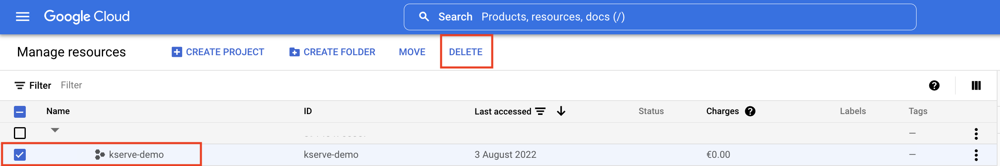

## Conclusion

In this tutorial, we learned about KServe and how to install it in a Kubernetes cluster, how to set up an MLOps stack with the ZenML KServe Integration and interact with it using the ZenML CLI.
We also saw how the KServe integration makes the experience of deploying a PyTorch model into KServe much easier, by handling the packaging and preparing of the different resources that are required by TorchServe.

We are also working on making the deployment story more customizable by allowing the user to write their own functionalities to be executed before and after the deployment. This will be a great feature for not only serve the model but also custom codes that can be deployed with the serving tools.

This demo was presented on our community hour. Check the recording [here](https://www.youtube.com/watch?v=nZeBhkN6RZU).

If you have any questions or feedback regarding this tutorial, join our 
[weekly community hour](https://www.eventbrite.com/e/zenml-meet-the-community-tickets-354426688767).

If you want to know more about ZenML or see more examples, check out our [docs](https://docs.zenml.io) and
[examples](https://github.com/zenml-io/zenml/tree/main/examples) or join our [Slack](https://zenml.io/slack-invite/).