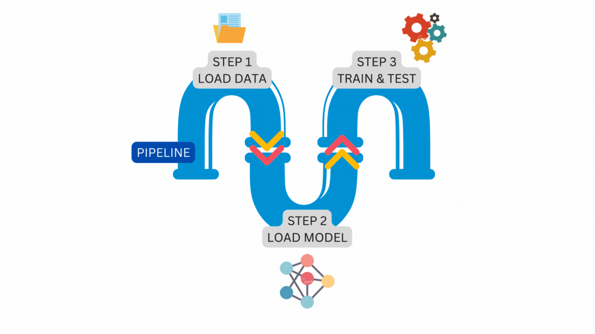
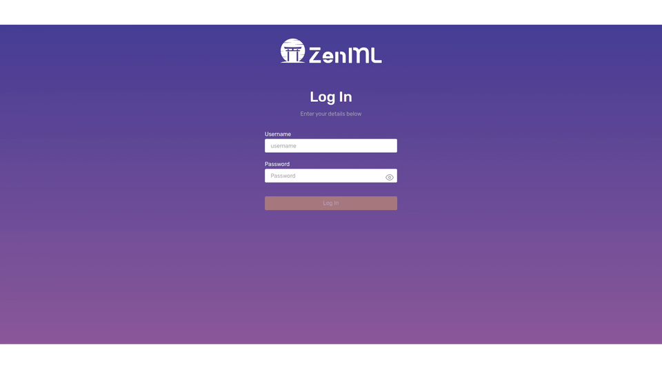
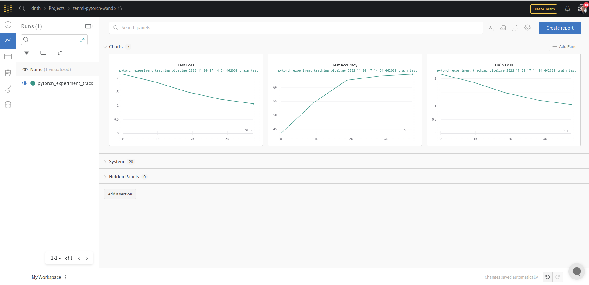

## 🔥 Motivation
It's 2022, anyone can train a machine learning (ML) model these days. 
Libraries like [PyTorch](https://pytorch.org/), [Tensorflow](https://www.tensorflow.org/), and [Scikit-learn](https://scikit-learn.org/stable/index.html) have lowered the entry barrier so much, you can get started in minutes.

Needless to say, there are tons of quickstart notebooks out there that will walk you through step-by-step.
While there are values in quickstarts, especially in the early stages, the codes you see in quickstarts often look very different and "unusable in production", some people might say.

Or, is it?

Is there a way we could transform quickstart codes so that they are usable for production ML? 
Is that even possible?!

With ZenML, yes it is 🚀.


In this post, we will show you how to turn vanilla PyTorch codes into a production-ready ML pipeline that can be run on any cloud infrastructure while incorporating the best practices of MLOps.
Next, we'll also show how you can easily manage access credentials and include components like experiment trackers into your pipeline.

By the end of the post, you'll learn how to -

+ Transform a vanilla PyTorch code into ZenML pipelines.
+ Visualize the pipeline on an interactive dashboard.
+ Configure a Secrets Manager to securely store and retrieve API keys.
+ Use the [Weights & Biases](https://wandb.ai/) (W&B) Experiment Tracker to log results and share them.

For those who prefer video, we showcased this during a community session on October 26, 2022. 
Otherwise, let's dive in!

<iframe width="560" height="316" src="https://www.youtube-nocookie.com/embed/YLKueXpAT8o" title="YouTube video player" frameborder="0" allow="accelerometer; autoplay; clipboard-write; encrypted-media; gyroscope; picture-in-picture" allowfullscreen></iframe>


## ☕️ Installation
Let's begin by installing all the packages we'll need.
We'd highly recommend that you install ZenML in a virtual environment of your choice.
Read more [in our docs](https://docs.zenml.io/getting-started/installation).

Also note that if you're running this on an M1 Mac, we have a special guide [here](https://docs.zenml.io/getting-started/installation/m1-mac-installation) to set it up.

Now in your virtual environment, run:

```shell
pip install "zenml[server]==0.21.1" torchvision==0.14.0
```

To verify if the installation was successful type:

```shell
zenml version
```

If you don't encounter any error messages, we're ready to start hacking!


Let's initialize a ZenML repository within your current directory with:

```shell
zenml init
```

This creates a `.zen` hidden folder in your current directory that stores the ZenML configs and management tools.

ZenML comes with various integrations, let's install the ones we will be using in this post:

```shell
zenml integration install pytorch wandb tensorboard mlflow -y
```

Wondering if you can use other tools instead? 
Check out more integrations [here](https://zenml.io/integrations).
You can even [write you own](https://docs.zenml.io/misc/integrating)!


## ✅ Vanilla PyTorch Code
Now that we're done with the setups, let's take a look at the *"hello world"* of PyTorch on the [quickstart page](https://pytorch.org/tutorials/beginner/basics/quickstart_tutorial.html).

The codes look like the following.

```python
import torch
from torch import nn
from torch.utils.data import DataLoader
from torchvision import datasets
from torchvision.transforms import ToTensor

# Download training data from open datasets.
training_data = datasets.FashionMNIST(
    root="data",
    train=True,
    download=True,
    transform=ToTensor(),
)

# Download test data from open datasets.
test_data = datasets.FashionMNIST(
    root="data",
    train=False,
    download=True,
    transform=ToTensor(),
)

batch_size = 64

# Create data loaders.
train_dataloader = DataLoader(training_data, batch_size=batch_size)
test_dataloader = DataLoader(test_data, batch_size=batch_size)

for X, y in test_dataloader:
    print(f"Shape of X [N, C, H, W]: {X.shape}")
    print(f"Shape of y: {y.shape} {y.dtype}")
    break

# Get cpu or gpu device for training.
device = "cuda" if torch.cuda.is_available() else "cpu"
print(f"Using {device} device")

# Define model
class NeuralNetwork(nn.Module):
    def __init__(self):
        super().__init__()
        self.flatten = nn.Flatten()
        self.linear_relu_stack = nn.Sequential(
            nn.Linear(28*28, 512),
            nn.ReLU(),
            nn.Linear(512, 512),
            nn.ReLU(),
            nn.Linear(512, 10)
        )

    def forward(self, x):
        x = self.flatten(x)
        logits = self.linear_relu_stack(x)
        return logits

model = NeuralNetwork().to(device)
print(model)

loss_fn = nn.CrossEntropyLoss()
optimizer = torch.optim.SGD(model.parameters(), lr=1e-3)

def train(dataloader, model, loss_fn, optimizer):
    size = len(dataloader.dataset)
    model.train()
    for batch, (X, y) in enumerate(dataloader):
        X, y = X.to(device), y.to(device)

        # Compute prediction error
        pred = model(X)
        loss = loss_fn(pred, y)

        # Backpropagation
        optimizer.zero_grad()
        loss.backward()
        optimizer.step()

        if batch % 100 == 0:
            loss, current = loss.item(), batch * len(X)
            print(f"loss: {loss:>7f}  [{current:>5d}/{size:>5d}]")

def test(dataloader, model, loss_fn):
    size = len(dataloader.dataset)
    num_batches = len(dataloader)
    model.eval()
    test_loss, correct = 0, 0
    with torch.no_grad():
        for X, y in dataloader:
            X, y = X.to(device), y.to(device)
            pred = model(X)
            test_loss += loss_fn(pred, y).item()
            correct += (pred.argmax(1) == y).type(torch.float).sum().item()
    test_loss /= num_batches
    correct /= size
    print(f"Test Error: \n Accuracy: {(100*correct):>0.1f}%, Avg loss: {test_loss:>8f} \n")


epochs = 5
for t in range(epochs):
    print(f"Epoch {t+1}\n-------------------------------")
    train(train_dataloader, model, loss_fn, optimizer)
    test(test_dataloader, model, loss_fn)
print("Done!")

```

You can put all the codes into a `.py` file, and it should run without a problem.

Now let's see how we can transform the codes into a ZenML pipeline.


## 🥳 Transforming PyTorch Codes into a ZenML Pipeline.
Before we start, we'd like to first tell you about the concept of *pipeline* and *step* in ZenML. This concept will come in handy later when we code.

In ZenML, a `pipeline` consists of a series of steps, organized in any order that makes sense for your use case.

The following illustration is a simple `pipeline` that consists of three `steps` running one after another.



The figure above is the exact `pipeline` and `steps` that we will construct from the vanilla PyTorch code.
Let's start the transformation.

First, import modules from `torch`, `torchvision` and `zenml`.

```python
import torch
from torch import nn
from torch.utils.data import DataLoader
from torchvision import datasets
from torchvision.transforms import ToTensor

from zenml.pipelines import pipeline
from zenml.steps import step, Output
```

Next, let's define the `pipeline`.

You can do this by putting a `@pipeline` decorator above the function definition.

```python
@pipeline
def pytorch_experiment_tracking_pipeline(
    load_data,
    load_model,
    train_test,
):
    """A `pipeline` to load data, load model, and train/evaluate the model."""
    train_dataloader, test_dataloader = load_data()
    model = load_model()
    train_test(model, train_dataloader, test_dataloader)
```
The pipeline we just wrote takes three `steps` as the input namely - `load_data`, `load_model`, and `train_test`. 
Each `step` runs sequentially one after another. 

Next, let's define what the `steps` actually do. 
We can define a `step` in the same way we define a `pipeline`, except we put a `@step` decorator now.

Let's start with the first `step` to load the data.

```python
@step
def load_data() -> Output(
    train_dataloader=DataLoader, test_dataloader=DataLoader
):
    """A `step` to load the Fashion MNIST dataset as a tuple of torch Datasets."""
    batch_size = 64

    # Download training data from open datasets.
    training_data = datasets.FashionMNIST(
        root="data",
        train=True,
        download=True,
        transform=ToTensor(),
    )

    # Download test data from open datasets.
    test_data = datasets.FashionMNIST(
        root="data",
        train=False,
        download=True,
        transform=ToTensor(),
    )

    # Create data loaders.
    train_dataloader = DataLoader(training_data, batch_size=batch_size)
    test_dataloader = DataLoader(test_data, batch_size=batch_size)

    return train_dataloader, test_dataloader
```

One of the best practices we keep when defining a `step` is [type annotation](https://blog.logrocket.com/understanding-type-annotation-python/).
In simple terms, this means we define the data type for all the inputs and outputs of a `step`.
This is a requirement when defining a `step`.

For the `load_data` step above, the outputs of the `step` are the train and test dataloaders of the `DataLoader` type in PyTorch.
All you have to do is append `Output(train_dataloader=DataLoader, test_dataloader=DataLoader)` to the function name.

Now, let's use the same method and define our next `step` to load the model.

```python
class NeuralNetwork(nn.Module):
    def __init__(self):
        super(NeuralNetwork, self).__init__()
        self.flatten = nn.Flatten()
        self.linear_relu_stack = nn.Sequential(
            nn.Linear(28 * 28, 512),
            nn.ReLU(),
            nn.Linear(512, 512),
            nn.ReLU(),
            nn.Linear(512, 10),
        )

    def forward(self, x):
        x = self.flatten(x)
        logits = self.linear_relu_stack(x)
        return logits

@step
def load_model() -> nn.Module:
    """A `step` to define a PyTorch model."""
    model = NeuralNetwork()
    print(model)
    return model
```

And the last `step`, to train and evaluate the model.

```python
# Get cpu or gpu device for training.
device = "cuda" if torch.cuda.is_available() else "cpu"
print(f"Using {device} device")

def train(dataloader, model, loss_fn, optimizer):
    """A function to train a model for one epoch."""
    size = len(dataloader.dataset)
    model.train()
    for batch, (X, y) in enumerate(dataloader):
        X, y = X.to(device), y.to(device)

        # Compute prediction error
        pred = model(X)
        loss = loss_fn(pred, y)

        # Backpropagation
        optimizer.zero_grad()
        loss.backward()
        optimizer.step()

        if batch % 100 == 0:
            loss, current = loss.item(), batch * len(X)
            print(f"loss: {loss:>7f}  [{current:>5d}/{size:>5d}]")

def test(dataloader, model, loss_fn):
    """A function to test a model on the validation / test dataset."""
    size = len(dataloader.dataset)
    num_batches = len(dataloader)
    model.eval()
    test_loss, correct = 0, 0
    with torch.no_grad():
        for X, y in dataloader:
            X, y = X.to(device), y.to(device)
            pred = model(X)
            test_loss += loss_fn(pred, y).item()
            correct += (pred.argmax(1) == y).type(torch.float).sum().item()
    test_loss /= num_batches
    correct /= size
    test_accuracy = 100*correct
    print(f"Test Error: \n Accuracy: {(100*correct):>0.1f}%, Avg loss: {test_loss:>8f} \n")

    return test_accuracy

@step
def train_test(
    model: nn.Module,
    train_dataloader: DataLoader, 
    test_dataloader: DataLoader
) -> Output(trained_model=nn.Module, test_acc=float):
    """A `step` to train and evaluate a torch model on given dataloaders."""
    lr = 1e-3
    epochs = 5

    model = model.to(device)
    loss_fn = nn.CrossEntropyLoss()
    optimizer = torch.optim.SGD(model.parameters(), lr=lr)
    test_acc = 0
    for t in range(epochs):
        print(f"Epoch {t+1}\n-------------------------------")
        train(train_dataloader, model, loss_fn, optimizer)
        test_acc = test(test_dataloader, model, loss_fn)
    print("Done!")

    return model, test_acc
```

We are now done with defining all the `steps` that take place in a `pipeline`!
What's left now is to run the `pipeline` by:

```python
pytorch_experiment_tracking_pipeline(
    load_data=load_data(),
    load_model=load_model(),
    train_test=train_test(),
).run(unlisted=True)
```

And that's it! 
How easy was that? We were only reorganizing the PyTorch codes into a series of `steps` and a `pipeline` with ZenML.
If you put all the codes above in a `.py` script, it should run just like the vanilla PyTorch code in the quickstart.

So why does this matter?

First, you've just transformed vanilla PyTorch codes into a form that can be run on your local machine and any cloud infrastructure in production. Second, structuring your code into steps and pipelines makes the code modular and easily maintainable. Third, using ZenML pipelines earlier on in your project also means that the code you use in development will look similar to the code in production. This saves a huge refactoring cost when transitioning from development to production. 

You can read more about other benefits of structuring your code with ZenML pipelines from the get-go [here](https://blog.zenml.io/ml-pipelines-from-the-start/). 
Learn more about other ZenML features [here](https://zenml.io/features) which will save you a lot of time and resources in productionalizing ML models.

## 📊 ZenML Dashboard

ZenML comes with a handy [dashboard](https://github.com/zenml-io/zenml-dashboard) that lets you visualize the pipeline you just run.
To open the dashboard, type in your terminal:

```shell
zenml up
```

This spins up a local [ZenML Server](https://docs.zenml.io/getting-started/core-concepts#zenml-server-and-dashboard) and launches the dashboard in the browser at `http://127.0.0.1:8237)`. Key in `default` as the username and leave the password empty, then click "Log in".



In the dashboard, you'll see all details about your *Steps*, *Pipelines*, *Runs*, *Stacks*, and *Stack Components*.
There's also a neat visualization on the pipeline which lets you visually inspect your workflow.

The ZenML dashboard lets you visually inspect if the pipeline and steps are in order especially if your steps are complicated and many.

So far we've only seen the details about the steps and pipelines in the dashboard. What about the experiment details like training accuracy, loss, etc? 

In ZenML experiment details are logged using [Experiment Trackers](https://docs.zenml.io/component-gallery/experiment-trackers) - a component in ZenML.

In the next section, we will show how you can add Experiment Trackers into your workflow so you can monitor and share your experiment results.

## ⚖ Tracking Experiments and Keeping Secrets
Since we will be using W&B in our pipeline, make sure to create an account at the official [site](https://wandb.ai/home). It's free to get started. Next, create a project and get the entity, project name and the API key.

Now with those details, let's put them in our code and start running them, shall we?

Of course not.

Sharing access credentials in your codes or files is a quick way to set your butt on fire.
We wouldn't recommend it.


[via GIPHY](https://giphy.com/gifs/season-13-the-simpsons-13x20-xT5LMpPoihn5AsoNB6)

ZenML handles secret information like access credentials with a component known as [Secret Managers](https://docs.zenml.io/component-gallery/secrets-managers).
Secrets Managers provide a secure way of storing and retrieving confidential information that is needed to run your ML pipelines.

Now let's configure our W&B credentials into the Secret Manager by running several commands in your terminal.

```shell
# Register secret manager
zenml secrets-manager register local --flavor=local

# Updating active stack with the secret manager
zenml stack update default -x local

# Registering the API key in the secret manager
zenml secrets-manager secret register wandb_secret --api_key=YOUR_W&B_API_KEY
```

The commands above register a secret manager on your local machine, add them to your stack and registers the W&B API key as a secret. 

Next, we will set up the experiment tracker by running:

```shell
# Register experiment tracker
zenml experiment-tracker register wandb_tracker --flavor=wandb --api_key="{{wandb_secret.api_key}}" --entity="dnth" --project_name="zenml-pytorch-wandb"

# Create a new MLOps stack with W&B experiment tracker in it
zenml stack register wandb_stack -a default -o default -e wandb_tracker -x local

# Set the wandb_stack as the active stack
zenml stack set wandb_stack
```

Remember to replace the entity and project_name argument with your own.

To view the configurations of the experiment tracker, run:

```shell
zenml experiment-tracker describe
```

which outputs:

```shell
Using the default local database.
Running with active project: 'default' (global)
Running with active stack: 'wandb_stack' (global)
Experiment_Tracker 'wandb_tracker' of flavor 'wandb' with id '47d74df8-b7bf-4e31-904d-cf8d7716d1a5' is owned by user 'default' and is 'private'.
  'wandb_tracker' EXPERIMENT_TRACKER Component   
             Configuration (ACTIVE)              
┏━━━━━━━━━━━━━━━━━━━━┯━━━━━━━━━━━━━━━━━━━━━━━━━━┓
┃ COMPONENT_PROPERTY │ VALUE                    ┃
┠────────────────────┼──────────────────────────┨
┃ API_KEY            │ {{wandb_secret.api_key}} ┃
┠────────────────────┼──────────────────────────┨
┃ ENTITY             │ dnth                     ┃
┠────────────────────┼──────────────────────────┨
┃ PROJECT_NAME       │ zenml-pytorch-wandb      ┃
┗━━━━━━━━━━━━━━━━━━━━┷━━━━━━━━━━━━━━━━━━━━━━━━━━┛
```

To get an overview of your current stack, run:

```shell
zenml stack describe
```

which outputs:

```shell
Using the default local database.
Running with active project: 'default' (global)
          Stack Configuration          
┏━━━━━━━━━━━━━━━━━━━━┯━━━━━━━━━━━━━━━━┓
┃ COMPONENT_TYPE     │ COMPONENT_NAME ┃
┠────────────────────┼────────────────┨
┃ ORCHESTRATOR       │ default        ┃
┠────────────────────┼────────────────┨
┃ SECRETS_MANAGER    │ local          ┃
┠────────────────────┼────────────────┨
┃ EXPERIMENT_TRACKER │ wandb_tracker  ┃
┠────────────────────┼────────────────┨
┃ ARTIFACT_STORE     │ default        ┃
┗━━━━━━━━━━━━━━━━━━━━┷━━━━━━━━━━━━━━━━┛
```

With that, we are done configuring the Secrets Manager and Experiment Tracker securely. 

Let's build on the code we used in the previous section. All we have to do is add a few more lines where we want W&B to log the information.

The first change is in the imports which include the `wandb` package now:

```python
import torch
from torch import nn
from torch.utils.data import DataLoader
from torchvision import datasets
from torchvision.transforms import ToTensor

from zenml.pipelines import pipeline
from zenml.steps import step, Output

# 🔥 Import wandb package
import wandb
```

Next, we add a few lines in the train function. Specifically, we added `global_step` as the argument so that it can be used to track the `loss` value.

```python
def train(dataloader, model, loss_fn, optimizer, global_step): 
    """A function to train a model for one epoch."""
    size = len(dataloader.dataset)
    model.train()
    for batch, (X, y) in enumerate(dataloader):
        X, y = X.to(device), y.to(device)

        # Compute prediction error
        pred = model(X)
        loss = loss_fn(pred, y)

        # Backpropagation
        optimizer.zero_grad()
        loss.backward()
        optimizer.step()

        if batch % 100 == 0:
            loss, current = loss.item(), batch * len(X)
            print(f"loss: {loss:>7f}  [{current:>5d}/{size:>5d}]")

            # 🔥 W&B tracking
            wandb.log({"Train Loss": loss}, step=global_step)
```

The same addition in the `test` function:

```python
def test(dataloader, model, loss_fn, global_step):
    """A function to test a model on the validation / test dataset."""
    size = len(dataloader.dataset)
    num_batches = len(dataloader)
    model.eval()
    test_loss, correct = 0, 0
    with torch.no_grad():
        for X, y in dataloader:
            X, y = X.to(device), y.to(device)
            pred = model(X)
            test_loss += loss_fn(pred, y).item()
            correct += (pred.argmax(1) == y).type(torch.float).sum().item()
    test_loss /= num_batches
    correct /= size
    test_accuracy = 100*correct
    print(f"Test Error: \n Accuracy: {(test_accuracy):>0.1f}%, Avg loss: {test_loss:>8f} \n")

    # 🔥 W&B tracking
    wandb.log({"Test Loss": test_loss, "Test Accuracy": test_accuracy}, step=global_step)
```

And finally some arguments to the `step` decorator:

```python
@step(enable_cache=False, experiment_tracker="wandb_tracker")
def train_test(
    model: nn.Module,
    train_dataloader: DataLoader, 
    test_dataloader: DataLoader
) -> Output(trained_model=nn.Module, test_acc=float):
    """A step to train and evaluate a torch model on given dataloaders."""
    lr = 1e-3
    epochs = 5

    model = model.to(device)
    loss_fn = nn.CrossEntropyLoss()
    optimizer = torch.optim.SGD(model.parameters(), lr=lr)
    test_acc = 0
    for t in range(epochs):
        print(f"Epoch {t+1}\n-------------------------------")
        global_step = t * len(train_dataloader)
        train(train_dataloader, model, loss_fn, optimizer, global_step)
        test_acc = test(test_dataloader, model, loss_fn, global_step)
    print("Done!")

    return model, test_acc
```

The rest of the code remains the same. If you run the code the experiment metrics now should appear in your W&B dashboard.
Here's mine



In our example above, we did not log a lot of experiment information for simplicity. 
But you can always log other metrics from any steps in the pipeline with `wandb.log`. 

## 💡 Conclusion
Congratulations! You made it!!
That's how easy it is to get started with ZenML.  

In summary, you've learned how to - 

+ Transform a vanilla PyTorch code into ZenML pipelines.
+ Visualize the pipeline on an interactive dashboard.
+ Configure a Secrets Manager to securely store and retrieve API keys.
+ Use the [Weights & Biases](https://wandb.ai/) (W&B) Experiment Tracker to log results and share them.

With this new superpower, you can turn any PyTorch codes into ZenML steps and pipelines and accelerate your journey to production ML.
Using the same steps you can also transform codes from other frameworks like Tensorflow/Keras. Check out this [example](https://github.com/zenml-io/zenml/tree/849d323139f3f4e3a8a2ca84a97fe225f9dfe7ce/examples/wandb_tracking).


Where to go next? If you're starting with ZenML we recommend checking out the [quickstart](https://github.com/zenml-io/zenml/tree/main/examples/quickstart) to learn more. Or if you're new to MLOps, check out our [ZenBytes](https://github.com/zenml-io/zenbytes) repository where we walk you through short practical lessons using ZenML.

Got questions? [Join our Slack channel](https://zenml.io/slack-invite) and get a quick response from us!