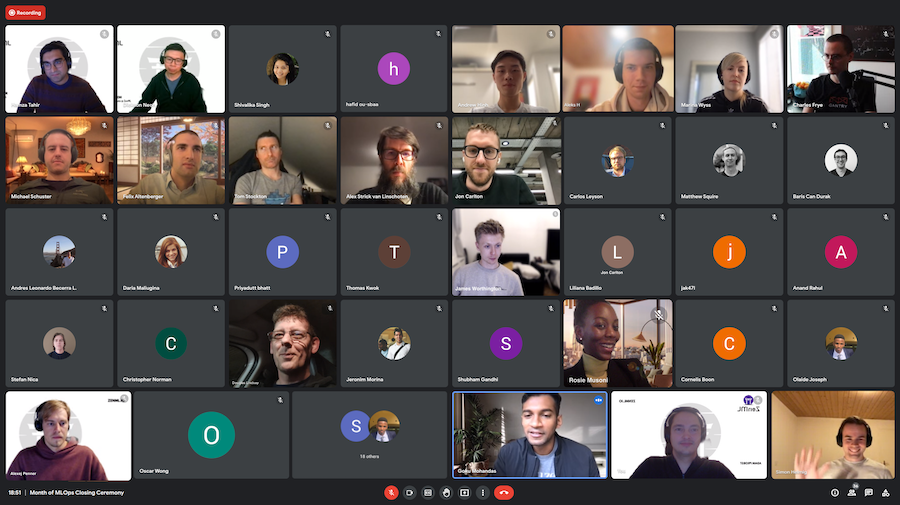

**Last updated:** Nov 29th, 2022.

The inaugural ZenML [Month of MLOps](https://zenml.io/competition) ran from October 10 to November 11, 2022. ending recently with a [closing ceremony streamed live](https://www.youtube.com/watch?v=acLrHtjiN9A). The goal of the competition was to make the most creative and innovative showcase of a production-grade ZenML MLOps pipeline. Aside from the cash prizes, joining the competition was a great way to contribute to open-source software, build a machine learning portfolio, and learn MLOps best practices.

We were more than excited to welcome some of the most well-renowned experts of the MLOps world to judge over proceedings:

- [Charles Frye](https://twitter.com/charles_irl), core instructor at the amazing [Full Stack Deep Learning](https://fullstackdeeplearning.com) course
- [Anthony Goldbloom](https://www.linkedin.com/in/anthonygoldbloom), co-founder and former CEO of [Kaggle](https://www.kaggle.com)
- [Chip Huyen](https://www.linkedin.com/in/chiphuyen/), author of '[Designing Machine Learning Systems](https://www.amazon.com/Designing-Machine-Learning-Systems-Huyen-ebook-dp-B0B1LGL2SR/dp/B0B1LGL2SR/ref=mt_other?qid=1653630445&me=&tag=soumet-20&_encoding=UTF8)' and co-founder of Claypot AI
- [Goku Mohandas](https://www.linkedin.com/in/goku/), founder of [MadeWithML](https://madewithml.com), another essential course in production ML

In total, the competition had **272** entrants from across the globe, with **5** deserving winners at the end!

## 🎖️ Announcing our winners!

After an intense month of competition, we announced the Month of MLOps competition winners in our closing ceremony!
Check out the recording of the closing ceremony and be inspired by the presentation by the winners and comments from judges Charles Frye and Goku Mohandas.

<iframe width="560" height="315" src="https://www.youtube-nocookie.com/embed/acLrHtjiN9A" title="YouTube video player" frameborder="0" allow="accelerometer; autoplay; clipboard-write; encrypted-media; gyroscope; picture-in-picture" allowfullscreen></iframe>

Here is a summary of the winners' submission:

### 🏅 1st Prize - Fuzzy Labs (Dobble on the Edge)

**GitHub repo:** [https://github.com/fuzzylabs/dobble-jetson-zenml-competition](https://github.com/fuzzylabs/dobble-jetson-zenml-competition)

**Demo:** [https://www.youtube.com/watch?v=gCAzpyE0Zr8](https://www.youtube.com/watch?v=gCAzpyE0Zr8)

**Summary (in their own words):** At Fuzzy Labs we’re trying to become Dobble world champions. So, we came up with a plan to train an ML model to recognize the common symbol between two cards. You might be asking yourself: what on earth is Dobble? It’s essentially a more sophisticated version of snap. It’s a card game where each card has 8 symbols and the first to find the common symbol and shout about it wins. To make this even more of a challenge, and as we’re wanting to win, we decided to run the detection on the edge (it’s a concealable device then). To do all of this, we’ve used ZenML to create two pipelines, a data pipeline and a training pipeline, along with a stack recipe to provision cloud resources. The project presents a proof-of-concept, where there is scope to go into further depth at each stage. For example, while we’re able to do offline monitoring, this could be expanded through the integration of real-time monitoring - a difficult challenge on the edge, where unreliable networks are common.

    <iframe width="560" height="315" src="https://www.youtube-nocookie.com/embed/EE2Z2l_hxVA" title="YouTube video player" frameborder="0" allow="accelerometer; autoplay; clipboard-write; encrypted-media; gyroscope; picture-in-picture" allowfullscreen></iframe>

The winner of the competition was an absolutely stellar submission by the [Fuzzy Labs](https://fuzzylabs.ai)
team, who really went all out on this one. They not only created a [series of blog posts](https://www.fuzzylabs.ai/blog-post/zenmls-month-of-mlops-data-science-edition) about their experience building out the pipeline, but also recorded funny, insightful 
videos about the process. Case in point:

<iframe width="560" height="315" src="https://www.youtube-nocookie.com/embed/j9TAVpM5NRQ" title="YouTube video player" frameborder="0" allow="accelerometer; autoplay; clipboard-write; encrypted-media; gyroscope; picture-in-picture" allowfullscreen></iframe>

The Fuzzy Labs team efforts were unanimously praised by the judges, and they were magnanimous in victory, donating the same amount of their winnings to a charity in the UK. Awesome work, Fuzzy Labs!

### 🏅 2nd Prize - Two (Detecting Fraudulent Financial Transactions with ZenML)

**GitHub repo:** [https://github.com/two-inc/zenml-competition](https://github.com/two-inc/zenml-competition)

**Demo:** [https://two-inc-zenml-competition-app-staging-banb63.streamlit.app/](https://two-inc-zenml-competition-app-staging-banb63.streamlit.app/)

**Summary (in their own words):** The aim of this project is to develop a production-ready ML application for fraud detection using the ZenML MLOps framework. To train our fraud detection model, we make use of the "Synthetic data from a financial payment system" Dataset available on Kaggle.

  <iframe width="560" height="315" src="https://www.youtube-nocookie.com/embed/E9FsXqHaSwM" title="YouTube video player" frameborder="0" allow="accelerometer; autoplay; clipboard-write; encrypted-media; gyroscope; picture-in-picture" allowfullscreen></iframe>

Team Two was fittingly in the second position, with a very neatly implemented financial payment fraud detection pipeline. They based their work on a real-world use-case that they are currently working on in their actual jobs at [two](https://two.inc/), so the submission was one of the most realistic takes on a working MLOps system. Well deserved and kudos to the team!

### 🏅 3rd Prize - Shivalika Singh (ChequeEasy: Banking with Transformers)

**GitHub repo:** [https://github.com/shivalikasingh95/cheque-easy](https://github.com/shivalikasingh95/cheque-easy)

**Demo:** [https://huggingface.co/spaces/shivi/ChequeEasy](https://huggingface.co/spaces/shivi/ChequeEasy)

**Summary (in their own words):** ChequeEasy is a project that aims to simplify the process of approval of cheques. Leveraging AI to extract relevant data from cheques and make the whole process quicker and easier for both bank officials and bank customers.

  <iframe width="560" height="315" src="https://www.youtube-nocookie.com/embed/b0_xSISvcfU" title="YouTube video player" frameborder="0" allow="accelerometer; autoplay; clipboard-write; encrypted-media; gyroscope; picture-in-picture" allowfullscreen></iframe>

Shivalika's submission was particularly impressive as it was her first experience with MLOps, and she absolutely nailed it! The demo works smoothly and shows off how easy it is to export ZenML models to the [HuggingFace Hub](https://huggingface.co/docs/hub/models-the-hub). Great job, Shivalika!

### 🏅 Most Promising Entry - Marina Wyss (Are You A Cat?)

**GitHub repo:** [https://github.com/MarinaWyss/are-you-a-cat](https://github.com/MarinaWyss/are-you-a-cat)

**Demo:** [https://marinawyss-are-you-a-cat-appstreamlit-app-ccycwd.streamlit.app/](https://marinawyss-are-you-a-cat-appstreamlit-app-ccycwd.streamlit.app/)

**Summary (in their own words):** Sometimes it is hard to know if you are a cat or not. The goal of this project is to use deep learning to help with that. It is a simple pipeline that trains a Tensorflow 2DCNN, evaluates the model performance and logs the experiment to MLflow, and deploys the model if the performance is satisfactory. Inference is done using Streamlit.

  <iframe width="560" height="315" src="https://www.youtube-nocookie.com/embed/2Uqm0KgOC_A" title="YouTube video player" frameborder="0" allow="accelerometer; autoplay; clipboard-write; encrypted-media; gyroscope; picture-in-picture" allowfullscreen></iframe>

Marina's tongue-in-cheek personality carried over well with this fun project, which showcased a simple object detection pipeline, with data validation, re-training, and deployment baked in. She detailed her journey in a [blog post](https://marinawyss.github.io/are-you-a-cat/), which was well received by the judges and bagged the most promising entry!

### 🏅 Most Promising Entry - Andrew Hinh and Aleks Hiidenhovi (Admirer)

**GitHub repo:** [https://github.com/andrewhinh/admirer](https://github.com/andrewhinh/admirer)

**Demo:** [https://admirer.loca.lt/](https://admirer.loca.lt/)

**Summary (in their own words):** A full-stack ML-powered website that utilizes users’ webcam feeds to answer open-ended questions requiring outside knowledge. The website and repository together serve as an open-source demonstration and implementation of a visual question-answering model in a full-stack machine learning product. The visual question-answering pipeline is inspired by a paper from Microsoft; in short, we prompt GPT-3 with a generated image caption and object tag list, the question-answer pair, and context examples that demonstrate the task at hand in a few-shot learning method. 

<iframe width="560" height="315" src="https://www.youtube-nocookie.com/embed/WYb3xBIOYvg" title="YouTube video player" frameborder="0" allow="accelerometer; autoplay; clipboard-write; encrypted-media; gyroscope; picture-in-picture" allowfullscreen></iframe>

Andrew and Aleks were one of our youngest participants in the competition, with Andrew only recently having graduated from high school - wow what a start to their MLOps career! After implementing a good chunk of their project in the fantastic [Full Stack Deep Learning](https://fullstackdeeplearning.com/) course, under the tutelage of Charles Frye, team Admirer continued their work with this submission. The overall result was a great continuation of their work and a worthy winner of most promising entry!

Congratulations to all winners! We hope your experience with ZenML will inspire more people to start building and sharing with the MLOps community worldwide.

## 🥡 Takeaways

While the entire competition was a huge learning experience for everyone involved, there were
particular takeaways that our judges articulated well as they went through the submissions:

- The standard of submissions was generally high - most were end-to-end MLOps applications that included monitoring, deployment, and data validation. The judges commented that some of the projects included components that even Fortune 100 companies don't have implemented.
- People used ZenML in many different contexts, with no one team having the same exact stacks, showing the versatility of the framework.
- Many projects used libraries that did not have an official integration yet - something that serves as input for the ZenML [roadmap](https://zenml.io/roadmap).
- The biggest factor in not being able to submit a project was **transitioning to the cloud**.

## ➡️ What's next

The Month of MLOps was one of the most enjoyable moments in the history of ZenML - and we had a blast hosting it.
If you missed out on the prizes this time, or would like to participate in competitions like the Month of MLOps, join the [ZenML Slack Community](https://zenml.io/slack-invite), and keep an eye out for more exciting announcements coming soon!

