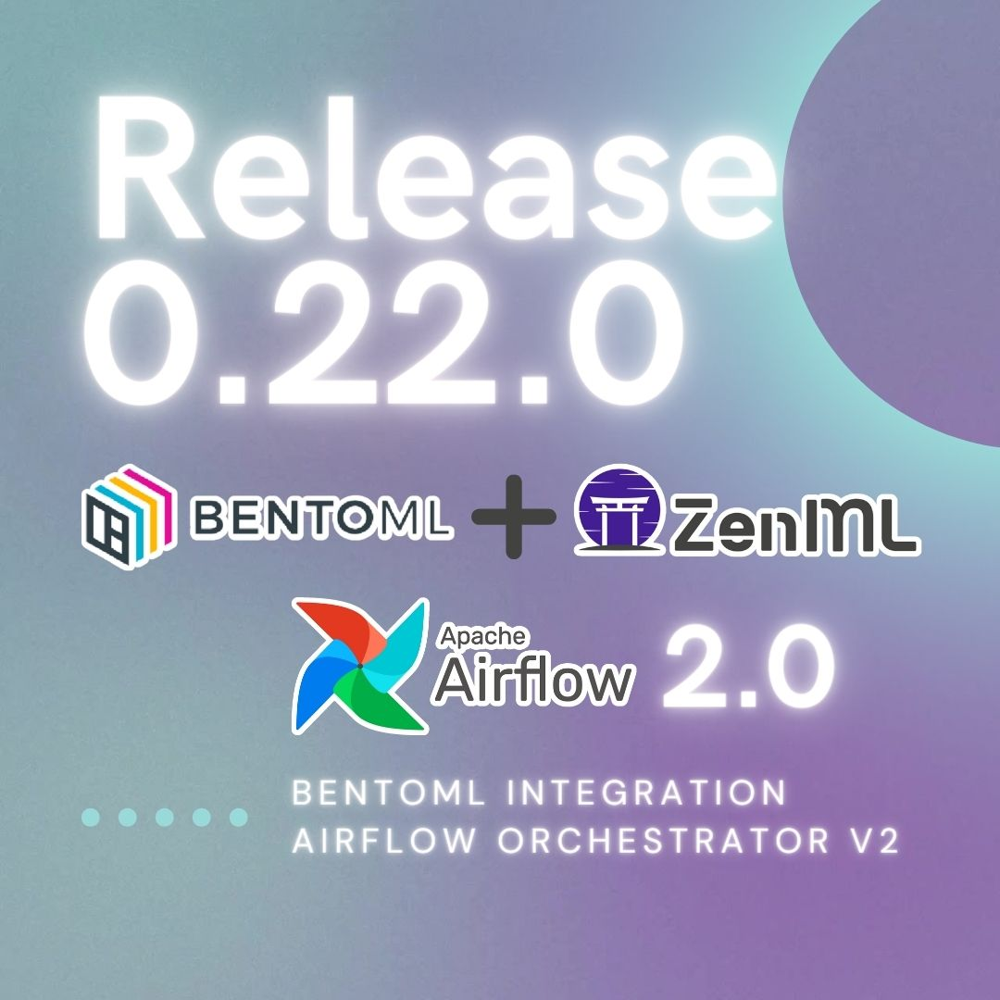

[ZenML 0.22.0](https://github.com/zenml-io/zenml/releases/tag/0.22.0) is out and brings a new [BentoML](https://www.bentoml.com/) integration and a revamped Airflow Orchestrator.

For now, let's dive right into the changes.

## 🤖 BentoML Integration

The new [BentoML integration](https://zenml.io/integrations/bentoml) includes a BentoML model deployer component that allows you to deploy your models from any of the major machine learning frameworks on your local machine.

See example [here](https://github.com/zenml-io/zenml/tree/main/examples/bentoml_deployment).

We showcased this in our community meetup demo on 23rd November 2022.

## 🚀 Airflow in the Clouds

The previous Airflow orchestrator was limited to running locally and had many additional unpleasant constraints that made it hard to work with. This release includes a completely rewritten, new version of the Airflow orchestrator that now relies on Docker images to run your pipelines and works both locally and with remote Airflow deployments.

See what changed [in this video](https://www.youtube.com/watch?v=v-tEm4O61Y8) and check out the brand-new example [here](https://github.com/zenml-io/zenml/tree/main/examples/airflow_orchestration).

## ☔ Notable Bugfixes

Further improvements to the synchronization that transfers pipeline run information from the MLMD database to the ZenML Server.

The ZenML Label Studio integration can now be used with non-local (i.e. deployed) instances. For more information see [the Label Studio docs](https://docs.zenml.io/component-gallery/annotators/label-studio).

The Spark example is fixed and now works again end-to-end.

## 💔 Breaking Changes

The following changes introduce with this release may require some manual
intervention to update your current installations:

The Airflow orchestrator now requires a newer version of Airflow (run `zenml integration install airflow` to upgrade) and Docker installed
to work.

View other changes [here](https://github.com/zenml-io/zenml/releases/edit/0.22.0).

## 🤗 New Contributors

We appreciate the following new contributors to the ZenML repo!

* [@sheikhomar](https://github.com/sheikhomar) made their first contribution in [#1045](https://github.com/zenml-io/zenml/pull/1045)
* [@chiragjn](https://github.com/chiragjn) made their first contribution in [#1057](https://github.com/zenml-io/zenml/pull/1057)

## 🔥 Onwards and Upwards!

If you find any bugs or something doesn't work the way you expect, please [let
us know in Slack](https://zenml.io/slack-invite) or also feel free to [open up a
Github issue](https://github.com/zenml-io/zenml/issues/new/choose) if you
prefer. We welcome your feedback and we thank you for your support!
