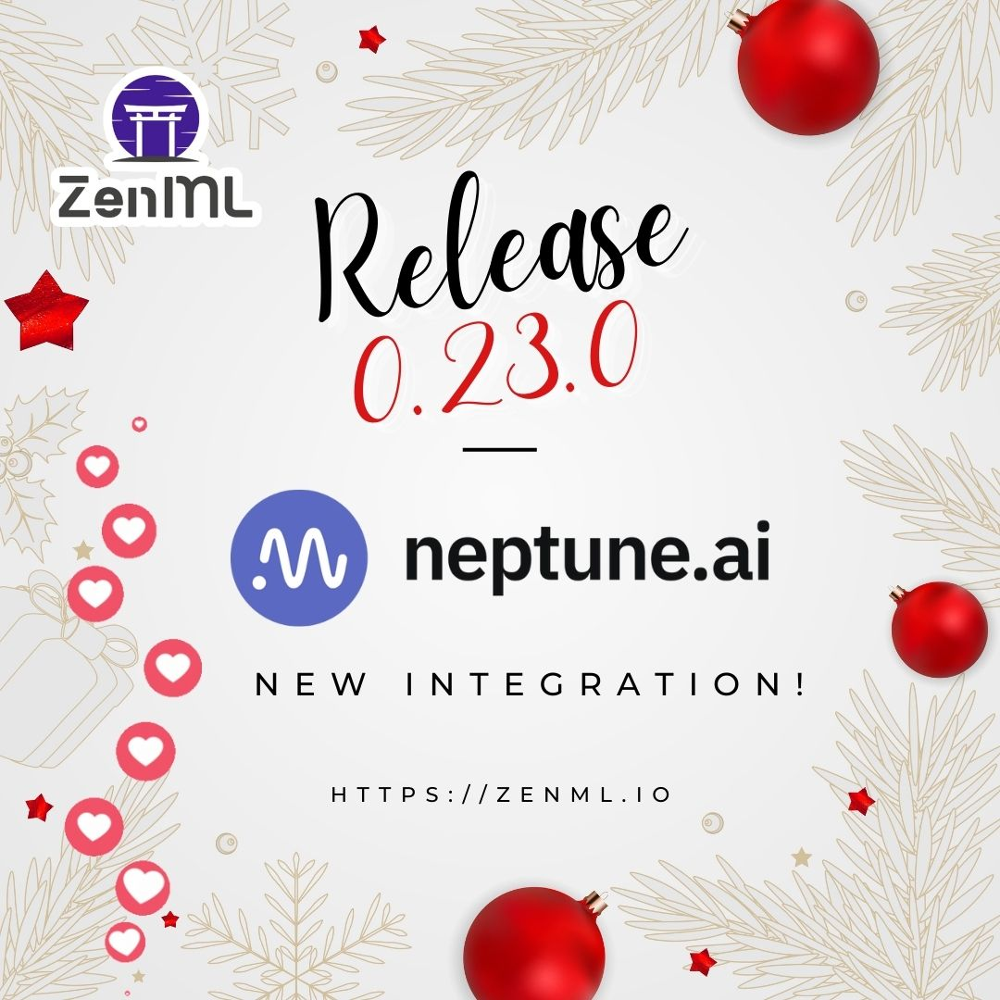
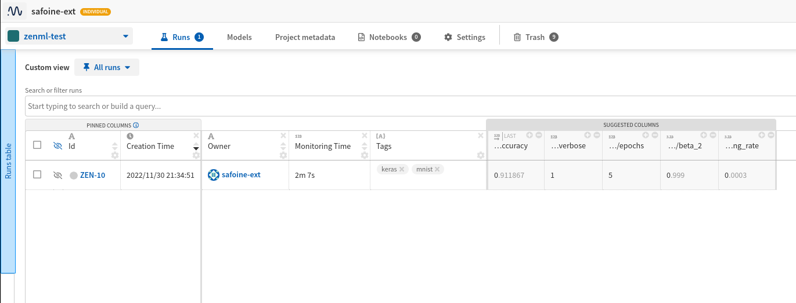
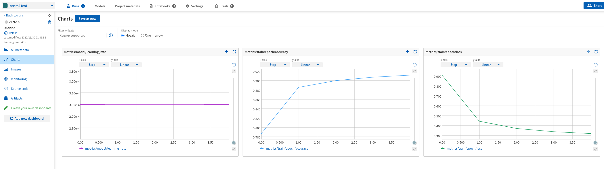
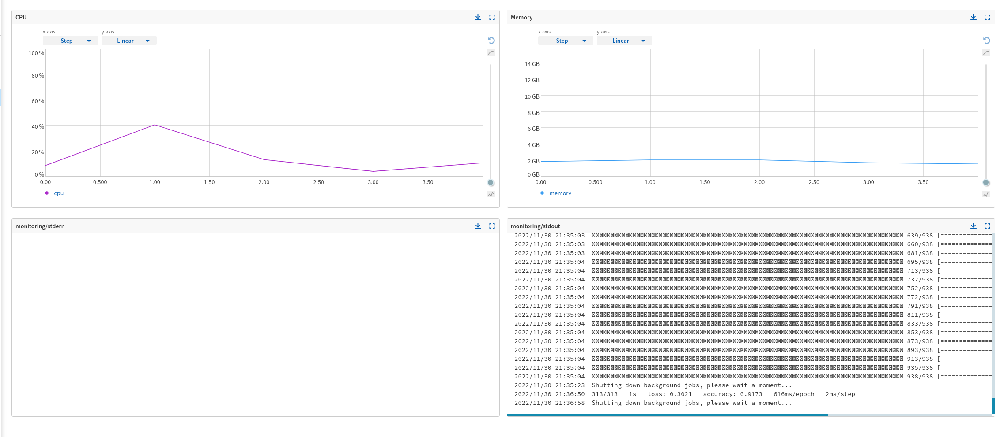

**Last updated:** December 05, 2022.



ZenML 0.23.0 was released this week, and comes bundled with a brand new `neptune` 
experiment tracker flavor. [Neptune](https://neptune.ai/product/experiment-tracking) is a
popular platform that you would normally use in the iterative ML experimentation
phase to track and visualize experiment results. Neptune can also
track and visualize the results produced by your
ZenML pipeline runs, as you make the transition towards a more production
oriented workflow.

A big shout-out to [@AleksanderWWW](https://github.com/AleksanderWWW), from the Neptune team
who spearheaded the [Neptune integration](https://zenml.io/integrations/neptune)
with [#1082](https://github.com/zenml-io/zenml/pull/1082).

## :couple_with_heart_man_man: How Neptune fits with ZenML

One of the coolest things about Neptune is how focused it is on what it does well:
Being a kick-ass experiment tracker and model registry. Given ZenML does not have a
model registry abstracton ([yet](https://zenml.io/roadmap)), we decided to focus on
the experiment tracking part this time around, with the ZenML
[experiment tracker](https://docs.zenml.io/component-gallery/experiment-trackers)
abstraction.

Experiment trackers in ZenML let you track your ML experiments by logging extended information about your models,
datasets, metrics and other parameters and allowing you to browse them, visualize them and compare them between runs.
In the ZenML world, every pipeline run is considered an experiment, and ZenML facilitates the storage of experiment
results through Experiment Tracker stack components. This establishes a clear link between pipeline runs and experiments.

## 🤾 Challenges faced while integration

The tougest challengewith the entire story was to try to maintain the state of the Neptune
run across the lifetime of a pipeline (i.e across steps). Aleksander and the Neptune team solved this with the
[RunProvider](https://github.com/zenml-io/zenml/blob/main/src/zenml/integrations/neptune/experiment_trackers/run_state.py#L33)
class that is a singleton object storing and persisting the Neptune run state across
the pipeline.

## 🪐 Using Neptune as an Experiment Tracker

With the new Neptune integration, one can easily create a Neptune experiment tracker component and use it in any step in
a pipeline.

A concrete example with a pipeline can be viewed in the [example](https://github.com/zenml-io/zenml/tree/main/examples/neptune_tracking)
on GitHub. Here is a brief summary:

### 🥞 Create the stack with the Neptune experiment tracker component

Ceate a new `StackComponent`,  and  subsequently a new `Stack` with the type `neptune`. The Neptune tracker stack component has the following options:

* `api_token`: [API key token](https://docs.neptune.ai/setup/setting_api_token) of your Neptune account. If left blank, Neptune will
attempt to retrieve it from your environment variables.
* `project`: The name of the project where you're sending the new run, in the form "workspace-name/project-name".
If the project is not specified, Neptune will attempt to retrieve it from your environment variables.

Note that project_name and entity are optional in the below command:

```shell
zenml experiment-tracker register neptune_experiment_tracker --flavor=neptune \ 
    --project=<project_name> --api_token=<token>

zenml stack register neptune_stack \
    -a default \
    -o default \
    -e neptune_experiment_tracker \
    --set
```

### 🏃 Run a pipeline with the experiment tracker enabled

Create a step that uses the experiment tracker component:

```python
from neptune.new.integrations.tensorflow_keras import NeptuneCallback
from zenml.integrations.neptune.experiment_trackers.run_state import (
    get_neptune_run,
)
from zenml.integrations.neptune.flavors import NeptuneExperimentTrackerSettings

settings = NeptuneExperimentTrackerSettings(tags={"keras", "mnist"})

@step(
  experiment_tracker=Client().active_stack.experiment_tracker.name,
  settings={"experiment_tracker.neptune": settings},
)
def tf_trainer(
    params: TrainerParameters,
    x_train: np.ndarray,
    y_train: np.ndarray,
) -> tf.keras.Model:
    """Train a neural net from scratch to recognize MNIST digits return our
    model or the learner"""
    neptune_run = get_neptune_run()  # Getting the run from the integration
    neptune_run["params/lr"] = params.lr

    neptune_cbk = NeptuneCallback(run=neptune_run, base_namespace="metrics")

    model = tf.keras.Sequential(
        [
            tf.keras.layers.Flatten(input_shape=(28, 28)),
            tf.keras.layers.Dense(10),
        ]
    )

    model.compile(
        optimizer=tf.keras.optimizers.Adam(params.lr),
        loss=tf.keras.losses.SparseCategoricalCrossentropy(from_logits=True),
        metrics=["accuracy"],
    )

    model.fit(
        x_train,
        y_train,
        epochs=params.epochs,
        batch_size=64,
        callbacks=[neptune_cbk],
    )

    return model
```

**Note**: The above code is only for illustration purpsoes. Full code can be seen
[here](https://github.com/zenml-io/zenml/tree/main/examples/neptune_tracking)

You can see that using `get_neptune_run` in the Neptune integration ensures that the user does not
need to take care of creating and managing the lifecycle of the Neptune run. Instead, ZenML takes care
of the lifecycle of the experiment and the user need only use the normal Neptune functions as shown with
the `NeptuneCallback`.

### 📈 Visualizing experiment results in Neptune

Once the experiment is completed, we can view the results in Neptune. In the Neptune UI, we can see the experiment's metrics, such as training and validation accuracy, as well as any other custom metrics that we have defined in the ML pipeline.

The results should be available at the URL: https://app.neptune.ai/{ACCOUNT_USERNAME}/{PROJECT_NAME}

Each pipeline run will be logged as a separate experiment run in Neptune. You can see the results of the pipeline run in the Neptune UI.

For example, here are the runs 'raw:



For each run, you should see the following visualizations:






## 🔥 Onwards and Upwards!

We hope this blog gave an insight into how the Neptune and ZenML team developed this integration
together. It's easy for you to create your own experiment tracker integration as well. Just follow
the guide [here](https://docs.zenml.io/component-gallery/experiment-trackers/custom).

If you find any bugs or something doesn't work the way you expect in the Neptune integration, please [let
us know in Slack](https://zenml.io/slack-invite) or also feel free to [open up a
GitHub issue](https://github.com/zenml-io/zenml/issues/new/choose) if you
prefer. We welcome your feedback and we thank you for your support!