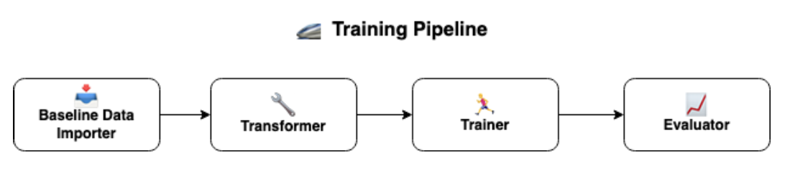
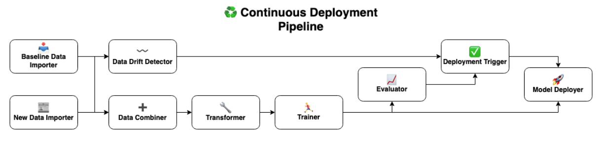

**Last updated:** December 16, 2022.

At [Two](https://www.two.inc/), we’re keenly aware that the ability to develop, deploy, 
and maintain sophisticated machine learning solutions is critical for the success of our business. 
That’s why we make it a priority to keep our finger on the pulse of ongoing developments in the MLOps space.

A great example of this is the impressive framework developed by the ZenML team. 
So, as part of our efforts to get properly acquainted with their software and its capabilities, 
we decided to enter their [Month of MLOps competition](https://blog.zenml.io/mlops-competition-recap/).

Here's a video summary of our submission.

  <iframe width="560" height="315" src="https://www.youtube-nocookie.com/embed/E9FsXqHaSwM" title="YouTube video player" frameborder="0" allow="accelerometer; autoplay; clipboard-write; encrypted-media; gyroscope; picture-in-picture" allowfullscreen></iframe>

For our submission, we decided to implement a fraud detection model using ZenML to utilise the framework 
for a problem similar to the ones our Data Science team works on.

In particular, we used the [Synthetic data from a financial payment system](https://www.kaggle.com/datasets/ealaxi/banksim1) dataset, 
made available by Kaggle, to develop our model. In line with the requirements of the competition, 
we began developing an end-to-end ML solution using ZenML, which was tasked with the following responsibilities:

* Importing the dataset
* Cleaning the data and engineering informative features
* Detecting data drift of new data
* Training a model to detect fraud on a transactional level
* Evaluating the performance of the model
* Deploying the model to a REST API endpoint
* Providing an interface for users to interact with the model

To address these requirements we built a Training pipeline which we used for experimentation, and a Continuous Deployment pipeline. 
The Continuous Deployment pipeline extended the capabilities of the Training Pipeline to identify data drift in new data, 
train a model on all available data, and evaluate the performance of this model prior to deploying it to an API endpoint.

To enable these pipelines, we made use of the following ZenML stack:

* Artifact Storage: [Google Cloud Storage](https://cloud.google.com/storage)
* Container Registry: [Google Cloud Container Registry](https://cloud.google.com/container-registry)
* Data Validator: [EvidentlyAI](https://www.evidentlyai.com/)
* Experiment Tracker: [MLflow](https://mlflow.org/)
* Orchestrator: [Google Kubernetes Engine](https://cloud.google.com/kubernetes-engine)
* Model Deployer: [Seldon](https://www.seldon.io/)

We had a lot of fun implementing this solution using ZenML, and encourage readers to give the framework a try for themselves!

### 🚄 Training Pipeline

The Training pipeline defines the end-to-end process of training our model to predict whether a given transaction is fraudulent.

This pipeline is particularly useful compared to an ad-hoc training workflow thanks to its reproducibility and maintainability. The artifacts produced by each stage of the pipeline are automatically saved to the ZenML artifact storage, allowing us to revisit any model knowing exactly what data it was trained on.

Thanks to ZenML's infrastructure-agnostic design, it was also simple to integrate our pipeline with the MLflow Experiment Tracker. This gave us visibility on the performance and metadata of each run of our pipeline, and made it easy to run the pipeline as a sequence of pods on Kubernetes.

The Training pipeline can be summarized as follows:

### 📥 Baseline Data Importer

This step is responsible for importing our baseline data from a Cloud Storage Bucket. 
Here, we define the baseline data as a subset of our toy dataset to act as the "ground-truth" for the model development phase.

### 🔧 Transformer

Within the Transformer, we execute a number of preprocessing and feature engineering functions to prepare our dataset for eventual training, and supply additional domain knowledge into the data provided to the model. In particular, we:

* Apply simple preprocessing techniques to clean up data entries
* Create moving averages, standard deviations and maximum amounts by product category, merchant, and customer
* Split the data according to the Step feature of the dataset, which denotes the simulated day on which transactions took place

### 🏃‍♂️ Trainer

This step takes the output generated by the transformer and trains a [Histogram-based Gradient Boosting Classification Tree](https://scikit-learn.org/stable/modules/generated/sklearn.ensemble.HistGradientBoostingClassifier.html) on the training data.

### 📈 Evaluator

As a final step of the Training pipeline, we tested the model’s performance against the validation dataset and track the results in our MLFlow Experiment Tracker. In particular, we used the following metrics to evaluate model performance:

* [ROC AUC](https://scikit-learn.org/stable/modules/generated/sklearn.metrics.roc_auc_score.html#sklearn.metrics.roc_auc_score)
* [PR AUC](https://scikit-learn.org/stable/modules/generated/sklearn.metrics.average_precision_score.html#sklearn.metrics.average_precision_score)
* [Precision](https://scikit-learn.org/stable/modules/generated/sklearn.metrics.precision_score.html#sklearn.metrics.precision_score)
* [Recall](https://scikit-learn.org/stable/modules/generated/sklearn.metrics.recall_score.html#sklearn.metrics.recall_score)
* [F1 Score](https://scikit-learn.org/stable/modules/generated/sklearn.metrics.f1_score.html#sklearn.metrics.f1_score)
* [Brier Score](https://scikit-learn.org/stable/modules/generated/sklearn.metrics.brier_score_loss.html#sklearn.metrics.brier_score_loss)
* [Accuracy](https://scikit-learn.org/stable/modules/generated/sklearn.metrics.accuracy_score.html#sklearn.metrics.accuracy_score)

By orchestrating all of the steps above via ZenML, we were able to build a reproducible and maintainable ML pipeline with automated output artifact storage, step caching, experiment tracking and remote orchestration baked in!

## ♻️ Continuous Deployment Pipeline

Our Continuous Deployment pipeline is responsible for a more ambitious task than the Training pipeline. Its role is to train a model on a fresh set of data and deploy it to a REST API endpoint, provided that particular acceptance criteria are met regarding the quality of the newly trained model.

In particular, we extended the Training pipeline to include five additional steps, described in further detail below:

### 📰 New Data Importer
This step imports an as-yet unseen slice of our dataset within the context of our submission. In a production setting, this step would import the newest set of data available in our Data Warehouse.

### 〰️ Data Drift Detector
This step compares the new data with the data used most recently to train our Continuous Deployment pipeline, in order to identify data drift between the two sets. The output of this step is later used to avoid unknowingly training our model on a dataset whose statistical properties deviate significantly from the original data used to train our model with. This step was implemented using the EvidentlyAI integration provided by ZenML.

### ➕ Data Combiner
After checking for data drift, we combine the dataset previously used to train our Continuous Deployment pipeline with a set of fresh data produced by our mock Data Warehouse. This is to create a unified training dataset used to train the new model on.

### ✅ Deployment Trigger
After training and evaluating the performance of our model against a validation dataset, we pass the results to a deployment trigger step. This is responsible for controlling whether the trained model will be deployed to a REST API endpoint. In particular, the performance metrics of the model are required to have exceeded some threshold values on the validation set. We also require that there is not to be any significant data drift between the original and fresh data according to the EvidentlyAI integration.

### 🚀 Model Deployer
Provided that the deployment trigger has been given the go-ahead for deployment, this step takes the trained model upstream and deploys it to a dedicated API endpoint on our Kubernetes Cluster using Seldon.

With this pipeline architecture, it is trivial to update our model at the API endpoint exposed by Seldon, while ensuring any model we deploy meets our performance requirements.

## 💭 Conclusions
As a team, we had a great time putting together this solution for the competition and we were delighted that we ended up placing second with our entry!

At Two, we’re very excited about the capabilities, abstractions, and flexibility ZenML provides, and we’re looking forward to taking the learnings we’ve garnered during the competition and funneling them into the development of our internal ML solutions.

## 📚 Learn More
Below are some resources to learn more about the project and the competition:

* [GitHub Repository](https://github.com/two-inc/zenml-competition)
* [ZenML Project](https://zenml.io/blog/two-inc-fraudulent-financial)
* [Month of MLOps Closing Ceremony Presentation](https://youtu.be/acLrHtjiN9A?t=1502)

