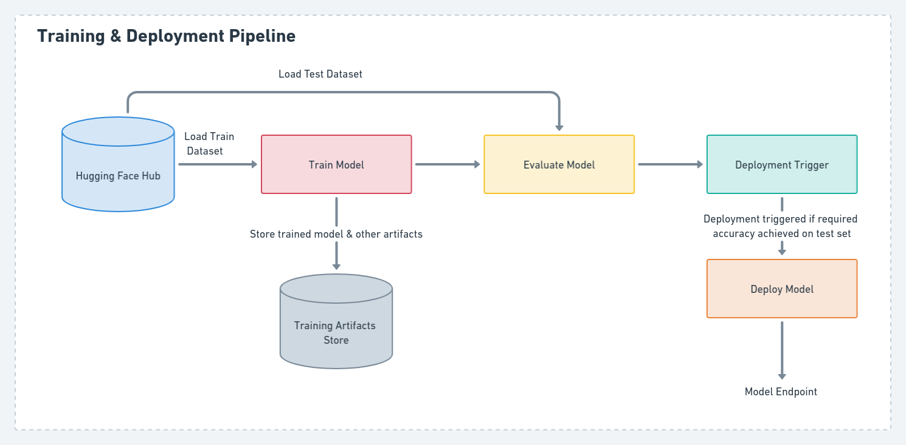
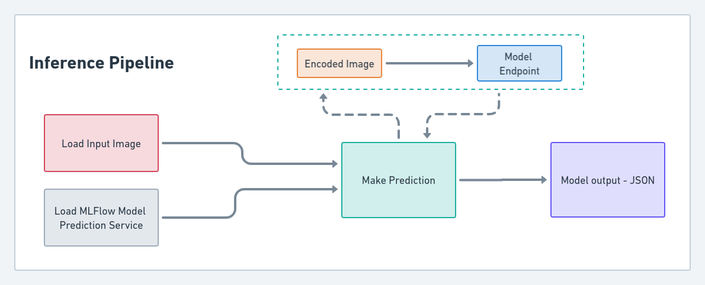

**Last updated:** December 19, 2022.

We all know ZenML has been creating a lot of buzz in the MLOps space, offering all the necessary components you'd require to setup production ready MLOps pipelines. So naturally, when I saw they're hosting a [Month of MLOps competition](https://zenml.notion.site/ZenML-s-Month-of-MLOps-Competition-Announcement-3c59f628447c48f1944035de85ff1a5f/), I couldn't resist the temptation to participate and use it as a medium to learn all about ZenML.

For the competition, I decided to take up a real world business problem - building the MLOps solution to support a ML driven cheque processing system and defined that as my problem statement. Of course, a ML driven cheque processing system could have several different components but since I wanted to participate as an individual in this competition, I decided to restrict the scope of the system to the extraction of important entities from a cheque such as -- payee name, amount in words, amount in figures, bank name, cheque date, etc.
I thought of leveraging a new transformer model called [Donut - **Do**cument **Un**derstanding **T**ransformer](https://arxiv.org/abs/2111.15664) for the extraction of the data instead of relying on traditional (slow and expensive) OCR based techniques.
I thought, building the MLOps pipelines for such a solution would be a good test of ZenML's capabilities for solving real-world problems.

In case, you want to know more about the business problem or ML algorithm choice aspects of the solution, please refer to my [blog](https://medium.com/@shivalikasingh95/chequeeasy-banking-with-transformers-f49fb05960d3) on Medium for a more detailed explanation.

You can also check out a video summary of my submission.

  <iframe width="560" height="315" src="https://www.youtube-nocookie.com/embed/b0_xSISvcfU" title="YouTube video player" frameborder="0" allow="accelerometer; autoplay; clipboard-write; encrypted-media; gyroscope; picture-in-picture" allowfullscreen></iframe>

Based on the requirements of the competition and the usecase I had chosen, I defined the scope of my solution to include the following features:

* Support for labeling data which can be used to train the model
* Combine the images and GT to prepare a dataset for model training
* Training a model to extract relevant data from a cheque image
* Evaluating the performance of the trained model
* Deploying the model based on a trigger to a REST API endpoint
* Using trained model for inference on unseen data
* Creating a demo app for the model 

Based on the features I wanted for the solution, it was clear that I needed pipelines for labeling, data processing, model training as well as model inference.

One great thing about using ZenML to setup pipelines is that it makes everything easily reproducible. Each pipeline is made up a sequence of steps and the outputs corresponding to each step are saved in the artifact store corresponding to your ZenML stack - making it very easy to track things.

With ZenML it was also very easy to pick and choose different components to setup stacks (infrastructure) for running the created pipelines. You could even create different stacks to run different kinds of pipelines depending on your use case. I used the stacks described below to build the necessary pipelines for my solution.

Stack for Annotation & Data Processing pipelines included the following components:

* Orchestrator: Local Orchestrator
* Artifact Storage: Azure Blob storage
* Secrets Manager: Azure Keyvault
* Annotator: Label Studio

Stack for Training & Inference pipelines included the following components:

* Orchestrator: Local Orchestrator
* Artifact Storage: Local Storage
* Secrets Manager: Local Secrets Manager
* Experiment Tracker: [MLflow](https://mlflow.org/)
* Model Deployer: [MLflow](https://mlflow.org/)

## Annotation Pipelines
While I did use a [Kaggle dataset](https://www.kaggle.com/datasets/medali1992/cheque-images) to fine tune my model, I also wanted to keep my solution as close to the real-world setting as possible. In my experience, companies have to spend a good amount of time on annotation when solving complex problems involving use of unstructured data. So I thought it would be useful if the solution could include support for annotating new data to train the model. This component consisted of 2 small pipelines:

### 1. Cheque Labeling Pipeline:

This pipeline was used to do the labeling setup in `Label Studio` which was the `annotator` component offered via ZenML that I used as part of the solution. It included the following steps:

#### Create Dataset: 
This step was used to create a labeling project (or dataset) inside Label Studio with the desired `dataset_name` and OCR task labeling config.
At the time of developing this solution, OCR labeling task was not supported directly via ZenML for Label Studio but through the competition I got the chance to add this as a small [contribution](https://github.com/zenml-io/zenml/pull/1062) to ZenML source code.

#### Sync or Create Storage: 
This step is used to attach a storage to the labeling dataset created as part of the previous step within Label Studio. In this case, I attached an Azure Blob Storage container which had all the data (cheque images) I wanted to use for annotation.

**Note**: Post running this pipeline, you could run the `zenml annotator dataset annotate <dataset_name>` to start up Label Studio and proceed with data annotation.

### 2. Process Labeled Data Pipeline: 

This was a simple post processing pipeline to convert the labeling output into a cleaner format and included the following steps:

#### Get Dataset: 
This step is used to fetch details of the labeling dataset created in Label Studio using the `Cheque Labeling Pipeline`.

#### Get Labeled Data: 
This step would take the annotation output (in JSON format) produced by Label Studio corresponding to the given `dataset` fetched using previous step.

#### Convert annotations:
Label Studio generates annotations by default in its own unique JSON format. However, I needed all the annotation files to follow one common format similar to the one that is included in the Kaggle dataset used for fine-tuning the model. The purpose of this step was to take the JSON output produced post annotation and convert it into the expected CSV file format which can be consumed as an input by the data processing pipeline.

## Data Processing Pipeline
The purpose of this pipeline was to take the raw image data and corresponding labeling file and prepare a Hugging Face compatible dataset. The steps have been summarized below.

### Import and clean data
This step was used to import the annotation CSV file and do some data cleaning.

### Split Data
The purpose of this step was to prepare the train, test and validation splits for the data.

### Create Metadata
This step was used to prepare the metadata JSON files corresponding to train, validation and test splits of our data which would be required to prepare a [Hugging Face](https://huggingface.co/docs/datasets/index) compatible dataset.

### Store Data
This step was used to combine and load the train, test and validation splits of the data as a common dataset and push to the [Hugging Face Hub](https://huggingface.co/datasets/shivi/cheques_sample_data). 

### Training Pipeline with Continuous Deployment

The Training pipeline defines the end-to-end process of training the Donut model to predict the required cheque details. I leveraged [ZenML's MLFlow integration](https://blog.zenml.io/mlflow-tracking/) for both experiment tracking as well as model deployment as part of this pipeline.
This pipeline also includes support for continuous deployment. Once model training is complete, the model can be evaluated on a test dataset and can then be deployed to a REST API endpoint, provided that the accuracy of the new model meets a certain threshold.

The Training pipeline can be summarized as follows:

### Load config, model, processor
Hugging Face's [transformers library](https://huggingface.co/docs/transformers/index) was used to fine-tune the model. To setup the Donut model using `transformers` we needed to load the configuration required to instantiate the model, the processor associated with the model along with the actual pretrained model.
To enable the writing and retrieval of the config and processor associated with Donut model from the artifact store, I had to implement custom [`materializers`](https://github.com/shivalikasingh95/cheque-easy/tree/main/materializers). 

In ZenML pipelines, a materializer dictates how a given artifact can be written to and retrieved from the artifact store and also contains all serialization and deserialization logic. ZenML already supports most of the commonly used objects in ML pipelines with its inbuilt [materializers](https://docs.zenml.io/user-guide/advanced-guide/handle-custom-data-types) but in case you want to use some custom data types between the steps of your pipelines then ZenML also allows you to write your own [customized](https://docs.zenml.io/user-guide/advanced-guide/handle-custom-data-types) implementation.

### Train Donut

This step is used fine tune [Donut](https://huggingface.co/docs/transformers/model_doc/donut) on the training data. [Pytorch Lightning](https://www.pytorchlightning.ai/) is also used along with Hugging Face transformers and datasets libraries for the fine-tuning of the model.
MLflow was used for experiment tracking as part of this step. It was used to log observed metrics during training as well as logging of the trained model at the end of the step.
Since, MLFlow doesn't support Hugging Face transformer models by default, I had to write a [custom implementation](https://github.com/shivalikasingh95/cheque-easy/blob/main/steps/cheque_parser/train_donut/mlflow_pyfunc.py) using MLFlow's `pyfunc` module to support MLflow logging of the trained model. 
Additionally, this step also supports pushing of the trained model to the Hugging Face Hub.

### Evaluator
As part of this step, the model’s performance is tested on a test dataset using a custom method which utilizes n-TED(Normalized Tree Edit Distance) based accuracy and F1 accuracy score written by the original authors of the Donut paper. Again, results of this steps are tracked using MLFlow.

### Deployment Trigger
After training and evaluating the performance of our model against a test dataset, we check if the model accuracy is above a desired threshold. Only if the model satisfies this criteria, it will be deployed to a REST API endpoint.

### Model Deployer
Once the deployment trigger has been activated, this step takes the trained model and deploys it using ZenML's Mlflow Deployer and creates a prediction service corresponding to the deployed model.

## Inference Pipeline
This pipeline consists of 3 simple steps as summarized below:

### Load data
Import the data (i.e. cheque image) that will be fed as input to model for getting prediction.

### Load Prediction Service
This step was used to load the MLFlow model prediction service created with the help of ZenML during the deployment step.

### Predict
Finally, the input image will be encoded as a base64 string and fed as input to the MLFlow model prediction service.  This will return the json output generated by the model containing the extracted cheque details.

Thanks to ZenML, I was easily able to build reproducible and maintainable pipelines including support for annotation, experiment tracking, model deployment, pipeline orchestration, secret management, artifact storage, etc.

## Gradio Demo
Finally, I created a simple [demo](https://huggingface.co/spaces/shivi/ChequeEasy) of the project to interact with the trained model using [Gradio](https://gradio.app/docs/) and deployed it with help of [Hugging Face Spaces](https://huggingface.co/docs/hub/spaces-overview).

## Future Work
There's definitely a lot of scope in terms of improving the performance of the Donut model so that it can work well with different kinds of cheque image inputs.
Since this competition was more about MLOps, I built a basic working model that would suffice for solving the use case and spent more effort on the MLOps side of the solution.
Going forward, I would definitely like to focus on the modeling aspects of this solution. I would even like to test out Donut's multi-lingual capabilities to process cheque images written in languages other than English.

On the MLOps side of the solution, I would like to explore [ZenML's DeepChecks integration](https://blog.zenml.io/deepchecks-and-zenml/) for data and model validation to further enhance my solution.
I would also like to migrate all my pipelines from a local setup to a cloud based setup and try out ZenML's [Kubeflow](https://docs.zenml.io/user-guide/component-guide/orchestrators/kubeflow) or [Kubernetes](https://docs.zenml.io/user-guide/component-guide/orchestrators/kubernetes) orchestrators. 

## 💭 Conclusions
As an individual, I had so much fun participating in this competition. It turned out to be a great opportunity to showcase my work to the topmost MLOps industry experts, build my own small open-source project, learn from the ZenML community as well as contribute back to ZenML. It's hard to get so much out of just one competition and it was only possible because of how well the ZenML team organized it.

I'd definitely recommend everyone to give ZenML a try for setting up their MLOps pipelines as well as engaging with the ZenML community. They're extremely helpful, patient and very receptive to feedback. 😄

## 📚 Learn More
Below are some of the resources to learn more about the project: 

* [GitHub Repository](https://github.com/shivalikasingh95/cheque-easy)
* [Project Demo](https://huggingface.co/spaces/shivi/ChequeEasy)
* [Medium Blog](https://medium.com/@shivalikasingh95/chequeeasy-banking-with-transformers-f49fb05960d3)
* [Month of MLOps Closing Ceremony Presentation](https://www.youtube.com/watch?v=acLrHtjiN9A&t=1502s)
