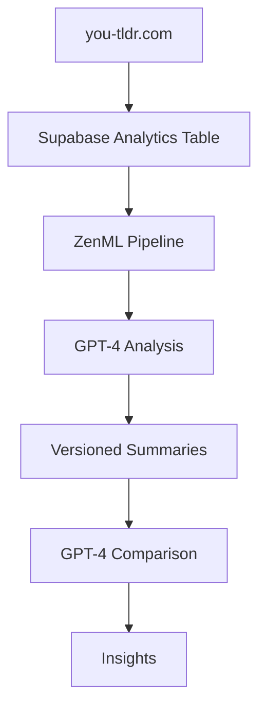

**Last updated:** May 1, 2023

In this blog post, we'll explore how [ZenML](https://zenml.io) can be used in conjunction with [OpenAI's GPT-4](https://openai.com/product/gpt-4) to analyze and version data from a [Supabase](https://supabase.com/) database. We'll use the [you-tldr.com](https://you-tldr.com/) website as an example, showcasing how the site populates an analytics table in Supabase and how ZenML asynchronously picks up the latest video data for analysis.

Large language models (LLMs) like GPT-4 have revolutionized natural language processing, offering unparalleled capabilities for knowledge generation and reasoning. However, incorporating custom, private data into these models remains a challenge. ZenML, an extensible, open-source MLOps framework, can help overcome this limitation by versioning data and allowing for comparisons between summaries rather than raw data.

The true power of this project lies in its ability to read from an enterprise dataset and generate summaries over time, which can be applied to a wide range of use cases, such as personalized marketing or monitoring and analyzing trends in your data. While this case study focuses on Supabase and OpenAI, the approach can be easily adapted to work with other databases and LLMs, providing flexibility and versatility for your specific needs. By leveraging the power of ZenML, GPT-4, and Supabase (or your preferred database and LLM), you can unlock the full potential of your enterprise data and gain a competitive edge in your industry.

# 🧑‍🎓 The you-tldr.com Case Study

[you-tldr.com](https://you-tldr.com) is a website that provides concise summaries of YouTube videos. The site populates an analytics table in Supabase with information about the kinds of videos that users are choosing to summarize. We'll demonstrate how ZenML can be used to analyze this data using GPT-4 and version the summaries for comparison.

## 🛠️ Creating the ZenML pipeline

### 📊 Populating a Supabase Analytics Table

The you-tldr.com website updates the Supabase analytics table with the latest video titles. This table serves as the data source for our ZenML pipeline, which will use GPT-4 to generate summaries of visitor activity over the last 24 hours. Here is a snapshot of the data:

| video_title                                                                                          | created_at                    |
| ---------------------------------------------------------------------------------------------------- | ----------------------------- |
| $75,000 Grants Now Available 10,000 Grants - Startups - Existing - Self Employed FREE MONEY NOT LOAN | 2023-04-19 16:39:23.157915+00 |
| $90 3v3 Challenge: Domi, Size, Hummi vs Crazy, Ammo, Boycah | 2023-04-30 00:29:03.918995+00 |
| 'A Bad Case of Stripes' read by Sean Astin                                                           | 2023-03-29 08:43:27.115494+00 |
| 'A Bicycle of the Mind' - Steve Jobs on the Computer                                                 | 2023-04-11 13:47:25.8898+00   |
| 'A Day in the Life' at My Off Grid Property! | 2023-04-29 20:34:57.28206+00  |Fish Pond, Forest Maintenance, Winching, Sawmill Shed | 2023-04-29 20:34:57.28206+00  |
| 'A Tale of Two Beasts' read by Sarah Silverman                                                       | 2023-03-23 13:50:36.405557+00 |
| 'Brave Irene' read by Al Gore                                                                        | 2023-03-29 02:40:08.482399+00 |
| 'Brilliant' and 'disgusting': New Trump ad pokes fun at DeSantis' alleged eating habit               | 2023-04-18 01:45:52.157644+00 |
| 'Censorship we can get behind': Elon Musk tears down tweet celebrating 'paedophile pride day'        | 2023-04-30 00:34:06.551438+00 |
| 'Clark the Shark' read by Chris Pine                                                                 | 2023-03-27 02:49:25.704303+00 |
| 'Emergency' Fed rate cut by June, only 6 U.S. banks will be left by 2025 paving way for CBDC - Dowd  | 2023-03-25 09:02:01.49922+00  |

### 🔄 Asynchronously Reading Data in a ZenML pipeline

Once the analytics table is populated, ZenML asynchronously picks up the latest video data and processes it using GPT-4. 

The first step is to read data from Supabase. Here is the code for this:

```python
@step(enable_cache=False)
def supabase_reader(
    params: SupabaseReaderParams,
) -> List[str]:
    """Reads from supabase and returns a list of dicts."""
    supabase_secret = Client().get_secret("supabase")

    supabase: SupabaseClient = create_client(
        supabase_secret.secret_values["supabase_url"],
        supabase_secret.secret_values["supabase_key"],
    )

    interval = datetime.now(timezone.utc) - timedelta(
        hours=params.filter_interval_hours
    )

    # Create a supabase query to filter for the last 24 hours
    response = (
        supabase.table(params.table_name)
        .select(params.summary_column)
        .filter(params.filter_date_column, "gte", interval)
        .order(params.filter_date_column, desc=True)
        .limit(params.limit)
        .execute()
    )

    return [d[params.summary_column] for d in response.data]
```

The `supabase_reader` step is a custom ZenML step that reads data from a Supabase database and returns a list of strings. This step is part of the ZenML pipeline that processes the latest video data from the you-tldr.com website.

The `supabase_reader` step takes `SupabaseReaderParams` as input, which includes parameters such as the table name, summary column, filter date column, filter interval hours, and limit. It then connects to the Supabase database using the provided credentials and constructs a query to filter the data based on the specified parameters. In this case, it filters the data for the last 24 hours and orders it in descending order. Finally, it returns a list of strings containing the summary column data.

This step can be easily adapted for other use cases by modifying the input parameters and the query construction. For example, you could use this step to read data from a different table, filter based on different criteria, or return different columns. By customizing this step, you can leverage the power of ZenML and Supabase to process and analyze data from various sources.

### 📝 Using the GPT-4 API to Summarize Data

The second step in the pipeline passes the latest data to [OpenAI GPT-4]() to summarize it.
It also compares it to the last summary that was created, ensuring we have some historic
comparison.

```python
@step(enable_cache=True)
def gpt_4_summarizer(
    params: SummarizerParams, documents: List[str], context: StepContext
) -> str:
    """Summarizes the data using GPT-4."""
    openai_secret = Client().get_secret("openai")
    last_step = (
        get_pipeline(context.pipeline_name)
        .runs[0]
        .get_step("generate_summary")
    )
    if len(last_step.outputs) == 0:
        last_analysis = "No previous analysis found."
    else:
        last_analysis = last_step.output.read()

    openai.api_key = openai_secret.secret_values["api_key"]

    response = openai.ChatCompletion.create(
        model="gpt-4",
        messages=[
            {"role": "system", "content": params.system_content},
            {
                "role": "user",
                "content": params.prompt_preamble
                + "\n"
                + "Here is an example output:"
                + "\n"
                + params.prompt_example
                + "\n"
                + "Here is the data: "
                + str(documents)
                + "\n"
                + "And here is the previous analysis: "
                + last_analysis,
            },
        ],
        temperature=0,
        max_tokens=256,
        top_p=1.0,
        frequency_penalty=0.0,
        presence_penalty=0.0,
    )
    return response.choices[0].message.content
```

The `gpt_4_summarizer` step is a custom ZenML step that leverages GPT-4 to generate summaries of the input data. It takes `SummarizerParams` and a list of documents as input, along with the `StepContext` to access previous pipeline runs.

The step first retrieves the secret API key for OpenAI and checks for any previous analysis. If a previous analysis is found, it is included in the input to GPT-4. This allows GPT-4 to consider the previous analysis while generating the new summary.

The step then calls the GPT-4 API with the specified parameters and input data, including the documents and the previous analysis. The API returns a summary, which is then returned as the output of the step.

This custom step can be adapted for other use cases by modifying the input parameters, the GPT-4 model, or the API call. For example, you could use this step to generate summaries for different types of data, use a different language model, or customize the API call to suit your specific needs.

### 📆 Daily reports on Slack

<figure>
  
  <figcaption style="text-align:center;font-size:14px;color:#666;">Analysis is reported to Slack every day.</figcaption>
</figure>

The last step in the pipeline posts the latest summary every day to a shared Slack channel. This allows us to keep an overview of the changes happening to the data over time. For example, yesterday the report said:

The latest data from the database indicates the following key insights:

1. There is a diverse range of video topics, including technology, economics, philosophy, aviation, health, politics, and entertainment.
2. Educational and informative content seems to be popular among users, with videos on subjects like economics, engineering, and artificial intelligence.
3. There is a noticeable interest in videos featuring influential figures, such as Steve Jobs and Noam Chomsky.
4. Users are also watching content related to personal development and self-improvement, such as videos on Landmark Forum and focusing the unconscious mind.
5. There is a significant presence of videos discussing current events and global issues, such as the Russia-Ukraine conflict and climate change.
6. Entertainment content includes gaming videos, comedy sketches, and movie reviews.
7. Some users are watching videos in languages other than English, indicating a diverse user base.

So now we know so much more about the usage of the website! Perhaps we could now cater it more for the needs of students watching educational content, or maybe have some affiliate marketing campaigns with self-improvement content creators online!

## 🚀 Overcoming GPT-4 Limitations with ZenML

One of the key insights of this case study is that by versioning the summaries over multiple pipelines, we can overcome GPT-4's context limitations. Instead of comparing raw data, we can compare summaries generated by GPT-4, allowing for more meaningful insights and analysis.



**Figure 4:** System Architecture Diagram

## 🌟 The Power of Summarizing Enterprise Data Over Time

The true power of this project lies in its ability to read from an enterprise dataset and generate summaries over time. By combining the capabilities of ZenML, GPT-4, and Supabase, we can create a powerful system that can be applied to a wide range of use cases.

For example, imagine combining a user table with the summaries generated by this pipeline. The last step of the pipeline could automatically generate personalized marketing emails based on the summarized data, allowing for highly targeted and effective communication with customers.

Another potential application is monitoring and analyzing trends in your data over time. By generating summaries at regular intervals, you can gain valuable insights into how your data is changing and evolving, allowing you to make more informed decisions and adapt your strategies accordingly.

In essence, the power of this project comes from its ability to provide a snapshot of recent data, which can be invaluable for businesses and organizations looking to stay ahead of the curve and make data-driven decisions. By leveraging the power of ZenML, GPT-4, and Supabase, you can unlock the full potential of your enterprise data and gain a competitive edge in your industry.

## 🎯 Conclusion

This case study demonstrates the power of combining ZenML with GPT-4 to analyze and version data from a Supabase database. By using ZenML to manage data versioning and GPT-4 for analysis, we can overcome the limitations of LLMs and gain valuable insights from our data. If you're interested in leveraging the latest technology for your own projects, consider using [ZenML](https://github.com/zenml-io/zenml) in conjunction with [Supabase](https://supabase.com/) and [OpenAI](https://openai.com/product/gpt-4) to unlock the full potential of your data.