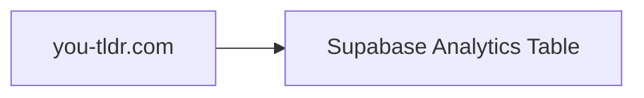
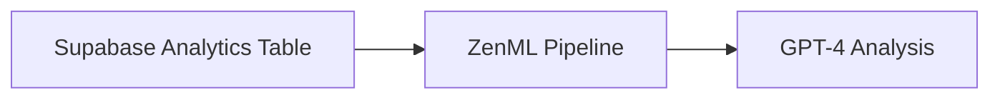
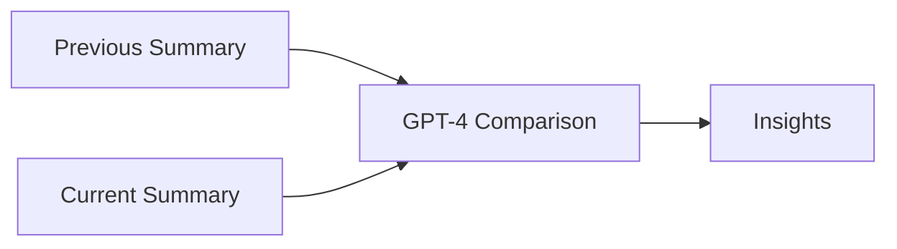
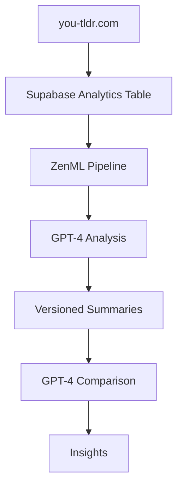

**Last updated:** April 30, 2023
# Using ZenML with GPT-4 to Analyze and Version Data from Supabase: A Case Study with you-tldr.com

In this blog post, we'll explore how ZenML can be used in conjunction with OpenAI's GPT-4 to analyze and version data from a Supabase database. We'll use the you-tldr.com website as an example, showcasing how the site populates an analytics table in Supabase and how ZenML asynchronously picks up the latest video data for analysis.

## Introduction

Large language models (LLMs) like GPT-4 have revolutionized natural language processing, offering unparalleled capabilities for knowledge generation and reasoning. However, incorporating custom, private data into these models remains a challenge. ZenML, an extensible, open-source MLOps framework, can help overcome this limitation by versioning data and allowing for comparisons between summaries rather than raw data.

## The you-tldr.com Case Study

you-tldr.com is a website that provides concise summaries of YouTube videos. The site populates an analytics table in Supabase with the latest video data. We'll demonstrate how ZenML can be used to analyze this data using GPT-4 and version the summaries for comparison.

### Populating the Supabase Analytics Table

**Figure 1:** Populating the Supabase Analytics Table

The you-tldr.com website updates the Supabase analytics table with the latest video titles. This table serves as the data source for our ZenML pipeline, which will use GPT-4 to generate summaries of visitor activity over the last 24 hours.

### Asynchronously Analyzing Data with ZenML

**Figure 2:** Asynchronously Analyzing Data with ZenML

Once the analytics table is populated, ZenML asynchronously picks up the latest video data and processes it using GPT-4. The pipeline is executed daily using GitHub Actions and a deployed ZenML instance in Hugging Face Spaces.

### Overcoming GPT-4 Limitations with ZenML

**Figure 3:** Overcoming GPT-4 Limitations with ZenML

One of the key insights of this case study is that by versioning the summaries over multiple pipelines, we can overcome GPT-4's context limitations. Instead of comparing raw data, we can compare summaries generated by GPT-4, allowing for more meaningful insights and analysis.

**Figure 4:** System Architecture Diagram

## Conclusion

This case study demonstrates the power of combining ZenML with GPT-4 to analyze and version data from a Supabase database. By using ZenML to manage data versioning and GPT-4 for analysis, we can overcome the limitations of LLMs and gain valuable insights from our data. If you're interested in leveraging the latest technology for your own projects, consider using ZenML in conjunction with GPT-4 and Supabase to unlock the full potential of your data.